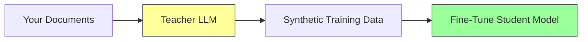

# Synthetic Data Generation with SDG Hub

SDG Hub is a Python framework for generating high-quality synthetic training data using composable blocks and flows. A teacher LLM reads your documents and generates training examples that you can use to fine-tune smaller models.

## Why Synthetic Data?

Manual data labeling is expensive, slow, and hard to scale. Synthetic data generation uses a powerful teacher model (GPT-4, Claude, Llama 405B) to create training examples automatically:



**Result:** A small 7B model fine-tuned on synthetic data can match the teacher's performance on your specific domain, at a fraction of the serving cost.

## Core Concepts

### Blocks

Blocks are individual processing units. Each block takes a dataset, transforms it, and returns a new dataset:

- **PromptBuilderBlock** — Formats prompts into structured chat messages from templates
- **LLMChatBlock** — Calls an LLM via LiteLLM (100+ providers)
- **LLMResponseExtractorBlock** — Extracts fields from LLM response objects
- **TagParserBlock** — Parses structured output from tagged LLM responses
- **ColumnValueFilterBlock** — Filters rows based on column value criteria
- **RowMultiplierBlock** — Duplicates rows for multiple generations
- **MeltColumnsBlock** — Transforms wide format into long format by melting columns

### Flows

Flows chain blocks into pipelines, defined in YAML:

```yaml
blocks:
  - block_type: PromptBuilderBlock
    block_config:
      block_name: build_question_prompt
      input_cols: [document, document_outline]
      output_cols: prompt
      prompt_config_path: prompts/generate_questions.yaml

  - block_type: LLMChatBlock
    block_config:
      block_name: generate_questions
      input_col: prompt
      output_col: response

  - block_type: LLMResponseExtractorBlock
    block_config:
      block_name: extract_response
      input_col: response
      output_col: response_text
```

### Flow Registry

SDG Hub ships with pre-built flows for common use cases:

```python
from sdg_hub import FlowRegistry

FlowRegistry.discover_flows()

# List all available flows (returns dicts with "id" and "name" keys)
for flow in FlowRegistry.list_flows():
    print(f"{flow['id']}: {flow['name']}")

    # For detailed metadata (description, tags, author):
    metadata = FlowRegistry.get_flow_metadata(flow["name"])
    if metadata:
        print(f"  {metadata.description}")
```

## Available Flows

| Flow | Use Case | Guide |
|------|----------|-------|
| Knowledge Tuning (4 variants) | Domain Q&A from documents | [Knowledge Tuning](knowledge-tuning.md) |
| Text Analysis | Structured insights extraction | [Text Analysis](text-analysis.md) |
| MCP Distillation | Tool-use training data | [MCP Distillation](../end-to-end/mcp-distillation.md) |
| RAG Evaluation | Retrieval quality benchmarks | [RAG Evaluation](../evaluation/rag-evaluation.md) |
| Code Evaluation | Code generation benchmarks | [Code Evaluation](../evaluation/code-evaluation.md) |
| Red Teaming | Safety test prompts | See repo |

## Quick Start

```python
from datasets import Dataset
from sdg_hub import Flow, FlowRegistry

FlowRegistry.discover_flows()

dataset = Dataset.from_dict({
    "document": ["Your domain document text here..."],
    "document_outline": ["Brief outline of the document content"],
    "domain": ["your-domain"],
    "icl_document": [""],
    "icl_query_1": [""],
    "icl_query_2": [""],
    "icl_query_3": [""],
})

flow_path = FlowRegistry.get_flow_path(
    "Document Based Knowledge Tuning Dataset Generation Flow"
)
flow = Flow.from_yaml(flow_path)
flow.set_model_config(model="gpt-4o-mini")
result = flow.generate(dataset)
result_df = result.to_pandas() if hasattr(result, "to_pandas") else result

result_df.to_json("training_data.jsonl", orient="records", lines=True)
```

!!! tip "Output type matches input type"
    `flow.generate()` returns the **same type** you pass in: `pd.DataFrame` in produces `pd.DataFrame` out; `datasets.Dataset` in produces `datasets.Dataset` out. The `.to_json(orient="records", lines=True)` call above is a pandas method, so we convert to pandas first if needed.

## Supported LLM Providers

SDG Hub uses LiteLLM under the hood, supporting 100+ providers:

| Provider | Model prefix | Example |
|----------|-------------|---------|
| OpenAI | `gpt-*`, `o1-*` | `gpt-4o-mini` |
| Anthropic | `claude-*` | `claude-sonnet-4-20250514` |
| IBM watsonx | `watsonx/*` | `watsonx/ibm/granite-3-8b-instruct` |
| vLLM (self-hosted) | `hosted_vllm/*` | `hosted_vllm/meta-llama/Llama-3.1-8B-Instruct` |
| Ollama | `ollama/*` | `ollama/llama3.1` |

Set the corresponding environment variable (`OPENAI_API_KEY`, `ANTHROPIC_API_KEY`, etc.) and LiteLLM handles the rest.

## Next Steps

- [Knowledge Tuning](knowledge-tuning.md) — Generate Q&A pairs from your documents
- [Text Analysis](text-analysis.md) — Extract structured insights
