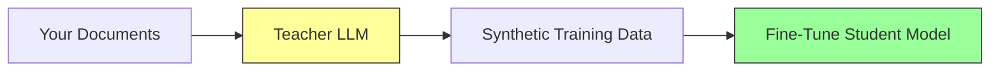

# Synthetic Data Generation with SDG Hub

[SDG Hub](https://github.com/Red-Hat-AI-Innovation-Team/sdg_hub) is a Python framework for generating high-quality synthetic training data using composable blocks and flows. A teacher LLM reads your documents and generates training examples that you can use to fine-tune smaller models.

## Why Synthetic Data?

Manual data labeling is expensive, slow, and hard to scale. Synthetic data generation uses a powerful teacher model (GPT-4, Claude, Llama 405B) to create training examples automatically:



**Result:** A small 7B model fine-tuned on synthetic data can match the teacher's performance on your specific domain, at a fraction of the serving cost.

## Core Concepts

### Blocks

Blocks are individual processing units. Each block takes a dataset, transforms it, and returns a new dataset:

- **LLMBlock** — Calls an LLM with a prompt template
- **FilterBlock** — Filters rows based on criteria
- **ReplicateRowsBlock** — Duplicates rows for multiple generations
- **FlattenColumnsBlock** — Restructures nested data

### Flows

Flows chain blocks into pipelines, defined in YAML:

```yaml
blocks:
  - name: generate_questions
    type: LLMBlock
    config:
      prompt_template: |
        Given this document: {document}
        Generate 3 questions that can be answered from the text.

  - name: generate_answers
    type: LLMBlock
    config:
      prompt_template: |
        Document: {document}
        Question: {question}
        Provide a detailed answer based on the document.
```

### Flow Registry

SDG Hub ships with pre-built flows for common use cases:

```python
from sdg_hub import FlowRegistry

FlowRegistry.discover_flows()

# List all available flows (returns dicts with "id" and "name" keys)
for flow in FlowRegistry.list_flows():
    print(f"{flow['id']}: {flow['name']}")

    # For detailed metadata (description, tags, author):
    metadata = FlowRegistry.get_flow_metadata(flow["name"])
    if metadata:
        print(f"  {metadata.description}")
```

## Available Flows

| Flow | Use Case | Guide |
|------|----------|-------|
| Knowledge Tuning (4 variants) | Domain Q&A from documents | [Knowledge Tuning](knowledge-tuning.md) |
| Skills Tuning | Instruction-following data | [Skills Tuning](skills-tuning.md) |
| Text Analysis | Structured insights extraction | [Text Analysis](text-analysis.md) |
| MCP Distillation | Tool-use training data | [MCP Distillation](../end-to-end/mcp-distillation.md) |
| RAG Evaluation | Retrieval quality benchmarks | [RAG Evaluation](../evaluation/rag-evaluation.md) |
| Code Evaluation | Code generation benchmarks | [Code Evaluation](../evaluation/code-evaluation.md) |
| Red Teaming | Safety test prompts | See repo |

## Quick Start

```python
from datasets import Dataset
from sdg_hub import Flow, FlowRegistry

FlowRegistry.discover_flows()

dataset = Dataset.from_dict({
    "document": ["Your domain document text here..."],
    "domain": ["your-domain"],
})

flow = Flow.from_yaml(
    FlowRegistry.get_flow_path(
        "Document Based Knowledge Tuning Dataset Generation Flow"
    )
)
flow.set_model_config(model="gpt-4o-mini")
result = flow.generate(dataset)

result.to_json("training_data.jsonl", orient="records", lines=True)
```

## Supported LLM Providers

SDG Hub uses [LiteLLM](https://docs.litellm.ai/) under the hood, supporting 100+ providers:

| Provider | Model prefix | Example |
|----------|-------------|---------|
| OpenAI | `gpt-*`, `o1-*` | `gpt-4o-mini` |
| Anthropic | `claude-*` | `claude-sonnet-4-20250514` |
| IBM watsonx | `watsonx/*` | `watsonx/ibm/granite-3-8b-instruct` |
| vLLM (self-hosted) | `openai/*` | `openai/meta-llama/Llama-3.1-8B-Instruct` |
| Ollama | `ollama/*` | `ollama/llama3.1` |

Set the corresponding environment variable (`OPENAI_API_KEY`, `ANTHROPIC_API_KEY`, etc.) and LiteLLM handles the rest.

## Next Steps

- [Knowledge Tuning](knowledge-tuning.md) — Generate Q&A pairs from your documents
- [Skills Tuning](skills-tuning.md) — Generate instruction-following data
- [Text Analysis](text-analysis.md) — Extract structured insights
