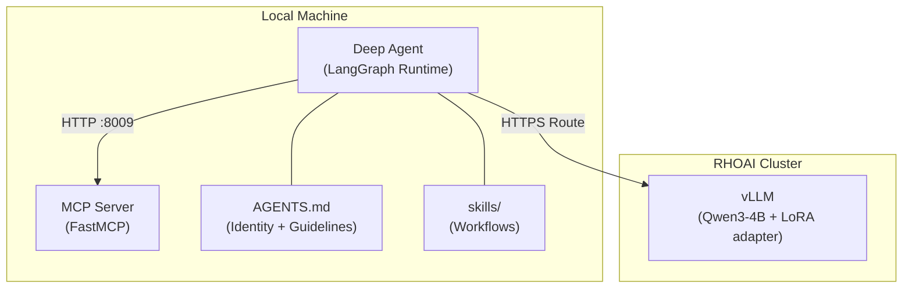
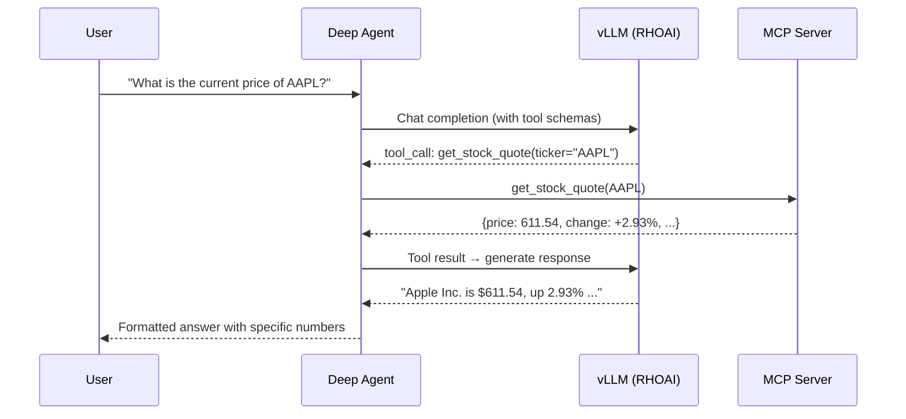

# Deep Agent — from Model to Agent

!!! info "Continues from the Tool-Calling Pipeline"
    This guide is **Step 7** of the [Tool-Calling Model Pipeline](tool-calling-financial.md). Complete Steps 0-4 (data generation, training, deployment) first — you need a fine-tuned model served on RHOAI before wiring it into an agent.

Take the tool-calling model you just trained and turn it into an autonomous agent using [LangChain Deep Agents](https://github.com/langchain-ai/deepagents). The agent can plan multi-step tasks, call tools in the right order, and synthesize professional answers — all powered by the fine-tuned model running on RHOAI.

!!! success "Validated on RHOAI 3.4.2"
    This harness has been runtime-validated against a fine-tuned Qwen3-4B LoRA adapter served via vLLM on RHOAI 3.4.2. The agent successfully called 15 financial tools, chained multi-tool queries (e.g., compliance + sector exposure), and synthesized professional responses with specific numbers from tool results.

## What is a Deep Agent?

A **Deep Agent** is a LangGraph-based agent that wraps an LLM with middleware for:

- **Tool calling** — the model decides which tools to call and in what order
- **Memory** — persistent identity and guidelines loaded from an `AGENTS.md` file
- **Skills** — on-demand workflows (e.g., "portfolio analysis" or "trade evaluation") the agent can invoke
- **Task planning** — built-in todo management and task decomposition
- **Context management** — automatic summarization to stay within context limits

The key difference from a plain ReAct agent: Deep Agents add a filesystem-backed middleware stack that gives a small model structure and guardrails it wouldn't have on its own.

## Architecture



The agent runs locally and calls the fine-tuned model on the cluster via its OpenShift Route (HTTPS). The MCP server provides 15 financial tools locally. In production, both the agent and MCP server would run as containers on the same cluster.

## Prerequisites

Before starting, complete at least Steps 0-4 of the [Tool-Calling Pipeline](tool-calling-financial.md):

- A trained LoRA adapter deployed via KServe + vLLM on RHOAI
- The MCP demo server code (included in the repo)
- Python 3.11+, `uv`, and `oc` CLI authenticated to the cluster

!!! warning "Context window requirement"
    The Deep Agents middleware adds ~3,500 tokens of system prompt. Your vLLM deployment must use `--max-model-len=16384` or higher. The default 4096 is too small.

## Step 1: Increase the Model Context Window

The default `--max-model-len=4096` on the ServingRuntime is too small for Deep Agents. Patch it to 16384:

```bash
oc patch servingruntime vllm-lora-runtime \
  -n tool-calling-financial \
  --type='json' \
  -p='[{"op":"replace","path":"/spec/containers/0/args/3","value":"--max-model-len=16384"}]'
```

This triggers a pod rollout. Wait for the new pod to reach `1/1 Running`:

```bash
oc get pods -n tool-calling-financial -l serving.kserve.io/inferenceservice -w
```

!!! tip "RWO PVC rollout"
    If the new pod gets stuck in `Init:0/1` with a `Multi-Attach error`, delete the old pod manually to release the PVC: `oc delete pod <old-pod-name> -n tool-calling-financial`

## Step 2: Set Up the Agent Environment

```bash
cd end-to-end-examples/tool-calling-financial/examples/

# Create a Python 3.12 virtual environment
uv venv --python 3.12
source .venv/bin/activate

# Install dependencies (deepagents, langchain, langgraph, etc.)
uv pip install -e .
```

Create your `.env` file (do **not** commit this file — it is already in `.gitignore`):

```bash
cat > .env << 'EOF'
MODEL_ENDPOINT=https://<your-model-route>/v1
MODEL_NAME=tool-calling-financial
MCP_SERVER_URL=http://localhost:8009/mcp
OPENAI_API_KEY=not-needed
EOF
```

Replace `<your-model-route>` with your InferenceService route hostname:

```bash
oc get route -n tool-calling-financial -l serving.kserve.io/inferenceservice \
  -o jsonpath='{.items[0].spec.host}'
```

!!! tip "No port-forward needed"
    Using the Route URL means you don't need `oc port-forward`. The agent connects directly to the model via the cluster's external route.

## Step 3: Understand the Agent Structure

The agent is built from four pieces:

```
examples/
├── 07_deep_agent.py      # Agent entrypoint — creates the Deep Agent graph
├── financial_tools.py     # 15 @tool wrappers that call the MCP server
├── AGENTS.md              # Agent identity, tool guidelines, communication style
├── skills/
│   ├── portfolio-analysis/SKILL.md   # Multi-step portfolio analysis workflow
│   ├── market-research/SKILL.md      # Stock screening and market overview
│   └── trade-evaluation/SKILL.md     # Compliance check → order submission
├── langgraph.json         # LangGraph runtime config (points to 07_deep_agent.py:agent)
└── pyproject.toml         # Dependencies (deepagents>=0.6.12)
```

### Agent creation (`07_deep_agent.py`)

The agent is created with `create_deep_agent`, which wires up the full middleware stack:

```python
from deepagents import create_deep_agent
from deepagents.backends import FilesystemBackend

agent = create_deep_agent(
    model=model,              # ChatOpenAI pointing at vLLM via port-forward
    tools=ALL_TOOLS,          # 15 financial tool functions
    memory=["./AGENTS.md"],   # Persistent identity file
    skills=["./skills/"],     # On-demand workflow directory
    subagents=[],             # No sub-agents for now
    backend=FilesystemBackend(root_dir=EXAMPLE_DIR),
)
```

### Tools (`financial_tools.py`)

Each tool is a `@tool`-decorated function that calls the MCP server over HTTP. Deep Agents infers the tool schema from the function signature and docstring — no manual JSON schema needed.

```python
@tool
def get_stock_quote(ticker: str) -> dict:
    """Get a real-time price quote for a single stock.

    Args:
        ticker: Stock ticker symbol (e.g. AAPL, JPM, MSFT)
    """
    return _call_mcp("get_stock_quote", {"ticker": ticker})
```

The 15 tools are organized into four clusters:

| Cluster | Tools | Purpose |
|---------|-------|---------|
| Market Data | `get_stock_quote`, `get_market_summary`, `get_historical_prices`, `screen_stocks` | Real-time and historical market information |
| Portfolio | `get_portfolio_positions`, `get_portfolio_performance`, `get_account_summary`, `get_transaction_history` | Portfolio holdings and performance |
| Risk & Analytics | `calculate_portfolio_risk`, `get_sector_exposure`, `run_stress_test`, `analyze_stock` | Risk metrics, stress testing, stock analysis |
| Trading & Compliance | `submit_trade_order`, `check_compliance`, `get_regulatory_status` | Pre-trade checks and order execution |

### Memory (`AGENTS.md`)

This file defines the agent's identity and is loaded into context on every request:

```markdown
# Financial Insights Agent

You are the Financial Insights Agent, a professional wealth management
assistant powered by a fine-tuned model served on Red Hat OpenShift AI.

## How to Use Tools

1. Identify which tools are needed. Many questions require chaining 2-3 tools.
2. Call tools in the right order (e.g., get positions before calculating risk).
3. Synthesize the results into a clear, professional answer with specific numbers.
```

### Skills (`skills/`)

Each skill is a `SKILL.md` file that describes a multi-step workflow. The agent loads the relevant skill when it matches the user's query:

- **portfolio-analysis** — get holdings, assess performance, calculate risk, check concentration, stress test
- **market-research** — quote lookup, market overview, historical trends, stock screening
- **trade-evaluation** — compliance check first, then submit order if compliant

## Step 4: Start the Servers

Open two terminal tabs:

=== "Tab 1: MCP Server"

    ```bash
    cd end-to-end-examples/tool-calling-financial/demo_server/
    source ../examples/.venv/bin/activate
    python server.py
    ```

    You should see: `Uvicorn running on http://0.0.0.0:8009`

=== "Tab 2: Agent"

    Verify the model is accessible via the Route:

    ```bash
    curl -sk https://$(oc get route -n tool-calling-financial \
      -l serving.kserve.io/inferenceservice \
      -o jsonpath='{.items[0].spec.host}')/v1/models | python3 -m json.tool
    ```

    You should see both `tool-calling-financial-lora` (base) and `tool-calling-financial` (LoRA adapter).

!!! tip "Port-forward alternative"
    If you prefer not to expose a Route, you can use `oc port-forward` instead and set `MODEL_ENDPOINT=http://localhost:8000/v1` in your `.env`:

    ```bash
    oc port-forward -n tool-calling-financial \
      deployment/tool-calling-financial-lora-predictor 8000:8080
    ```

## Step 5: Run the Agent

### Headless mode (single query)

```bash
cd end-to-end-examples/tool-calling-financial/examples/
source .venv/bin/activate

python 07_deep_agent.py "What is the current price of AAPL?"
```

The agent follows this flow:



The terminal output looks like:

```
  >> get_stock_quote(ticker='AAPL')
  ✓ get_stock_quote: {"ticker": "AAPL", "name": "Apple Inc.", ...}

  Agent: The current price of Apple Inc. (AAPL) is $611.54 on the NASDAQ.
         Daily change: +$17.43 (+2.93%). Market cap: $1.00T.
```

### Multi-tool chaining

```bash
python 07_deep_agent.py "What is the risk-adjusted performance of portfolio PORT-0001?"
```

The agent chains `get_portfolio_performance` and `calculate_portfolio_risk` in parallel, then synthesizes a combined analysis with Sharpe ratio, VaR, beta, and a rebalancing recommendation.

### Compliance workflow

```bash
python 07_deep_agent.py "Check if buying 50 shares of JPM in PORT-0002 would be compliant"
```

The agent calls `check_compliance` and reports the result with risk tolerance context.

### Interactive mode (LangGraph Studio)

```bash
langgraph dev --allow-blocking
```

Opens a web UI at `http://127.0.0.1:2024` where you can send queries, inspect tool calls, and see the full message history.

## How the Fine-Tuned Model Helps

The agent uses the **fine-tuned LoRA adapter** (`tool-calling-financial`), not the raw base model. The fine-tuning:

- Trained the model on tool-calling demonstrations generated by MCP distillation
- Reinforced the specific tool schemas (15 financial tools with their parameter names)
- Improved consistency in chaining the right tools for financial workflows

You can verify the adapter is active:

```bash
curl -sk https://<your-model-route>/v1/models | python3 -c "
import sys, json
for m in json.load(sys.stdin)['data']:
    print(f'{m[\"id\"]:30s} root={m[\"root\"]}  parent={m.get(\"parent\", \"(base)\")}')"
```

Expected output:

```
tool-calling-financial-lora    root=/mnt/models  parent=(base)
tool-calling-financial         root=/mnt/lora-adapter/output  parent=tool-calling-financial-lora
```

## Troubleshooting

| Symptom | Resolution |
|---------|------------|
| `maximum context length is 4096 tokens` | Increase `--max-model-len` to 16384 in the ServingRuntime (see Step 1) |
| `Multi-Attach error for volume` | RWO PVC can only be mounted by one pod. Delete the old pod to release it |
| `JSONDecodeError: Expecting value` | MCP server returns SSE format. Make sure you're using the updated `financial_tools.py` with `_parse_mcp_response` |
| `Connection refused` or `SSL error` | If using a Route, check the URL is correct and the InferenceService is running. If using port-forward, it may have timed out — restart it |
| Agent thinks but doesn't call tools | The model may be generating too many thinking tokens. Try a more direct prompt |
| `FilesystemBackend virtual_mode` warning | Harmless deprecation warning. Can be silenced by passing `virtual_mode=True` |

## What's Next

- **Production deployment**: Package the agent and MCP server as containers, deploy alongside the model on the same cluster
- **Larger models**: With a 70B model (e.g., Llama 3.3 70B on multi-GPU), the Deep Agents middleware becomes more effective — planning, subagent spawning, and context offloading all benefit from a stronger base
- **Custom MCP servers**: Replace the demo financial server with your own domain tools

## Source Code

- [Agent script (`07_deep_agent.py`)](https://github.com/rrbanda/rhoai/tree/main/end-to-end-examples/tool-calling-financial/examples/07_deep_agent.py)
- [Tool wrappers (`financial_tools.py`)](https://github.com/rrbanda/rhoai/tree/main/end-to-end-examples/tool-calling-financial/examples/financial_tools.py)
- [Agent identity (`AGENTS.md`)](https://github.com/rrbanda/rhoai/tree/main/end-to-end-examples/tool-calling-financial/examples/AGENTS.md)
- [Skills directory](https://github.com/rrbanda/rhoai/tree/main/end-to-end-examples/tool-calling-financial/examples/skills/)
- [Deep Agents library](https://github.com/langchain-ai/deepagents)
