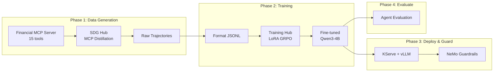

# End-to-End Financial Agent Pipeline

Build a tool-calling agent for financial services by fine-tuning Qwen3-4B with GRPO, then deploying it behind NeMo Guardrails for compliance. This pipeline uses SDG Hub's MCP distillation to generate training data from a financial MCP server with 15 tools.

## RHOAI Feature Matrix

| Feature | RHOAI Version | Status |
|---------|--------------|--------|
| SDG Hub MCP Distillation | 3.4+ | GA |
| Training Hub LoRA GRPO | 3.4+ | GA |
| KServe RawDeployment + vLLM | 3.4+ | GA |
| NeMo Guardrails | 3.4+ | GA |
| LM-Eval | 3.4+ | GA |
| NeMo + MCP Gateway | 3.5 EA2 | **TP** |
| Validated Tool-Calling Config | 3.5 EA2 | **TP** |
| EvalHub SDK | 3.5 EA2 | **TP** |

The core pipeline (Steps 0–6) runs fully on RHOAI 3.4. RHOAI 3.5 features are additive enhancements.

## Pipeline Overview



## Prerequisites

- RHOAI 3.4+ cluster (3.5 EA2 for MCP Gateway and EvalHub)
- GPU: 1x A100/H100 80GB minimum (4-8x for multi-GPU training)
- Teacher model API key (GPT-5.2 or compatible)
- Langflow instance with a frontier model agent connected to the financial MCP server
- Python 3.10+, `oc` CLI authenticated to your cluster

## Step 0: Start the Financial MCP Server

The demo server provides 15 financial tools organized into ambiguity clusters — groups of tools with overlapping functionality that test the model's ability to choose the right tool.

```bash
cd end-to-end-examples/financial-agent/demo_server/
pip install fastmcp
python server.py
# Server starts on http://localhost:8009
```

| Cluster | Tools | Challenge |
|---------|-------|-----------|
| Market Data | `get_stock_quote`, `get_market_summary`, `get_historical_prices`, `screen_stocks` | Single ticker vs. broad market vs. time series vs. screener |
| Portfolio Mgmt | `get_portfolio_positions`, `get_portfolio_performance`, `get_account_summary`, `get_transaction_history` | Holdings vs. returns vs. account overview vs. trade history |
| Risk & Analytics | `calculate_portfolio_risk`, `get_sector_exposure`, `run_stress_test`, `analyze_stock` | VaR/Sharpe vs. allocation vs. scenario vs. stock research |
| Trading & Compliance | `submit_trade_order`, `check_compliance`, `get_regulatory_status` | Execute vs. dry-run validate vs. client regulatory status |

The server uses deterministic seed data (50 stocks, 5 client portfolios, 200 transactions) for reproducibility.

## Step 1: Generate Tool-Call Training Data

**RHOAI Feature:** SDG Hub MCP Distillation (GA)

```bash
cd end-to-end-examples/financial-agent/examples/
cp .env.example .env
# Edit .env with your API keys and Langflow URL

python 01_generate_tool_data.py --num-samples 10
```

The pipeline:

1. A frontier model (via Langflow) **explores** all 15 financial tools
2. A teacher LLM **synthesizes** realistic financial questions grounded in the exploration
3. The frontier model **solves** each question via actual MCP tool calls (expert trajectories)
4. Quality filters **remove** incomplete or low-quality examples
5. Output: `generated_data/distillation_output.parquet`

## Step 2: Format Training Data

Convert raw traces into structured function-calling conversations:

```bash
python 02_format_training_data.py
```

Output format:

```json
{"messages": [
  {"role": "system", "content": "<tool declarations>"},
  {"role": "user", "content": "What's the risk-adjusted return on my tech portfolio?"},
  {"role": "assistant", "content": "", "function_call": {"name": "get_portfolio_positions", "arguments": "..."}},
  {"role": "function", "content": "{...}", "name": "get_portfolio_positions"},
  {"role": "assistant", "content": "", "function_call": {"name": "calculate_portfolio_risk", "arguments": "..."}},
  {"role": "function", "content": "{...}", "name": "calculate_portfolio_risk"},
  {"role": "assistant", "content": "Your tech portfolio has a Sharpe ratio of..."}
]}
```

## Step 3: Train with GRPO

**RHOAI Feature:** Training Hub LoRA GRPO (GA)

```bash
# Single-GPU (A100 80GB)
python 03_train_grpo.py --backend art --num-iterations 15

# Multi-GPU (4x A100 80GB)
python 03_train_grpo.py --backend verl --n-gpus 4
```

GRPO generates multiple candidate tool-call sequences per prompt, scores them with a `tool_call_reward` function (correct tool? valid args? logical order?), and optimizes the model to prefer high-scoring sequences.

!!! info "Why GRPO instead of SFT?"
    Financial APIs have overlapping tools (e.g., `get_account_summary` vs `get_portfolio_performance` vs `get_portfolio_positions`). SFT memorizes one "correct" path. GRPO learns from reward signals, making the model robust to ambiguous tool choices and generalizable to unseen query patterns.

## Step 4: Deploy the Fine-Tuned Model

**RHOAI Feature:** KServe RawDeployment (GA) + Validated Tool-Calling Config (3.5 TP)

```bash
python 04_deploy_model.py
```

This creates a KServe InferenceService with vLLM serving the LoRA adapter. Key vLLM arguments for tool-calling:

```
--enable-auto-tool-choice --tool-call-parser hermes
```

Verify with:

```bash
curl -X POST "$MODEL_ENDPOINT/v1/chat/completions" \
  -H "Content-Type: application/json" \
  -d '{
    "model": "financial-agent",
    "messages": [{"role": "user", "content": "Show me my portfolio performance this quarter"}],
    "tools": [{"type": "function", "function": {"name": "get_portfolio_performance", "parameters": {}}}]
  }'
```

For detailed deployment options, see [Serving](../serving/index.md).

## Step 5: Evaluate

**RHOAI Feature:** LM-Eval (GA) + Agent Evaluation

```bash
python 05_evaluate_agent.py \
  --model-endpoint http://financial-agent.rhoai-serving.svc:8080 \
  --output evaluation_results.json
```

The evaluation script measures:

| Metric | What it measures |
|--------|-----------------|
| Tool recall | Does the model call all required tools? |
| Tool precision | Does it avoid calling unnecessary tools? |
| Order match | Are multi-step tool chains in the right sequence? |
| Parameter match | Are function arguments correct? |
| LLM-as-judge (6 dimensions) | Task fulfillment, grounding, tool appropriateness, parameter accuracy, dependency awareness, efficiency |

For evaluation concepts and methodology, see [Agent Evaluation](../evaluation/agent-evaluation.md).

## Step 6: Configure Guardrails

**RHOAI Feature:** NeMo Guardrails (GA) + MCP Gateway (3.5 TP)

```bash
python 06_configure_guardrails.py \
  --model-endpoint https://financial-agent.apps.cluster.example.com/v1
```

### Tier 1 — NeMo Guardrails (GA, RHOAI 3.4+)

- **PII detection & masking** — Account numbers (`ACCT-XXXX`), SSNs, routing numbers
- **Jailbreak detection** — Blocks prompt injection attacks
- **Financial disclaimer injection** — Appends regulatory disclaimers to investment advice
- **Pre-trade compliance** — Validates trades against concentration limits and restricted lists

### Tier 2 — MCP Gateway (TP, RHOAI 3.5)

```bash
python 06_configure_guardrails.py \
  --model-endpoint https://financial-agent.apps.cluster.example.com/v1 \
  --enable-mcp-gateway \
  --mcp-server-url http://finance-mcp.svc:8080
```

Routes all agent tool calls through the guardrails before they reach the MCP server.

For guardrails concepts and configuration details, see [Guardrails](../guardrails/index.md).

## Resource Estimates

| Phase | Resource | Time |
|-------|----------|------|
| Data Generation | 1x CPU + Teacher API | 2–4 hours |
| Training (art, single GPU) | 1x A100 80GB | 4–8 hours |
| Training (verl, multi-GPU) | 4x A100 80GB | 1–2 hours |
| Serving | 1x A100 40GB+ | Ongoing |
| Evaluation | 1x CPU + Model endpoint | 30–60 min |

## Troubleshooting

| Symptom | Resolution |
|---------|------------|
| "MCP Server Distillation flow not found" | `pip install sdg_hub[dev]` |
| "CUDA out of memory during GRPO" | Reduce `--group-size` (8 → 4) or use `verl` backend with more GPUs |
| "Tool call parser error" during inference | Verify `--tool-call-parser` matches model architecture (`hermes` for Qwen3) |
| "Guardrails CR not ready" | Check TrustyAI operator is installed |
| "MCPGatewayExtension not found" | Requires RHOAI 3.5 EA2 (Technology Preview) |

## Source Code

All scripts, manifests, and the demo server are in the repository:

- [Financial Agent Example](https://github.com/rrbanda/rhoai/tree/main/end-to-end-examples/financial-agent)
- [Demo MCP Server](https://github.com/rrbanda/rhoai/tree/main/end-to-end-examples/financial-agent/demo_server)
- [Guardrails Config](https://github.com/rrbanda/rhoai/tree/main/end-to-end-examples/financial-agent/guardrails)

## Related

- [Financial Domain Guide](../domains/financial.md) — Knowledge tuning vs. agent paths for financial models
- [MCP Distillation](mcp-distillation.md) — General MCP distillation pipeline
- [GRPO](../training/grpo.md) — LoRA GRPO algorithm details
- [Serving](../serving/index.md) — KServe deployment options
- [Guardrails](../guardrails/index.md) — NeMo Guardrails configuration
- [Agent Evaluation](../evaluation/agent-evaluation.md) — Evaluation methodology
