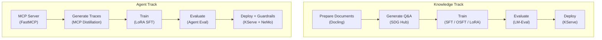

# End-to-End Pipelines

Complete walkthroughs from raw data to a deployed, guarded model on RHOAI. Each pipeline covers data generation, training, evaluation, and serving.

## Which Pipeline Is Right for You?

| Pipeline | Goal | Training Algorithm | Validated? |
|----------|------|-------------------|------------|
| [Knowledge Tuning](knowledge-tuning.md) | Teach a model domain knowledge from documents | SFT / OSFT / LoRA | Locally |
| [MCP Distillation](mcp-distillation.md) | Teach a model to call tools via MCP servers | GRPO | Locally |
| [Financial Agent](financial-agent.md) | Build a production financial tool-calling agent | LoRA SFT | **On RHOAI 3.4.2** |

## Recommended Starting Points

=== "Knowledge Track"

    You want to teach a model your domain knowledge (regulations, product docs, research):

    1. Start with [Knowledge Tuning](knowledge-tuning.md)
    2. Choose between SFT, OSFT, or LoRA based on your [GPU budget](../getting-started/choosing-an-algorithm.md)
    3. Deploy via [KServe + vLLM](../serving/index.md)

=== "Agent Track"

    You want to build a tool-calling agent for MCP servers or APIs:

    1. Start with [Financial Agent](financial-agent.md) — the most complete and validated pipeline
    2. Adapt the MCP server and training data for your domain
    3. Deploy with [LoRA adapter serving](financial-agent.md#42-option-a-serve-the-lora-adapter-directly-recommended) and [guardrails](../guardrails/index.md)

## Pipeline Comparison

