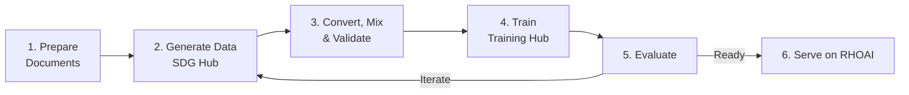

# End-to-End Knowledge Tuning Pipeline

Teach a model your domain knowledge — financial regulations, product documentation, medical literature — by generating synthetic Q&A training data from your documents, then fine-tuning with OSFT, SFT, or LoRA. This pipeline uses SDG Hub for data generation and Training Hub for training, then deploys the model on RHOAI with KServe + vLLM.

!!! success "Validated on RHOAI 3.4.2"
    This pipeline has been validated on RHOAI 3.4.2 (OCP 4.18, NVIDIA L4 24GB). Key validated results:

    - **SDG Hub** outputs `question`/`response` columns (not `messages`)
    - **Data mixing** correctly converts to `messages` format with `unmask: true`
    - **OSFT** uses `unfreeze_rank_ratio=0.25` (preserves general capability)
    - **LoRA SFT** option available alongside SFT and OSFT
    - **Hyperparameters** aligned: `num_epochs=4`, `learning_rate=2e-5`, `effective_batch_size=32`

## Pipeline Overview



## Prerequisites

- RHOAI 3.4+ cluster with at least 1x NVIDIA L4 24GB GPU (for training and serving)
- LLM API key for synthetic data generation (OpenAI, Gemini, or any [LiteLLM-supported provider](https://docs.litellm.ai/docs/providers))
- Python 3.10+, `oc` CLI authenticated to your cluster
- Hugging Face token for gated models (Llama, Mistral): `export HF_TOKEN="hf_..."`

## Two Ways to Follow This Guide

=== "Run the Scripts (recommended)"

    The repository includes tested, production-ready scripts for each step:

    ```bash
    git clone https://github.com/rrbanda/rhoai.git
    cd rhoai/end-to-end-examples/knowledge-tuning/examples/

    # Install dependencies
    pip install -r requirements.txt

    # Configure environment
    cp .env.example .env
    # Edit .env with your API key, model, and paths
    ```

    Then follow each step below using the `python 0N_*.py` commands shown in the callout boxes.

=== "Inline Code (for notebooks / exploration)"

    Copy the Python snippets below into a Jupyter notebook or workbench. This path is useful for learning and experimentation, but the scripts are more robust for production runs.

## Step 1: Prepare Documents

Convert your source documents to structured text. Use [Docling](https://ds4sd.github.io/docling/) for PDFs and web pages:

```python
from docling.document_converter import DocumentConverter

converter = DocumentConverter()

sources = [
    "https://docs.example.com/product-guide.html",
    "/path/to/technical-manual.pdf",
]

documents = []
for source in sources:
    result = converter.convert(source)
    documents.append(result.document.export_to_markdown())

print(f"Prepared {len(documents)} documents")
```

Create a seed dataset with document chunks:

```python
from datasets import Dataset

chunks = []
for doc in documents:
    for i in range(0, len(doc), 1500):
        chunks.append(doc[i:i+2000])

dataset = Dataset.from_dict({
    "document": chunks,
    "document_outline": [""] * len(chunks),
    "domain": ["your-domain"] * len(chunks),
    "icl_document": [""] * len(chunks),
    "icl_query_1": [""] * len(chunks),
    "icl_query_2": [""] * len(chunks),
    "icl_query_3": [""] * len(chunks),
})

print(f"Created {len(dataset)} document chunks")
```

!!! tip "Using the scripts"
    Place your `.pdf`, `.md`, or `.html` files in a `documents/` directory, then:

    ```bash
    python 01_data_generation.py --document-dir ./documents --output-dir ./generated_output_data
    ```

    The script handles document loading, chunking, and runs all four flow variants automatically.

## Step 2: Generate Training Data

Run multiple SDG Hub knowledge tuning flow variants for diverse training examples:

```python
from sdg_hub import Flow, FlowRegistry

FlowRegistry.discover_flows()

FLOW_VARIANTS = {
    "extractive_summary": "Extractive Summary Knowledge Tuning Dataset Generation Flow",
    "detailed_summary": "Detailed Summary Knowledge Tuning Dataset Generation Flow",
    "key_facts": "Key Facts Knowledge Tuning Dataset Generation Flow",
    "doc_direct_qa": "Document Based Knowledge Tuning Dataset Generation Flow",
}

generated_data = {}
for variant_name, flow_display_name in FLOW_VARIANTS.items():
    flow_path = FlowRegistry.get_flow_path(flow_display_name)
    if flow_path is None:
        print(f"WARNING: {flow_display_name} not found, skipping")
        continue
    flow = Flow.from_yaml(flow_path)
    flow.set_model_config(model="gpt-4o-mini")
    result = flow.generate(dataset)
    result_df = result.to_pandas() if hasattr(result, "to_pandas") else result
    result_df.to_json(f"{variant_name}.jsonl", orient="records", lines=True)
    generated_data[variant_name] = result_df
    print(f"{variant_name}: {len(result_df)} examples")
```

## Step 3: Convert, Mix, and Validate

!!! warning "SDG Hub outputs `question`/`response` columns — not `messages`"
    Knowledge tuning flows produce rows with `question` and `response` columns. Training Hub expects the `messages` chat format. You **must** convert before training. For knowledge tuning, also set `"unmask": true` so the loss is computed on all message roles (not just assistant).

Convert SDG Hub output to Training Hub format, then combine all variants:

```python
import pandas as pd
import json

def convert_to_messages(df):
    """Convert question/response rows to messages format for Training Hub."""
    records = []
    for _, row in df.iterrows():
        if "question" not in row or "response" not in row:
            continue
        records.append({
            "messages": [
                {"role": "user", "content": str(row["question"])},
                {"role": "assistant", "content": str(row["response"])},
            ],
            "unmask": True,
        })
    return pd.DataFrame(records)

dfs = []
for name in FLOW_VARIANTS:
    raw = pd.read_json(f"{name}.jsonl", lines=True)
    converted = convert_to_messages(raw)
    dfs.append(converted)
    print(f"{name}: {len(raw)} raw → {len(converted)} converted")

combined = pd.concat(dfs, ignore_index=True)
combined = combined.drop_duplicates(subset=["messages"])
combined = combined.sample(frac=1, random_state=42).reset_index(drop=True)

combined.to_json("training_data.jsonl", orient="records", lines=True)
print(f"Final training set: {len(combined)} examples")
```

!!! tip "Using the scripts"
    ```bash
    python 02_data_mixing.py --input-dir ./generated_output_data --skip-tokenize
    ```

    The script loads all JSONL files, converts `question`/`response` → `messages` with `unmask: true`, deduplicates, and writes `knowledge_train.jsonl`.

## Step 4: Train

**RHOAI Feature:** Training Hub SFT / OSFT / LoRA (GA)

Choose your algorithm based on the [decision guide](../getting-started/choosing-an-algorithm.md):

=== "OSFT (Recommended)"

    Preserves base knowledge while adding domain expertise:

    ```python
    from training_hub import osft

    osft(
        model_path="meta-llama/Llama-3.1-8B-Instruct",
        data_path="training_data.jsonl",
        ckpt_output_dir="./knowledge-model",
        unfreeze_rank_ratio=0.25,
        unmask_messages=True,
        effective_batch_size=32,
        max_tokens_per_gpu=16384,
        max_seq_len=4096,
        learning_rate=2e-5,
        num_epochs=4,
    )
    ```

=== "SFT (Maximum Capacity)"

    Full parameter update for maximum learning:

    ```python
    from training_hub import sft

    sft(
        model_path="meta-llama/Llama-3.1-8B-Instruct",
        data_path="training_data.jsonl",
        ckpt_output_dir="./knowledge-model",
        num_epochs=4,
        effective_batch_size=32,
        max_seq_len=4096,
    )
    ```

=== "LoRA (Memory Efficient)"

    Single-GPU fine-tuning:

    ```python
    from training_hub import lora_sft

    lora_sft(
        model_path="meta-llama/Llama-3.1-8B-Instruct",
        data_path="training_data.jsonl",
        ckpt_output_dir="./knowledge-model",
        num_epochs=4,
        lora_r=16,
        lora_alpha=32,
    )
    ```

!!! tip "Using the scripts"
    ```bash
    # OSFT (recommended)
    python 03_model_training.py osft --data-path ./generated_output_data/training_mix/knowledge_train.jsonl

    # LoRA (single GPU)
    python 03_model_training.py lora --data-path ./generated_output_data/training_mix/knowledge_train.jsonl

    # SFT
    python 03_model_training.py sft --data-path ./generated_output_data/training_mix/knowledge_train.jsonl
    ```

!!! tip "Where is my trained model?"
    Training Hub writes the final model to `{ckpt_output_dir}/hf_format/samples_0/`. Use this path for evaluation, serving, and further training.

### Training on RHOAI with TrainJob (recommended)

The RHOAI-native approach uses the **Kubeflow Trainer** with the pre-installed `training-hub` ClusterTrainingRuntime. This runs directly on GPU nodes with no local Python environment required.

**Prerequisite:** Verify the Trainer is enabled and the runtime exists:

```bash
oc get dsc default-dsc -o jsonpath='{.spec.components.trainer.managementState}' && echo
# Expected: Managed

oc get clustertrainingruntimes training-hub
# Expected: training-hub   (pre-installed by RHOAI 3.4+)
```

#### Step 4a: Create namespace and workspace PVC

```bash
oc new-project knowledge-tuning

cat <<'YAML' | oc apply -n knowledge-tuning -f -
apiVersion: v1
kind: PersistentVolumeClaim
metadata:
  name: knowledge-workspace
spec:
  accessModes: [ReadWriteOnce]
  storageClassName: gp3-csi
  resources:
    requests:
      storage: 50Gi
YAML
```

#### Step 4b: Create the training script ConfigMap

This ConfigMap embeds a LoRA SFT training script that reads data from the PVC. For OSFT or SFT, replace the `lora_sft` call with `osft` or `sft` (see the inline Python examples above).

```bash
cat <<'YAML' | oc apply -n knowledge-tuning -f -
apiVersion: v1
kind: ConfigMap
metadata:
  name: knowledge-train-script
data:
  train.py: |
    """Knowledge tuning via Training Hub LoRA SFT on RHOAI."""
    import os, json, sys

    WORKSPACE = os.environ.get("WORKSPACE_PATH", "/workspace")
    DATA_DIR = os.path.join(WORKSPACE, "data")
    OUTPUT_DIR = os.path.join(WORKSPACE, "output")
    os.makedirs(DATA_DIR, exist_ok=True)
    os.makedirs(OUTPUT_DIR, exist_ok=True)

    data_path = os.path.join(DATA_DIR, "knowledge_train.jsonl")
    if not os.path.isfile(data_path):
        print(f"ERROR: Training data not found at {data_path}")
        print("Upload your Step 3 output to the PVC first.")
        sys.exit(1)

    with open(data_path) as f:
        count = sum(1 for _ in f)
    print(f"Found {count} training examples at {data_path}")

    from training_hub import lora_sft
    lora_sft(
        model_path=os.environ.get("MODEL_PATH", "Qwen/Qwen3-4B"),
        data_path=data_path,
        ckpt_output_dir=OUTPUT_DIR,
        lora_r=8,
        lora_alpha=16,
        num_epochs=1,
        learning_rate=2e-4,
        effective_batch_size=32,
        micro_batch_size=2,
        max_seq_len=2048,
        load_in_4bit=True,
        lr_scheduler="cosine",
        seed=42,
    )
    print(f"Training complete. Output saved to: {OUTPUT_DIR}")
YAML
```

#### Step 4c: Upload training data to the PVC

```bash
# Start a helper pod to copy data into the PVC
oc run copy-data --rm -i --restart=Never --image=busybox \
  -n knowledge-tuning \
  --overrides='{"spec":{"containers":[{"name":"copy","image":"busybox","command":["sh","-c","mkdir -p /workspace/data && cat > /workspace/data/knowledge_train.jsonl"],"stdin":true,"volumeMounts":[{"mountPath":"/workspace","name":"ws"}]}],"volumes":[{"name":"ws","persistentVolumeClaim":{"claimName":"knowledge-workspace"}}]}}' \
  < knowledge_train.jsonl
```

#### Step 4d: Submit the TrainJob

```bash
cat <<'YAML' | oc apply -n knowledge-tuning -f -
apiVersion: trainer.kubeflow.org/v1alpha1
kind: TrainJob
metadata:
  name: knowledge-tuning-lora
spec:
  runtimeRef:
    name: training-hub
    apiGroup: trainer.kubeflow.org
    kind: ClusterTrainingRuntime
  trainer:
    command:
      - python
      - /scripts/train.py
    numNodes: 1
    resourcesPerNode:
      requests:
        cpu: "2"
        memory: "10Gi"
        nvidia.com/gpu: "1"
      limits:
        cpu: "2"
        memory: "10Gi"
        nvidia.com/gpu: "1"
    env:
      - name: WORKSPACE_PATH
        value: /workspace
      - name: MODEL_PATH
        value: Qwen/Qwen3-4B
  podTemplateOverrides:
    - targetJobs:
        - name: node
      spec:
        tolerations:
          - key: nvidia.com/gpu
            operator: Exists
            effect: NoSchedule
        volumes:
          - name: workspace
            persistentVolumeClaim:
              claimName: knowledge-workspace
          - name: scripts
            configMap:
              name: knowledge-train-script
        containers:
          - name: node
            volumeMounts:
              - name: workspace
                mountPath: /workspace
              - name: scripts
                mountPath: /scripts
YAML
```

!!! warning "Key TrainJob details"
    - **`targetJobs` and container name must be `node`** — matches the `training-hub` ClusterTrainingRuntime
    - **GPU toleration required** if GPU nodes have `nvidia.com/gpu=True:NoSchedule` taint
    - **Resource requests** must fit the GPU node (e.g., `g6.xlarge` has ~3.5 CPU, ~14GB RAM)

#### Step 4e: Monitor training

```bash
# Watch the pod start
oc get pods -n knowledge-tuning -l job-name=knowledge-tuning-lora-node-0 -w

# Stream training logs
oc logs -f -l job-name=knowledge-tuning-lora-node-0 -n knowledge-tuning

# Check TrainJob status
oc get trainjob knowledge-tuning-lora -n knowledge-tuning
```

## Step 5: Evaluate

### Training Loss

```python
from training_hub import plot_loss

plot_loss("./knowledge-model")
```

### Domain Accuracy

Generate a held-out evaluation set by reserving some document chunks from Step 1, then test the model:

```python
from sdg_hub import Flow, FlowRegistry

FlowRegistry.discover_flows()
flow = Flow.from_yaml(FlowRegistry.get_flow_path(
    "Document Based Knowledge Tuning Dataset Generation Flow"
))
flow.set_model_config(model="gpt-4o-mini")

# Use document chunks NOT included in training (e.g., last 20%)
held_out_dataset = dataset.select(range(int(len(dataset) * 0.8), len(dataset)))
eval_data = flow.generate(held_out_dataset)
```

Compare the fine-tuned model's answers against the teacher's answers using LLM-as-judge or exact match metrics.

!!! tip "Using the scripts"
    ```bash
    python 04_evaluation.py --model-path ./knowledge-model/hf_format/samples_0/
    ```

## Step 6: Serve on RHOAI

**RHOAI Feature:** KServe RawDeployment (GA) + vLLM ServingRuntime (GA)

After training completes, deploy the model on RHOAI. Two options are available:

- **Option A (recommended):** Serve the LoRA adapter directly from the training PVC — no upload step needed
- **Option B:** Upload to S3 and serve a fully merged model

### 6.1 Option A: Serve LoRA adapter from PVC (recommended, validated)

The LoRA adapter is already on the `knowledge-workspace` PVC at `/output`. Create a ServingRuntime that mounts the PVC and loads the adapter with vLLM:

```bash
cat <<'YAML' | oc apply -n knowledge-tuning -f -
apiVersion: serving.kserve.io/v1alpha1
kind: ServingRuntime
metadata:
  name: vllm-lora-runtime
  labels:
    opendatahub.io/dashboard: "true"
spec:
  annotations:
    prometheus.io/port: "8080"
    prometheus.io/path: "/metrics"
  multiModel: false
  supportedModelFormats:
    - name: vLLM
      autoSelect: true
  containers:
    - name: kserve-container
      image: registry.redhat.io/rhaii/vllm-cuda-rhel9@sha256:5800e12b2a465f15961fcf34b645d79ed4f91ec9161eab22b1205d12682183c8
      command: ["python", "-m", "vllm.entrypoints.openai.api_server"]
      args:
        - --port=8080
        - --model=/mnt/models
        - --served-model-name={{.Name}}
        - --max-model-len=4096
        - --enable-lora
        - --lora-modules
        - knowledge-model=/mnt/lora-adapter/output
        - --max-lora-rank=16
        - --gpu-memory-utilization=0.90
      env:
        - name: HF_HUB_CACHE
          value: /tmp/hf_cache
      ports:
        - containerPort: 8080
          protocol: TCP
      volumeMounts:
        - name: lora-adapter
          mountPath: /mnt/lora-adapter
          readOnly: true
        - name: shm
          mountPath: /dev/shm
  tolerations:
    - key: nvidia.com/gpu
      operator: Exists
      effect: NoSchedule
  volumes:
    - name: lora-adapter
      persistentVolumeClaim:
        claimName: knowledge-workspace
    - name: shm
      emptyDir:
        medium: Memory
        sizeLimit: 4Gi
YAML
```

Then deploy the InferenceService (the base model is pulled from HuggingFace; the LoRA adapter is loaded by the runtime):

```bash
cat <<'YAML' | oc apply -n knowledge-tuning -f -
apiVersion: serving.kserve.io/v1beta1
kind: InferenceService
metadata:
  name: knowledge-model
  annotations:
    serving.kserve.io/deploymentMode: RawDeployment
  labels:
    opendatahub.io/dashboard: "true"
spec:
  predictor:
    tolerations:
      - key: nvidia.com/gpu
        operator: Exists
        effect: NoSchedule
    model:
      modelFormat:
        name: vLLM
      runtime: vllm-lora-runtime
      storageUri: hf://Qwen/Qwen3-4B
      resources:
        requests:
          cpu: "2"
          memory: "8Gi"
          nvidia.com/gpu: "1"
        limits:
          cpu: "3"
          memory: "10Gi"
          nvidia.com/gpu: "1"
YAML
```

### 6.2 Option B: Upload to S3 and serve merged model

If you need to serve a fully merged model (without LoRA runtime overhead), merge the adapter locally and upload:

```bash
aws s3 sync ./knowledge-model/hf_format/samples_0/ s3://your-bucket/models/knowledge-model/
```

Create the S3 data connection:

```bash
oc create secret generic aws-connection-models \
  -n knowledge-tuning \
  --from-literal=AWS_ACCESS_KEY_ID="your-access-key" \
  --from-literal=AWS_SECRET_ACCESS_KEY="your-secret-key" \
  --from-literal=AWS_S3_ENDPOINT="https://s3.amazonaws.com" \
  --from-literal=AWS_DEFAULT_REGION="us-east-1" \
  --from-literal=AWS_S3_BUCKET="your-bucket"
```

Deploy:

```bash
cat <<'YAML' | oc apply -n knowledge-tuning -f -
apiVersion: serving.kserve.io/v1beta1
kind: InferenceService
metadata:
  name: knowledge-model
  annotations:
    serving.kserve.io/deploymentMode: RawDeployment
    serving.kserve.io/secretName: aws-connection-models
  labels:
    opendatahub.io/dashboard: "true"
spec:
  predictor:
    tolerations:
      - key: nvidia.com/gpu
        operator: Exists
        effect: NoSchedule
    model:
      modelFormat:
        name: vLLM
      runtime: vllm-lora-runtime
      storageUri: s3://your-bucket/models/knowledge-model
      resources:
        requests:
          cpu: "2"
          memory: "8Gi"
          nvidia.com/gpu: "1"
        limits:
          cpu: "3"
          memory: "10Gi"
          nvidia.com/gpu: "1"
YAML
```

### 6.4 Monitor deployment

```bash
# Watch until READY=True (typically 2-5 minutes for initial model download)
oc get inferenceservice knowledge-model -n knowledge-tuning -w

# Stream vLLM startup logs
oc logs -f deployment/knowledge-model-predictor -n knowledge-tuning
```

Model is ready when logs show:

```
INFO:     Application startup complete.
INFO:     Uvicorn running on http://0.0.0.0:8080
```

### 6.5 Test the deployed model

```bash
# Get the internal endpoint
ENDPOINT="http://knowledge-model-predictor.knowledge-tuning.svc.cluster.local:8080"

# Test with a domain question
curl -s "$ENDPOINT/v1/chat/completions" \
  -H "Content-Type: application/json" \
  -d '{
    "model": "knowledge-model",
    "messages": [
      {"role": "user", "content": "Explain the key features of your domain topic."}
    ],
    "max_tokens": 256,
    "temperature": 0.1
  }' | python3 -m json.tool
```

Expected response:

```json
{
  "choices": [{
    "message": {
      "role": "assistant",
      "content": "Based on my training, the key features are..."
    },
    "finish_reason": "stop"
  }]
}
```

For external access, create an OpenShift Route:

```bash
oc create route edge knowledge-model \
  --service=knowledge-model-predictor \
  --port=8080 \
  -n knowledge-tuning

ROUTE_URL=$(oc get route knowledge-model -n knowledge-tuning -o jsonpath='{.spec.host}')
echo "External endpoint: https://${ROUTE_URL}"
```

## Resource Estimates

| Phase | Resource | Time |
|-------|----------|------|
| Data Generation | 1x CPU + Teacher API | 1-4 hours (depends on document count) |
| Training (OSFT, 2x A100) | 2x A100 80GB | 2-6 hours |
| Training (LoRA, 1x L4) | 1x L4 24GB | 1-3 hours |
| Serving | 1x L4 24GB+ | Ongoing |

## Troubleshooting

| Symptom | Resolution |
|---------|------------|
| "Flow not found" during data generation | `pip install sdg-hub[examples]` |
| Training fails with OOM | Use LoRA (`--algorithm lora`) or reduce `--max-seq-len` |
| `unmask` not set in training data | Re-run Step 3 — the `convert_to_messages()` function adds `"unmask": True` |
| Model outputs generic answers | Increase training data (more flow variants) or epochs |
| InferenceService stuck at `READY=False` | Check pod events: `oc describe pod -l serving.kserve.io/inferenceservice=knowledge-model` |

## Source Code

The complete pipeline is available as runnable scripts and a Jupyter notebook:

- **Scripts:** [`end-to-end-examples/knowledge-tuning/examples/`](https://github.com/rrbanda/rhoai/tree/main/end-to-end-examples/knowledge-tuning/examples)
- **Notebook:** [`model_customization_e2e.ipynb`](https://github.com/rrbanda/rhoai/blob/main/end-to-end-examples/knowledge-tuning/model_customization_e2e.ipynb)

| Script | Step | Description |
|--------|------|-------------|
| `01_data_generation.py` | 1-2 | Load documents, run all 4 flow variants |
| `02_data_mixing.py` | 3 | Convert `question`/`response` → `messages`, mix, deduplicate |
| `03_model_training.py` | 4 | Train with OSFT, SFT, or LoRA |
| `04_evaluation.py` | 5 | Evaluate model quality |

## Related

- [Choosing an Algorithm](../getting-started/choosing-an-algorithm.md) — Algorithm selection guide
- [Knowledge Tuning Data](../data-generation/knowledge-tuning.md) — Detailed data generation guide
- [Serving Guide](../serving/index.md) — KServe + vLLM deployment options
- [Tool-Calling Pipeline](tool-calling-financial.md) — Alternative pipeline for tool-use training
- [Data Formats](../reference/data-formats.md) — Full format specification
