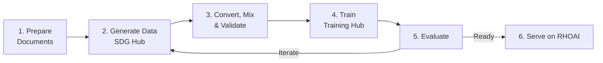

# End-to-End Knowledge Tuning Pipeline

This walkthrough takes you through the complete model customization lifecycle: preparing documents, generating synthetic training data, training a model, evaluating it, and preparing for deployment.

!!! success "Validated on RHOAI 3.4.2"
    This pipeline has been validated on RHOAI 3.4.2. Key validated results:

    - **SDG Hub** outputs `question`/`response` columns (not `messages`)
    - **Data mixing** correctly converts to `messages` format with `unmask: true`
    - **OSFT** uses `unfreeze_rank_ratio=0.01` (preserves general capability)
    - **LoRA SFT** option available alongside SFT and OSFT
    - **Hyperparameters** aligned: `num_epochs=4`, `learning_rate=2e-5`, `effective_batch_size=32`

## Pipeline Overview



## Step 1: Prepare Documents

Convert your source documents to structured text. Use Docling for PDFs and web pages:

```python
from docling.document_converter import DocumentConverter

converter = DocumentConverter()

sources = [
    "https://docs.example.com/product-guide.html",
    "/path/to/technical-manual.pdf",
]

documents = []
for source in sources:
    result = converter.convert(source)
    documents.append(result.document.export_to_markdown())

print(f"Prepared {len(documents)} documents")
```

Create a seed dataset with document chunks:

```python
from datasets import Dataset

chunks = []
for doc in documents:
    for i in range(0, len(doc), 1500):
        chunks.append(doc[i:i+2000])

dataset = Dataset.from_dict({
    "document": chunks,
    "document_outline": [""] * len(chunks),
    "domain": ["your-domain"] * len(chunks),
    "icl_document": [""] * len(chunks),
    "icl_query_1": [""] * len(chunks),
    "icl_query_2": [""] * len(chunks),
    "icl_query_3": [""] * len(chunks),
})

print(f"Created {len(dataset)} document chunks")
```

## Step 2: Generate Training Data

Run multiple SDG Hub knowledge tuning flow variants for diverse training examples:

```python
from sdg_hub import Flow, FlowRegistry

FlowRegistry.discover_flows()

FLOW_VARIANTS = {
    "extractive_summary": "Extractive Summary Knowledge Tuning Dataset Generation Flow",
    "detailed_summary": "Detailed Summary Knowledge Tuning Dataset Generation Flow",
    "key_facts": "Key Facts Knowledge Tuning Dataset Generation Flow",
    "doc_direct_qa": "Document Based Knowledge Tuning Dataset Generation Flow",
}

generated_data = {}
for variant_name, flow_display_name in FLOW_VARIANTS.items():
    flow_path = FlowRegistry.get_flow_path(flow_display_name)
    if flow_path is None:
        print(f"WARNING: {flow_display_name} not found, skipping")
        continue
    flow = Flow.from_yaml(flow_path)
    flow.set_model_config(model="gpt-4o-mini")
    result = flow.generate(dataset)
    result_df = result.to_pandas() if hasattr(result, "to_pandas") else result
    result_df.to_json(f"{variant_name}.jsonl", orient="records", lines=True)
    generated_data[variant_name] = result_df
    print(f"{variant_name}: {len(result_df)} examples")
```

## Step 3: Convert, Mix, and Validate

!!! warning "SDG Hub outputs `question`/`response` columns — not `messages`"
    Knowledge tuning flows produce rows with `question` and `response` columns. Training Hub expects the `messages` chat format. You **must** convert before training. For knowledge tuning, also set `"unmask": true` so the loss is computed on all message roles (not just assistant).

Convert SDG Hub output to Training Hub format, then combine all variants:

```python
import pandas as pd
import json

def convert_to_messages(df):
    """Convert question/response rows to messages format for Training Hub."""
    records = []
    for _, row in df.iterrows():
        if "question" not in row or "response" not in row:
            continue
        records.append({
            "messages": [
                {"role": "user", "content": str(row["question"])},
                {"role": "assistant", "content": str(row["response"])},
            ],
            "unmask": True,
        })
    return pd.DataFrame(records)

dfs = []
for name in FLOW_VARIANTS:
    raw = pd.read_json(f"{name}.jsonl", lines=True)
    converted = convert_to_messages(raw)
    dfs.append(converted)
    print(f"{name}: {len(raw)} raw → {len(converted)} converted")

combined = pd.concat(dfs, ignore_index=True)
combined = combined.drop_duplicates(subset=["messages"])
combined = combined.sample(frac=1, random_state=42).reset_index(drop=True)

combined.to_json("training_data.jsonl", orient="records", lines=True)
print(f"Final training set: {len(combined)} examples")
```

## Step 4: Train

Choose your algorithm based on the [decision guide](../getting-started/choosing-an-algorithm.md):

=== "OSFT (Recommended)"

    Preserves base knowledge while adding domain expertise:

    ```python
    from training_hub import osft

    osft(
        model_path="meta-llama/Llama-3.1-8B-Instruct",
        data_path="training_data.jsonl",
        ckpt_output_dir="./knowledge-model",
        unfreeze_rank_ratio=0.01,
        unmask_messages=True,
        effective_batch_size=32,
        max_tokens_per_gpu=16384,
        max_seq_len=4096,
        learning_rate=2e-5,
        num_epochs=4,
    )
    ```

=== "SFT (Maximum Capacity)"

    Full parameter update for maximum learning:

    ```python
    from training_hub import sft

    sft(
        model_path="meta-llama/Llama-3.1-8B-Instruct",
        data_path="training_data.jsonl",
        ckpt_output_dir="./knowledge-model",
        num_epochs=4,
        effective_batch_size=32,
        max_seq_len=4096,
    )
    ```

=== "LoRA (Memory Efficient)"

    Single-GPU fine-tuning:

    ```python
    from training_hub import lora_sft

    lora_sft(
        model_path="meta-llama/Llama-3.1-8B-Instruct",
        data_path="training_data.jsonl",
        ckpt_output_dir="./knowledge-model",
        num_epochs=4,
        lora_r=16,
        lora_alpha=32,
    )
    ```

!!! tip "Where is my trained model?"
    Training Hub writes the final model to `{ckpt_output_dir}/hf_format/samples_0/`. Use this path for evaluation, serving, and further training.

## Step 5: Evaluate

### Training Loss

```python
from training_hub import plot_loss

plot_loss("./knowledge-model")
```

### Domain Accuracy

Generate a held-out evaluation set and test the model:

```python
from sdg_hub import Flow, FlowRegistry

FlowRegistry.discover_flows()
flow = Flow.from_yaml(FlowRegistry.get_flow_path(
    "Document Based Knowledge Tuning Dataset Generation Flow"
))
flow.set_model_config(model="gpt-4o-mini")
eval_data = flow.generate(held_out_dataset)
```

Compare the fine-tuned model's answers against the teacher's answers using LLM-as-judge or exact match metrics.

## Step 6: Serve on RHOAI

Deploy the trained model via KServe with vLLM runtime:

```yaml
apiVersion: serving.kserve.io/v1beta1
kind: InferenceService
metadata:
  name: knowledge-model
  annotations:
    serving.kserve.io/deploymentMode: RawDeployment
spec:
  predictor:
    tolerations:
      - key: nvidia.com/gpu
        operator: Exists
        effect: NoSchedule
    model:
      modelFormat:
        name: vLLM
      runtime: vllm-runtime
      storageUri: s3://models/knowledge-model
      resources:
        requests:
          cpu: "2"
          memory: "8Gi"
          nvidia.com/gpu: "1"
        limits:
          cpu: "4"
          memory: "16Gi"
          nvidia.com/gpu: "1"
```

## Full Example

The complete pipeline is available as a runnable Jupyter notebook:

- **Notebook:** [`model_customization_e2e.ipynb`](https://github.com/rrbanda/rhoai/blob/main/end-to-end-examples/knowledge-tuning/model_customization_e2e.ipynb)
- **Scripts:** [`end-to-end-examples/knowledge-tuning/examples/`](https://github.com/rrbanda/rhoai/tree/main/end-to-end-examples/knowledge-tuning/examples)

## Related

- [Choosing an Algorithm](../getting-started/choosing-an-algorithm.md) — Algorithm selection guide
- [Knowledge Tuning Data](../data-generation/knowledge-tuning.md) — Detailed data generation guide
- [MCP Distillation Pipeline](mcp-distillation.md) — Alternative pipeline for tool-use training
