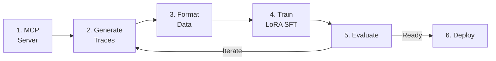

# End-to-End MCP Distillation Pipeline

MCP (Model Context Protocol) distillation teaches a smaller model to use tools by learning from a frontier model's tool-use behavior. A teacher model explores your MCP servers, generating high-quality tool-use traces that train the student model.

!!! warning "GRPO is not available on RHOAI 3.4.2"
    The `training-hub` package pre-installed in the RHOAI 3.4.2 ClusterTrainingRuntime includes `lora_sft`, `sft`, and `osft` — but **not `lora_grpo`**. To use GRPO, you must install `training-hub[grpo,lora]` locally or in a custom container image. The RHOAI TrainJob section below uses **LoRA SFT** as the validated on-cluster training method.

!!! tip "Looking for a validated, production-ready example?"
    The [Tool-Calling Model Pipeline](tool-calling-financial.md) uses MCP distillation + **LoRA SFT** and has been validated end-to-end on RHOAI 3.4.2. This page documents the generic pipeline with both training options.

## Pipeline Overview



## Step 1: Set Up Your MCP Server

Create or connect to an MCP server. Here's a minimal example using FastMCP:

```python
from mcp.server.fastmcp import FastMCP

mcp = FastMCP("E-Commerce API")

PRODUCTS = [
    {"id": 1, "name": "Widget", "price": 15.99, "category": "tools"},
    {"id": 2, "name": "Gadget", "price": 24.99, "category": "electronics"},
]

@mcp.tool()
def search_products(query: str, max_price: float | None = None) -> list[dict]:
    """Search products by name or category."""
    results = [p for p in PRODUCTS if query.lower() in p["name"].lower()
               or query.lower() in p["category"].lower()]
    if max_price:
        results = [p for p in results if p["price"] <= max_price]
    return results

@mcp.tool()
def get_product(product_id: int) -> dict | None:
    """Get product details by ID."""
    return next((p for p in PRODUCTS if p["id"] == product_id), None)
```

## Step 2: Generate Tool-Use Traces

!!! tip "Skip this step with sample data"
    The repository includes pre-generated sample data in `examples/sample_data/`. You can jump straight to training:

    - **On RHOAI:** Upload `sample_data/training_data.jsonl` to the PVC and follow the [TrainJob section](#option-b-train-on-rhoai-with-trainjob-lora-sft-recommended) below.
    - **Locally:** `python 03_train_grpo.py --data-path sample_data/training_data.jsonl`

    Use this path to validate the full train → deploy → serve pipeline before investing in Langflow setup.

Use SDG Hub's MCP distillation flow. The teacher LLM explores your MCP server, discovering tools and generating realistic usage scenarios:

```python
import pandas as pd
from sdg_hub import Flow, FlowRegistry

FlowRegistry.discover_flows()
flow_path = FlowRegistry.get_flow_path("MCP Server Distillation")
if flow_path is None:
    raise RuntimeError("MCP Server Distillation flow not found. Install: pip install sdg-hub[examples]")

flow = Flow.from_yaml(flow_path)

flow.set_model_config(model="gpt-4o", api_key="...")  # Teacher model

flow.set_agent_config(
    agent_framework="langflow",
    agent_url="http://localhost:7860/api/v1/run/your-flow-id",
)

seed_data = pd.DataFrame({
    "tool_list": [[
        {"name": "search_products", "description": "Search products by name or category",
         "inputSchema": {"type": "object", "properties": {"query": {"type": "string"}}, "required": ["query"]}},
        {"name": "get_product", "description": "Get product details by ID",
         "inputSchema": {"type": "object", "properties": {"product_id": {"type": "integer"}}, "required": ["product_id"]}},
    ]],
    "mcp_server_name": ["E-Commerce API"],
    "mcp_server_description": ["Product catalog with search and detail views"],
})

result = flow.generate(seed_data)
result_df = result.to_pandas() if hasattr(result, "to_pandas") else result
result_df.to_json("tool_traces.jsonl", orient="records", lines=True)
```

The teacher model:

1. **Discovers** available tools and their schemas
2. **Generates** diverse user queries that require tool use
3. **Executes** tool calls against the real MCP server
4. **Produces** complete conversation traces with tool calls and results

## Step 3: Format Training Data

Convert the raw traces into the messages format expected by Training Hub. The MCP distillation flow outputs an `extract_agent_text_tool_trace` column containing structured tool-call traces:

```python
import json
import pandas as pd
from sdg_hub.core.utils.message_formatter import tool_trace_to_messages

df = pd.read_json("tool_traces.jsonl", lines=True)

training_records = []
for _, row in df.iterrows():
    tool_trace = row["extract_agent_text_tool_trace"]
    question = row["question"]
    messages = tool_trace_to_messages(question, tool_trace)
    training_records.append({"messages": messages})

pd.DataFrame(training_records).to_json(
    "grpo_training_data.jsonl", orient="records", lines=True
)
```

## Step 4: Train

### Option A: Train locally with GRPO

!!! warning "GRPO requires local installation — not runtime-validated"
    GRPO is **not available** in the RHOAI 3.4.2 ClusterTrainingRuntime. Use this option only when running locally or in a custom container. Local GRPO training has not been runtime-validated. If issues arise, use LoRA SFT (Option B) which has been validated on RHOAI 3.4.2.

```bash
pip install training-hub[grpo,lora]
```

```python
from training_hub import lora_grpo

lora_grpo(
    model_path="meta-llama/Llama-3.1-8B-Instruct",
    data_path="grpo_training_data.jsonl",
    ckpt_output_dir="./tool-use-model",
    num_iterations=15,
    lora_r=16,
    lora_alpha=8,
    backend="art",
)
```

!!! info "GRPO vs LoRA SFT for tool-use"
    GRPO learns from verifiable rewards (did the tool call succeed?) rather than just imitating examples. This can produce models that generalize better to unseen tool combinations. However, LoRA SFT on expert traces is faster to train, simpler to set up, and is the [validated method on RHOAI](tool-calling-financial.md). Use GRPO when you want reward-based exploration; use LoRA SFT when you have high-quality expert demonstrations from MCP distillation.

### Option B: Train on RHOAI with TrainJob (LoRA SFT) — Recommended

The RHOAI-native approach uses the **Kubeflow Trainer** with the pre-installed `training-hub` ClusterTrainingRuntime. Since GRPO is not included in the RHOAI 3.4.2 runtime, this section uses **LoRA SFT** — the same validated approach used by the [Tool-Calling Model Pipeline](tool-calling-financial.md).

!!! info "Why LoRA SFT instead of GRPO on-cluster?"
    The `training-hub` package in the RHOAI 3.4.2 ClusterTrainingRuntime exports: `lora_sft`, `sft`, `osft`, `estimate`, `plot_loss`. GRPO (`lora_grpo`) requires `pip install training-hub[grpo,lora]` which is not pre-installed. LoRA SFT on MCP distillation traces produces strong tool-calling models — the frontier model already generated expert demonstrations, so imitation learning is effective.

**Prerequisite:** Verify the Trainer is enabled and the runtime exists:

```bash
oc get dsc default-dsc -o jsonpath='{.spec.components.trainer.managementState}' && echo
# Expected: Managed

oc get clustertrainingruntimes training-hub
# Expected: training-hub   (pre-installed by RHOAI 3.4+)
```

#### Create namespace and workspace PVC

```bash
oc new-project mcp-distillation

cat <<'YAML' | oc apply -n mcp-distillation -f -
apiVersion: v1
kind: PersistentVolumeClaim
metadata:
  name: mcp-workspace
spec:
  accessModes: [ReadWriteOnce]
  storageClassName: gp3-csi
  resources:
    requests:
      storage: 50Gi
YAML
```

#### Create the training script ConfigMap

```bash
cat <<'YAML' | oc apply -n mcp-distillation -f -
apiVersion: v1
kind: ConfigMap
metadata:
  name: mcp-train-script
data:
  train.py: |
    """MCP distillation training via Training Hub LoRA SFT on RHOAI."""
    import os, sys

    WORKSPACE = os.environ.get("WORKSPACE_PATH", "/workspace")
    DATA_DIR = os.path.join(WORKSPACE, "data")
    OUTPUT_DIR = os.path.join(WORKSPACE, "output")
    os.makedirs(OUTPUT_DIR, exist_ok=True)

    data_path = os.path.join(DATA_DIR, "training_data.jsonl")
    if not os.path.isfile(data_path):
        print(f"ERROR: Training data not found at {data_path}")
        print("Upload your training data to the PVC first.")
        sys.exit(1)

    with open(data_path) as f:
        count = sum(1 for _ in f)
    print(f"Found {count} training examples at {data_path}")

    from training_hub import lora_sft
    lora_sft(
        model_path=os.environ.get("MODEL_PATH", "Qwen/Qwen3-4B"),
        data_path=data_path,
        ckpt_output_dir=OUTPUT_DIR,
        lora_r=16,
        lora_alpha=32,
        num_epochs=3,
        learning_rate=2e-4,
        effective_batch_size=32,
        micro_batch_size=2,
        max_seq_len=2048,
        load_in_4bit=True,
        lr_scheduler="cosine",
        seed=42,
    )
    print(f"Training complete. Output saved to: {OUTPUT_DIR}")
YAML
```

#### Upload training data to the PVC

!!! note "OpenShift permission handling"
    OpenShift runs containers as a non-root UID. The `fsGroup: 0` setting ensures the PVC is group-writable by the OpenShift-assigned user. Do not use `securityContext.runAsUser: 0` — OpenShift SCCs will reject it.

```bash
# Create a helper pod that mounts the PVC
oc run data-helper --image=busybox -n mcp-distillation \
  --overrides='{"spec":{"containers":[{"name":"data-helper","image":"busybox","command":["sleep","300"],"volumeMounts":[{"mountPath":"/workspace","name":"ws"}]}],"securityContext":{"fsGroup":0},"volumes":[{"name":"ws","persistentVolumeClaim":{"claimName":"mcp-workspace"}}]}}'

# Wait for the pod to be ready, create the data directory, and copy
oc wait pod/data-helper -n mcp-distillation --for=condition=Ready --timeout=60s
oc exec data-helper -n mcp-distillation -- mkdir -p /workspace/data
oc cp training_data.jsonl mcp-distillation/data-helper:/workspace/data/training_data.jsonl

# Verify the upload
oc exec data-helper -n mcp-distillation -- wc -l /workspace/data/training_data.jsonl

# Clean up the helper pod
oc delete pod data-helper -n mcp-distillation --wait=false
```

#### Submit the TrainJob

```bash
cat <<'YAML' | oc apply -n mcp-distillation -f -
apiVersion: trainer.kubeflow.org/v1alpha1
kind: TrainJob
metadata:
  name: mcp-distillation-lora
spec:
  runtimeRef:
    name: training-hub
    kind: ClusterTrainingRuntime
  trainer:
    command:
      - python
      - /scripts/train.py
    numNodes: 1
    resourcesPerNode:
      requests:
        cpu: "2"
        memory: "10Gi"
        nvidia.com/gpu: "1"
      limits:
        cpu: "2"
        memory: "10Gi"
        nvidia.com/gpu: "1"
    env:
      - name: WORKSPACE_PATH
        value: /workspace
      - name: MODEL_PATH
        value: Qwen/Qwen3-4B
  podTemplateOverrides:
    - targetJobs:
        - name: node
      spec:
        tolerations:
          - key: nvidia.com/gpu
            operator: Exists
            effect: NoSchedule
        volumes:
          - name: workspace
            persistentVolumeClaim:
              claimName: mcp-workspace
          - name: scripts
            configMap:
              name: mcp-train-script
        containers:
          - name: node
            volumeMounts:
              - name: workspace
                mountPath: /workspace
              - name: scripts
                mountPath: /scripts
YAML
```

#### Monitor and verify

```bash
# Watch the TrainJob status until it shows Complete
oc get trainjob mcp-distillation-lora -n mcp-distillation -w

# Stream training logs (loss should decrease over epochs)
oc logs -f $(oc get pods -n mcp-distillation -l batch.kubernetes.io/job-name=mcp-distillation-lora-node -o name) -n mcp-distillation

# Verify checkpoint output after training completes
oc run verify-output --rm -i --restart=Never --image=busybox -n mcp-distillation \
  --overrides='{"spec":{"containers":[{"name":"verify","image":"busybox","command":["ls","-la","/workspace/output/"],"volumeMounts":[{"mountPath":"/workspace","name":"ws"}]}],"securityContext":{"fsGroup":0},"volumes":[{"name":"ws","persistentVolumeClaim":{"claimName":"mcp-workspace"}}]}}'
```

Expected output includes: `adapter_config.json`, `adapter_model.safetensors` (~132MB), `tokenizer.json`, `tokenizer_config.json`, `training_metrics.jsonl`.

## Step 5: Evaluate (Optional)

!!! info "Not runtime-validated"
    This evaluation step requires Langflow, an MCP server, and a GPT-4o API key. It has not been runtime-validated on RHOAI. You can skip this step and proceed directly to [Step 6: Deploy](#step-6-deploy-on-rhoai). For details on evaluation approaches, see [Tool-Use Evaluation](../evaluation/agent-evaluation.md).

Generate an evaluation benchmark and test the model's tool-use quality:

```python
import pandas as pd
from sdg_hub import Flow, FlowRegistry

FlowRegistry.discover_flows()

# Reuse the same seed data from Step 2 to generate evaluation scenarios
eval_seed_data = seed_data  # same tool_list / mcp_server_name DataFrame

eval_flow = Flow.from_yaml(FlowRegistry.get_flow_path("MCP Server Distillation"))
eval_flow.set_model_config(model="gpt-4o", api_key="...")
eval_flow.set_agent_config(
    agent_framework="langflow",
    agent_url="http://localhost:7860/api/v1/run/your-flow-id",
)
eval_data = eval_flow.generate(eval_seed_data)

# Score the model's traces using LLM-as-judge
judge_path = FlowRegistry.get_flow_path("Agent Tool-Use Evaluation")
if judge_path is None:
    raise RuntimeError("Eval flow not found. Ensure sdg-hub is installed.")
judge_flow = Flow.from_yaml(judge_path)
judge_flow.set_model_config(model="gpt-4o", api_key="...")
scores = judge_flow.generate(eval_data)
```

Evaluation metrics:

| Metric | What it measures |
|--------|-----------------|
| Tool selection accuracy | Did the model call the right tool? |
| Argument correctness | Were the arguments well-formed? |
| Response quality | Did the model use the tool result correctly? |
| Multi-step success | Can the model chain multiple tool calls? |

## Step 6: Deploy on RHOAI

After training, deploy the LoRA adapter on RHOAI with KServe + vLLM. This deployment pattern has been runtime-validated on RHOAI 3.4.2.

!!! warning "Base model must be on the PVC"
    vLLM needs the base model weights at serving time. Download the base model to the PVC before deploying. Avoid using `storageUri: pvc://` with a separate model path — mount the PVC directly in the ServingRuntime and set `--model` to the PVC path.

#### Download base model to PVC

!!! note "Why this works without `fsGroup`"
    The data upload step above (using `fsGroup: 0`) made the PVC directories group-writable. This Job runs as the OpenShift-assigned UID which inherits group-write access. Do **not** add `securityContext.fsGroup: 0` to Job specs — OpenShift SCCs reject it for Jobs.

```bash
cat <<'YAML' | oc apply -n mcp-distillation -f -
apiVersion: batch/v1
kind: Job
metadata:
  name: download-model
spec:
  template:
    spec:
      restartPolicy: Never
      tolerations:
        - key: nvidia.com/gpu
          operator: Exists
          effect: NoSchedule
      containers:
        - name: download
          image: registry.redhat.io/rhoai/odh-th06-cuda130-torch210-py312-rhel9@sha256:c18bb50a0082f9258afeb95cf9d8bbc6af7a48e712a7587073f2b281ca2200b8
          command: ["python3", "-c"]
          args:
            - |
              from huggingface_hub import snapshot_download
              import os
              target = "/workspace/base-model"
              os.makedirs(target, exist_ok=True)
              snapshot_download(
                  repo_id="Qwen/Qwen3-4B",
                  local_dir=target,
                  ignore_patterns=["*.gguf", "*.bin"],
              )
              print("Download complete!")
          resources:
            requests:
              cpu: "2"
              memory: "8Gi"
            limits:
              cpu: "2"
              memory: "8Gi"
          volumeMounts:
            - name: workspace
              mountPath: /workspace
      volumes:
        - name: workspace
          persistentVolumeClaim:
            claimName: mcp-workspace
YAML

# Wait for download to complete (~3-5 min)
oc wait job/download-model -n mcp-distillation --for=condition=complete --timeout=600s
```

#### Deploy with KServe

```bash
cat <<'YAML' | oc apply -n mcp-distillation -f -
apiVersion: serving.kserve.io/v1alpha1
kind: ServingRuntime
metadata:
  name: vllm-lora-runtime
  annotations:
    openshift.io/display-name: "vLLM LoRA Runtime"
spec:
  supportedModelFormats:
    - name: vLLM
      autoSelect: true
  multiModel: false
  containers:
    - name: kserve-container
      image: registry.redhat.io/rhaii/vllm-cuda-rhel9@sha256:5800e12b2a465f15961fcf34b645d79ed4f91ec9161eab22b1205d12682183c8
      command: ["python", "-m", "vllm.entrypoints.openai.api_server"]
      args:
        - "--port=8080"
        - "--model=/workspace/base-model"
        - "--enable-lora"
        - "--lora-modules"
        - "mcp-distillation-lora=/workspace/output"
        - "--max-lora-rank=64"
        - "--max-model-len=4096"
        - "--enable-auto-tool-choice"
        - "--tool-call-parser=hermes"
      ports:
        - containerPort: 8080
          protocol: TCP
      volumeMounts:
        - name: workspace
          mountPath: /workspace
  volumes:
    - name: workspace
      persistentVolumeClaim:
        claimName: mcp-workspace
---
apiVersion: serving.kserve.io/v1beta1
kind: InferenceService
metadata:
  name: mcp-distillation-model
  annotations:
    serving.kserve.io/deploymentMode: RawDeployment
spec:
  predictor:
    model:
      runtime: vllm-lora-runtime
      modelFormat:
        name: vLLM
      resources:
        requests:
          cpu: "2"
          memory: "10Gi"
          nvidia.com/gpu: "1"
        limits:
          cpu: "2"
          memory: "10Gi"
          nvidia.com/gpu: "1"
    tolerations:
      - key: nvidia.com/gpu
        operator: Exists
        effect: NoSchedule
YAML
```

#### Test inference

```bash
# Get the predictor pod IP
POD_IP=$(oc get pod -l app=isvc.mcp-distillation-model-predictor \
  -n mcp-distillation -o jsonpath='{.items[0].status.podIP}')

# Send a tool-calling request
oc run test-inference --rm -i --restart=Never --image=curlimages/curl \
  -n mcp-distillation -- -s -X POST "http://${POD_IP}:8080/v1/chat/completions" \
  -H "Content-Type: application/json" \
  -d '{
    "model": "mcp-distillation-lora",
    "messages": [
      {"role": "system", "content": "You are a helpful financial assistant."},
      {"role": "user", "content": "What is the stock price of AAPL?"}
    ],
    "tools": [{
      "type": "function",
      "function": {
        "name": "get_stock_price",
        "description": "Get stock price for a ticker",
        "parameters": {
          "type": "object",
          "properties": {"ticker": {"type": "string"}},
          "required": ["ticker"]
        }
      }
    }],
    "max_tokens": 200,
    "temperature": 0
  }'
```

The response should include `tool_calls` with `get_stock_price({"ticker": "AAPL"})`.

## Full Example

- **Notebook:** [`mcp_distillation_e2e.ipynb`](https://github.com/rrbanda/rhoai/blob/main/end-to-end-examples/mcp-distillation/mcp_distillation_e2e.ipynb)
- **Scripts:** [`end-to-end-examples/mcp-distillation/examples/`](https://github.com/rrbanda/rhoai/tree/main/end-to-end-examples/mcp-distillation/examples)
- **Demo Server:** [`end-to-end-examples/mcp-distillation/demo_server/`](https://github.com/rrbanda/rhoai/tree/main/end-to-end-examples/mcp-distillation/demo_server)

## Related

- [Tool-Calling Model Pipeline](tool-calling-financial.md) — Full end-to-end example using MCP distillation + LoRA SFT for financial services (validated on RHOAI 3.4.2)
- [GRPO](../training/grpo.md) — Training algorithm details
- [Tool-Use Evaluation](../evaluation/agent-evaluation.md) — Evaluate tool-calling models
- [Knowledge Tuning Pipeline](knowledge-tuning.md) — Alternative pipeline for knowledge injection
