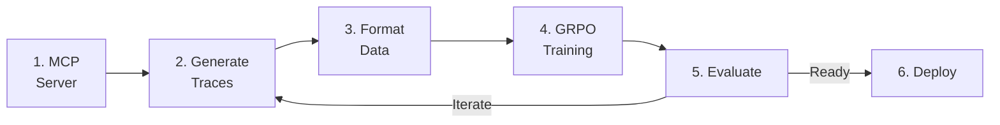

# End-to-End MCP Distillation Pipeline (GRPO)

MCP (Model Context Protocol) distillation teaches a smaller model to use tools by learning from a frontier model's tool-use behavior. A teacher model explores your MCP servers, generating high-quality tool-use traces that train the student model. This page documents the **GRPO-based** variant of the pipeline.

!!! tip "Looking for a validated, production-ready example?"
    The [Tool-Calling Model Pipeline](tool-calling-financial.md) uses MCP distillation + **LoRA SFT** (not GRPO) and has been validated end-to-end on RHOAI 3.4.2. This page documents the generic GRPO-based pipeline for reference.

## Pipeline Overview



## Step 1: Set Up Your MCP Server

Create or connect to an MCP server. Here's a minimal example using FastMCP:

```python
from mcp.server.fastmcp import FastMCP

mcp = FastMCP("E-Commerce API")

PRODUCTS = [
    {"id": 1, "name": "Widget", "price": 15.99, "category": "tools"},
    {"id": 2, "name": "Gadget", "price": 24.99, "category": "electronics"},
]

@mcp.tool()
def search_products(query: str, max_price: float | None = None) -> list[dict]:
    """Search products by name or category."""
    results = [p for p in PRODUCTS if query.lower() in p["name"].lower()
               or query.lower() in p["category"].lower()]
    if max_price:
        results = [p for p in results if p["price"] <= max_price]
    return results

@mcp.tool()
def get_product(product_id: int) -> dict | None:
    """Get product details by ID."""
    return next((p for p in PRODUCTS if p["id"] == product_id), None)
```

## Step 2: Generate Tool-Use Traces

!!! tip "Skip this step with sample data"
    The repository includes pre-generated sample data in `examples/sample_data/`. To jump straight to training:

    ```bash
    # Use the included sample data — no Langflow or API keys needed
    python 03_train_grpo.py --data-path sample_data/training_data.jsonl
    ```

    Then continue from [Step 4](#step-4-train-with-grpo). Use this path to validate the full train → deploy → serve pipeline before investing in Langflow setup.

Use SDG Hub's MCP distillation flow. The teacher LLM explores your MCP server, discovering tools and generating realistic usage scenarios:

```python
import pandas as pd
from sdg_hub import Flow, FlowRegistry

FlowRegistry.discover_flows()
flow_path = FlowRegistry.get_flow_path("MCP Server Distillation")
if flow_path is None:
    raise RuntimeError("MCP Server Distillation flow not found. Install: pip install sdg-hub[examples]")

flow = Flow.from_yaml(flow_path)

flow.set_model_config(model="gpt-4o", api_key="...")  # Teacher model

flow.set_agent_config(
    agent_framework="langflow",
    agent_url="http://localhost:7860/api/v1/run/your-flow-id",
)

seed_data = pd.DataFrame({
    "tool_list": [[
        {"name": "search_products", "description": "Search products by name or category",
         "inputSchema": {"type": "object", "properties": {"query": {"type": "string"}}, "required": ["query"]}},
        {"name": "get_product", "description": "Get product details by ID",
         "inputSchema": {"type": "object", "properties": {"product_id": {"type": "integer"}}, "required": ["product_id"]}},
    ]],
    "mcp_server_name": ["E-Commerce API"],
    "mcp_server_description": ["Product catalog with search and detail views"],
})

result = flow.generate(seed_data)
result_df = result.to_pandas() if hasattr(result, "to_pandas") else result
result_df.to_json("tool_traces.jsonl", orient="records", lines=True)
```

The teacher model:

1. **Discovers** available tools and their schemas
2. **Generates** diverse user queries that require tool use
3. **Executes** tool calls against the real MCP server
4. **Produces** complete conversation traces with tool calls and results

## Step 3: Format Training Data

Convert the raw traces into the messages format expected by Training Hub. The MCP distillation flow outputs an `extract_agent_text_tool_trace` column containing structured tool-call traces:

```python
import json
import pandas as pd
from sdg_hub.core.utils.message_formatter import tool_trace_to_messages

df = pd.read_json("tool_traces.jsonl", lines=True)

training_records = []
for _, row in df.iterrows():
    tool_trace = row["extract_agent_text_tool_trace"]
    question = row["question"]
    messages = tool_trace_to_messages(question, tool_trace)
    training_records.append({"messages": messages})

pd.DataFrame(training_records).to_json(
    "grpo_training_data.jsonl", orient="records", lines=True
)
```

## Step 4: Train with GRPO

Use GRPO (Group Relative Policy Optimization) to train the student model:

```bash
pip install training-hub[grpo,lora]
```

```python
from training_hub import lora_grpo

lora_grpo(
    model_path="meta-llama/Llama-3.1-8B-Instruct",
    data_path="grpo_training_data.jsonl",
    ckpt_output_dir="./tool-use-model",
    num_iterations=15,
    lora_r=16,
    lora_alpha=8,
    backend="art",
)
```

!!! info "GRPO vs LoRA SFT for tool-use"
    GRPO learns from verifiable rewards (did the tool call succeed?) rather than just imitating examples. This can produce models that generalize better to unseen tool combinations. However, LoRA SFT on expert traces is faster to train, simpler to set up, and has a [validated pipeline on RHOAI](tool-calling-financial.md). Use GRPO when you want reward-based exploration; use LoRA SFT when you have high-quality expert demonstrations from MCP distillation.

### Training on RHOAI with TrainJob

The RHOAI-native approach uses the **Kubeflow Trainer** with the pre-installed `training-hub` ClusterTrainingRuntime. This runs directly on GPU nodes with no local Python environment required.

**Prerequisite:** Verify the Trainer is enabled and the runtime exists:

```bash
oc get dsc default-dsc -o jsonpath='{.spec.components.trainer.managementState}' && echo
# Expected: Managed

oc get clustertrainingruntimes training-hub
# Expected: training-hub   (pre-installed by RHOAI 3.4+)
```

#### Create namespace and workspace PVC

```bash
oc new-project mcp-distillation

cat <<'YAML' | oc apply -n mcp-distillation -f -
apiVersion: v1
kind: PersistentVolumeClaim
metadata:
  name: grpo-workspace
spec:
  accessModes: [ReadWriteOnce]
  storageClassName: gp3-csi
  resources:
    requests:
      storage: 50Gi
YAML
```

#### Create the training script ConfigMap

```bash
cat <<'YAML' | oc apply -n mcp-distillation -f -
apiVersion: v1
kind: ConfigMap
metadata:
  name: grpo-train-script
data:
  train.py: |
    """GRPO training via Training Hub on RHOAI."""
    import os, sys

    WORKSPACE = os.environ.get("WORKSPACE_PATH", "/workspace")
    DATA_DIR = os.path.join(WORKSPACE, "data")
    OUTPUT_DIR = os.path.join(WORKSPACE, "output")
    os.makedirs(OUTPUT_DIR, exist_ok=True)

    data_path = os.path.join(DATA_DIR, "training_data.jsonl")
    if not os.path.isfile(data_path):
        print(f"ERROR: Training data not found at {data_path}")
        print("Upload your training data to the PVC first.")
        sys.exit(1)

    with open(data_path) as f:
        count = sum(1 for _ in f)
    print(f"Found {count} training examples at {data_path}")

    from training_hub import lora_grpo
    lora_grpo(
        model_path=os.environ.get("MODEL_PATH", "Qwen/Qwen3-4B"),
        data_path=data_path,
        ckpt_output_dir=OUTPUT_DIR,
        lora_r=16,
        lora_alpha=8,
        num_iterations=15,
        group_size=8,
        backend="art",
    )
    print(f"Training complete. Output saved to: {OUTPUT_DIR}")
YAML
```

#### Upload training data to the PVC

```bash
oc run copy-data --rm -i --restart=Never --image=busybox \
  -n mcp-distillation \
  --overrides='{"spec":{"containers":[{"name":"copy","image":"busybox","command":["sh","-c","mkdir -p /workspace/data && cat > /workspace/data/training_data.jsonl"],"stdin":true,"volumeMounts":[{"mountPath":"/workspace","name":"ws"}]}],"volumes":[{"name":"ws","persistentVolumeClaim":{"claimName":"grpo-workspace"}}]}}' \
  < training_data.jsonl
```

#### Submit the TrainJob

```bash
cat <<'YAML' | oc apply -n mcp-distillation -f -
apiVersion: trainer.kubeflow.org/v1alpha1
kind: TrainJob
metadata:
  name: mcp-distillation-grpo
spec:
  runtimeRef:
    name: training-hub
    apiGroup: trainer.kubeflow.org
    kind: ClusterTrainingRuntime
  trainer:
    command:
      - python
      - /scripts/train.py
    numNodes: 1
    resourcesPerNode:
      requests:
        cpu: "2"
        memory: "16Gi"
        nvidia.com/gpu: "1"
      limits:
        cpu: "2"
        memory: "16Gi"
        nvidia.com/gpu: "1"
    env:
      - name: WORKSPACE_PATH
        value: /workspace
      - name: MODEL_PATH
        value: Qwen/Qwen3-4B
  podTemplateOverrides:
    - targetJobs:
        - name: node
      spec:
        tolerations:
          - key: nvidia.com/gpu
            operator: Exists
            effect: NoSchedule
        volumes:
          - name: workspace
            persistentVolumeClaim:
              claimName: grpo-workspace
          - name: scripts
            configMap:
              name: grpo-train-script
        containers:
          - name: node
            volumeMounts:
              - name: workspace
                mountPath: /workspace
              - name: scripts
                mountPath: /scripts
YAML
```

!!! note "GPU memory for GRPO"
    GRPO generates multiple completions per prompt (group_size=8), requiring more memory than LoRA SFT. With QLoRA 4-bit quantization, `Qwen/Qwen3-4B` fits on a single L4 24GB. For larger models, increase to an L40 or A100 and consider the `verl` backend with `numNodes > 1`.

#### Monitor and verify

```bash
oc get trainjob mcp-distillation-grpo -n mcp-distillation -w
oc logs -f job/mcp-distillation-grpo-node -n mcp-distillation

# Verify checkpoint output
oc run check --rm -i --restart=Never --image=busybox \
  -n mcp-distillation \
  --overrides='{"spec":{"containers":[{"name":"check","image":"busybox","command":["ls","-la","/workspace/output/"],"volumeMounts":[{"mountPath":"/workspace","name":"ws"}]}],"volumes":[{"name":"ws","persistentVolumeClaim":{"claimName":"grpo-workspace"}}]}}'
```

## Step 5: Evaluate

Generate an evaluation benchmark and test the model's tool-use quality:

```python
import pandas as pd
from sdg_hub import Flow, FlowRegistry

FlowRegistry.discover_flows()

# Reuse the same seed data from Step 2 to generate evaluation scenarios
eval_seed_data = seed_data  # same tool_list / mcp_server_name DataFrame

eval_flow = Flow.from_yaml(FlowRegistry.get_flow_path("MCP Server Distillation"))
eval_flow.set_model_config(model="gpt-4o", api_key="...")
eval_flow.set_agent_config(
    agent_framework="langflow",
    agent_url="http://localhost:7860/api/v1/run/your-flow-id",
)
eval_data = eval_flow.generate(eval_seed_data)

# Score the model's traces using LLM-as-judge
judge_path = FlowRegistry.get_flow_path("Agent Tool-Use Evaluation")
if judge_path is None:
    raise RuntimeError("Eval flow not found. Ensure sdg-hub is installed.")
judge_flow = Flow.from_yaml(judge_path)
judge_flow.set_model_config(model="gpt-4o", api_key="...")
scores = judge_flow.generate(eval_data)
```

Evaluation metrics:

| Metric | What it measures |
|--------|-----------------|
| Tool selection accuracy | Did the model call the right tool? |
| Argument correctness | Were the arguments well-formed? |
| Response quality | Did the model use the tool result correctly? |
| Multi-step success | Can the model chain multiple tool calls? |

## Step 6: Deploy

After training, deploy the GRPO-tuned model on RHOAI with KServe + vLLM. The deployment process is the same as for any LoRA adapter — see the [Serving Guide](../serving/index.md) for full KServe RawDeployment instructions, or follow the [Tool-Calling Model Pipeline Step 4](tool-calling-financial.md#step-4-deploy-the-fine-tuned-model-on-rhoai) for a worked example with YAML manifests.

## Full Example

- **Notebook:** [`mcp_distillation_e2e.ipynb`](https://github.com/rrbanda/rhoai/blob/main/end-to-end-examples/mcp-distillation/mcp_distillation_e2e.ipynb)
- **Scripts:** [`end-to-end-examples/mcp-distillation/examples/`](https://github.com/rrbanda/rhoai/tree/main/end-to-end-examples/mcp-distillation/examples)
- **Demo Server:** [`end-to-end-examples/mcp-distillation/demo_server/`](https://github.com/rrbanda/rhoai/tree/main/end-to-end-examples/mcp-distillation/demo_server)

## Related

- [Tool-Calling Model Pipeline](tool-calling-financial.md) — Full end-to-end example using MCP distillation + LoRA SFT for financial services (validated on RHOAI 3.4.2)
- [GRPO](../training/grpo.md) — Training algorithm details
- [Tool-Use Evaluation](../evaluation/agent-evaluation.md) — Evaluate tool-calling models
- [Knowledge Tuning Pipeline](knowledge-tuning.md) — Alternative pipeline for knowledge injection
