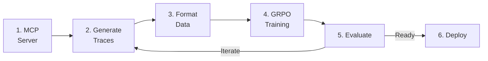

# End-to-End MCP Distillation Pipeline

MCP (Model Context Protocol) distillation teaches a smaller model to use tools by learning from a frontier model's tool-use behavior. A teacher model explores your MCP servers, generating high-quality tool-use traces that train the student model.

!!! tip "Looking for a validated, production-ready example?"
    The [Financial Agent Pipeline](financial-agent.md) uses MCP distillation + **LoRA SFT** (not GRPO) and has been validated end-to-end on RHOAI 3.4.2. This page documents the generic GRPO-based pipeline for reference.

## Pipeline Overview



## Step 1: Set Up Your MCP Server

Create or connect to an MCP server. Here's a minimal example using FastMCP:

```python
from mcp.server.fastmcp import FastMCP

mcp = FastMCP("E-Commerce API")

PRODUCTS = [
    {"id": 1, "name": "Widget", "price": 15.99, "category": "tools"},
    {"id": 2, "name": "Gadget", "price": 24.99, "category": "electronics"},
]

@mcp.tool()
def search_products(query: str, max_price: float | None = None) -> list[dict]:
    """Search products by name or category."""
    results = [p for p in PRODUCTS if query.lower() in p["name"].lower()
               or query.lower() in p["category"].lower()]
    if max_price:
        results = [p for p in results if p["price"] <= max_price]
    return results

@mcp.tool()
def get_product(product_id: int) -> dict | None:
    """Get product details by ID."""
    return next((p for p in PRODUCTS if p["id"] == product_id), None)
```

## Step 2: Generate Tool-Use Traces

Use SDG Hub's MCP distillation flow. The teacher LLM explores your MCP server, discovering tools and generating realistic usage scenarios:

```python
from sdg_hub import Flow, FlowRegistry

FlowRegistry.discover_flows()

flow = Flow.from_yaml(FlowRegistry.get_flow_path("MCP Server Distillation"))

flow.set_model_config(model="gpt-4o")  # Teacher model

result = flow.generate(
    seed_data,
    runtime_params={
        "mcp_server": {
            "command": "python",
            "args": ["server.py"],
        }
    }
)

result.to_json("tool_traces.jsonl", orient="records", lines=True)
```

The teacher model:

1. **Discovers** available tools and their schemas
2. **Generates** diverse user queries that require tool use
3. **Executes** tool calls against the real MCP server
4. **Produces** complete conversation traces with tool calls and results

## Step 3: Format Training Data

Convert the raw traces into the messages format expected by Training Hub:

```python
import pandas as pd

df = pd.read_json("tool_traces.jsonl", lines=True)

training_records = []
for _, row in df.iterrows():
    messages = []
    for turn in row["conversation"]:
        messages.append({
            "role": turn["role"],
            "content": turn.get("content"),
            "tool_calls": turn.get("tool_calls"),
        })
    training_records.append({"messages": messages})

pd.DataFrame(training_records).to_json(
    "grpo_training_data.jsonl", orient="records", lines=True
)
```

## Step 4: Train with GRPO

Use GRPO (Group Relative Policy Optimization) to train the student model:

```python
from training_hub import lora_grpo

lora_grpo(
    model_path="meta-llama/Llama-3.1-8B-Instruct",
    data_path="grpo_training_data.jsonl",
    ckpt_output_dir="./tool-use-model",
    num_iterations=15,
    lora_r=16,
    lora_alpha=8,
)
```

!!! info "GRPO vs LoRA SFT for tool-use"
    GRPO learns from verifiable rewards (did the tool call succeed?) rather than just imitating examples. This can produce models that generalize better to unseen tool combinations. However, LoRA SFT on expert traces is faster to train, simpler to set up, and has a [validated pipeline on RHOAI](financial-agent.md). Use GRPO when you want reward-based exploration; use LoRA SFT when you have high-quality expert demonstrations from MCP distillation.

## Step 5: Evaluate

Generate an evaluation benchmark and test the model's tool-use quality:

```python
from sdg_hub import Flow, FlowRegistry

FlowRegistry.discover_flows()

# Generate evaluation scenarios
eval_flow = Flow.from_yaml(FlowRegistry.get_flow_path("MCP Server Distillation"))
eval_flow.set_model_config(model="gpt-4o")
eval_data = eval_flow.generate(eval_seed_data)

# Evaluate using LLM-as-judge
judge_flow = Flow.from_yaml(FlowRegistry.get_flow_path("Agent Evaluation"))
judge_flow.set_model_config(model="gpt-4o")
scores = judge_flow.generate(eval_data)
```

Evaluation metrics:

| Metric | What it measures |
|--------|-----------------|
| Tool selection accuracy | Did the model call the right tool? |
| Argument correctness | Were the arguments well-formed? |
| Response quality | Did the model use the tool result correctly? |
| Multi-step success | Can the model chain multiple tool calls? |

## Full Example

- **Notebook:** [`mcp_distillation_e2e.ipynb`](https://github.com/rrbanda/rhoai/blob/main/end-to-end-examples/mcp-distillation/mcp_distillation_e2e.ipynb)
- **Scripts:** [`end-to-end-examples/mcp-distillation/examples/`](https://github.com/rrbanda/rhoai/tree/main/end-to-end-examples/mcp-distillation/examples)
- **Demo Server:** [`end-to-end-examples/mcp-distillation/demo_server/`](https://github.com/rrbanda/rhoai/tree/main/end-to-end-examples/mcp-distillation/demo_server)

## Related

- [Financial Agent Pipeline](financial-agent.md) — Full end-to-end example using MCP distillation + LoRA SFT for financial services (validated on RHOAI 3.4.2)
- [GRPO](../training/grpo.md) — Training algorithm details
- [Agent Evaluation](../evaluation/agent-evaluation.md) — Evaluate tool-use models
- [Knowledge Tuning Pipeline](knowledge-tuning.md) — Alternative pipeline for knowledge injection
