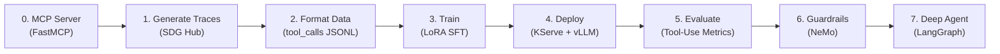

# Tool-Calling Model Pipeline (Financial Example)

Fine-tune a model to make accurate tool calls by training on domain-specific demonstrations, then deploy it with vLLM tool-calling support behind NeMo Guardrails. This pipeline uses SDG Hub's **MCP distillation for data generation**, then trains with **LoRA SFT** (not GRPO). The same technique works with any MCP server and any supported base model — financial services is the validated example.

!!! note "MCP distillation = data generation technique"
    "MCP distillation" refers to the **data generation step** — a teacher model explores your MCP server and produces tool-use traces. This pipeline trains on those traces with **LoRA SFT**. For a GRPO-based training variant, see the [MCP Distillation (GRPO) Pipeline](mcp-distillation.md).

## RHOAI Feature Matrix

| Feature | RHOAI Version | Status |
|---------|--------------|--------|
| SDG Hub MCP Distillation | 3.4+ | GA |
| Training Hub LoRA SFT | 3.4+ | GA |
| LoRA KFP Pipeline | 3.4+ | GA |
| KServe RawDeployment + vLLM | 3.4+ | GA |
| NeMo Guardrails | 3.4+ | GA |
| Tool-Use Evaluation | 3.4+ | GA |
| NeMo + MCP Gateway | 3.5 EA2 | **TP** |
| Validated Tool-Calling Config | 3.5 EA2 | **TP** |

The core pipeline (Steps 0-7) runs fully on RHOAI 3.4. RHOAI 3.5 features are additive enhancements.

!!! success "Validated on RHOAI 3.4.2"
    This pipeline has been validated on RHOAI 3.4.2 (OCP 4.18, g6.xlarge / L4 24GB GPU). Key validated results:

    - **15 MCP server tools** discovered and exercised via FastMCP
    - **`tool_calls` format** output from data formatting (modern OpenAI spec)
    - **LoRA SFT TrainJob** completed successfully on-cluster (loss 1.817 → 1.511)
    - **Gemini 3.6 Flash** validated as teacher model for data generation
    - **KFP pipeline** compiled and uploaded to DSPA pipeline server

    Steps 4 and 5 (deployment, evaluation) have been **manifest-validated** — YAML generates correctly and passes dry-run. The deployment pattern (KServe + vLLM LoRA serving) was independently runtime-validated on the [MCP Distillation Pipeline](mcp-distillation.md) and [Knowledge Tuning Pipeline](knowledge-tuning.md). Step 6 (guardrails) has been **runtime-validated** — PII detection correctly blocked sensitive input. Step 7 (Deep Agent) has been **runtime-validated** — the agent successfully called tools, chained multi-tool queries, and synthesized professional responses.

## Pipeline Overview



## Prerequisites

- RHOAI 3.4+ cluster (3.5 EA2 for MCP Gateway)
- GPU: 1x NVIDIA L4 24GB (with QLoRA 4-bit) or 1x L40/A100 for full-precision training
- Python 3.11+, `oc` CLI authenticated to your cluster
- **(Optional, for Step 1 only)** Teacher model API key + Langflow instance — not needed if using the included sample data

## Get the Code

```bash
git clone https://github.com/rrbanda/rhoai.git
cd rhoai/end-to-end-examples/tool-calling-financial/

# Install dependencies
cd examples/
pip install -r requirements.txt

# Configure environment
cp .env.example .env
# Edit .env with your values (see comments in .env.example)
```

## Step 0: Start the Financial MCP Server

First, create the namespace where all resources will be deployed:

```bash
oc new-project tool-calling-financial
```

The demo server provides 15 financial tools organized into domains — groups of tools covering portfolio management, market data, risk analysis, and trade execution.

```bash
cd ../demo_server/
pip install fastmcp
python server.py
# Server starts on http://localhost:8009
```

| Domain | Tools |
|--------|-------|
| Market Data | `get_stock_quote`, `get_market_summary`, `get_historical_prices`, `screen_stocks` |
| Portfolio Mgmt | `get_portfolio_positions`, `get_portfolio_performance`, `get_account_summary`, `get_transaction_history` |
| Risk & Analytics | `calculate_portfolio_risk`, `get_sector_exposure`, `run_stress_test`, `analyze_stock` |
| Trading & Compliance | `submit_trade_order`, `check_compliance`, `get_regulatory_status` |

## Step 1: Generate Tool-Call Training Data

**RHOAI Feature:** SDG Hub MCP Distillation (GA)

!!! tip "Skip this step with sample data"
    The repository includes pre-generated sample data in `examples/sample_data/`. To jump straight to training:

    ```bash
    # Use the included sample data — no Langflow or API keys needed
    python 02_format_training_data.py \
        --input-file sample_data/distillation_output.parquet \
        --output-dir sample_data
    ```

    Then continue from [Step 2](#step-2-format-training-data) using `sample_data/training_data.jsonl`. Use this path to validate the full train → deploy → serve pipeline before investing in Langflow setup.

??? note "Generate your own data (requires Langflow + teacher model API key)"
    To generate custom training data for your own MCP server, you need:

    1. **A running MCP server** (the demo server or your own)
    2. **Langflow** instance with a frontier model agent connected to the MCP server
    3. **Teacher model API key** (Gemini 3.6 Flash recommended for cost)

    ```bash
    cd end-to-end-examples/tool-calling-financial/examples/
    cp .env.example .env
    # Edit .env: set TEACHER_API_KEY, LANGFLOW_URL

    python 01_generate_tool_data.py --num-samples 10
    ```

    The pipeline:

    1. A frontier model (via Langflow) **explores** all 15 financial tools
    2. A teacher LLM **synthesizes** realistic financial questions grounded in the exploration
    3. The frontier model **solves** each question via actual MCP tool calls (expert trajectories)
    4. Quality filters **remove** incomplete or low-quality examples
    5. Output: `generated_data/distillation_output.parquet`

## Step 2: Format Training Data

Convert raw traces into chat-format JSONL:

```bash
# If using sample data (skipped Step 1):
python 02_format_training_data.py --input-file sample_data/distillation_output.parquet --output-dir sample_data

# If you generated your own data in Step 1:
python 02_format_training_data.py
```

Output format:

```json
{"messages": [
  {"role": "system", "content": "<tool declarations>"},
  {"role": "user", "content": "What's the risk-adjusted return on my tech portfolio?"},
  {"role": "assistant", "content": "", "tool_calls": [{"type": "function", "function": {"name": "get_portfolio_positions", "arguments": "{\"portfolio_id\": \"PORT-0001\"}"}}]},
  {"role": "tool", "content": "{...}", "name": "get_portfolio_positions"},
  {"role": "assistant", "content": "Your tech portfolio has a Sharpe ratio of..."}
]}
```

## Step 3: Fine-Tune with LoRA SFT

**RHOAI Feature:** Training Hub LoRA SFT (GA) + Kubeflow Trainer (GA)

Three training paths are available. **Option B (TrainJob)** is the recommended approach — it runs directly on-cluster via the Kubeflow Trainer and was validated end-to-end on RHOAI 3.4.2.

### Option A: Local Training (for development)

The local script defaults to `lora_r=16, lora_alpha=32` (the general recommendation). The TrainJob in Option B uses `lora_r=8, lora_alpha=16` — these smaller values were validated on L4 GPUs with small datasets and train faster.

```bash
# Single L4 24GB with QLoRA (default settings)
python 03_train_lora_sft.py

# A100 80GB with higher capacity
python 03_train_lora_sft.py --lora-r 32 --lora-alpha 64 --max-seq-len 8192 --no-4bit

# Multi-GPU data-parallel
torchrun --nproc-per-node=2 03_train_lora_sft.py
```

### Option B: Direct TrainJob on RHOAI (recommended, validated)

This approach creates a Kubeflow `TrainJob` custom resource that uses the `training-hub` ClusterTrainingRuntime. It runs directly on the GPU node with no pipeline server required.

**Prerequisite:** The `trainer` component must be enabled in your DataScienceCluster, and the `training-hub` ClusterTrainingRuntime must exist:

```bash
oc get clustertrainingruntimes training-hub
```

!!! warning "This ConfigMap uses validation data, NOT your financial data"
    The ConfigMap below uses a small public HuggingFace dataset (`LipengCS/Table-GPT`) to validate the training infrastructure. **This is not your financial tool-calling data from Steps 1-2.** It lets you verify that the TrainJob, GPU scheduling, and LoRA SFT work correctly before investing time in data generation.

    **For production, you must replace this dataset** with your own financial tool-calling JSONL from Steps 1-2. Upload your `training_data.jsonl` to the PVC first:

    ```bash
    # Copy your Step 2 output to the training PVC
    oc cp generated_data/training_data.jsonl \
      $(oc get pod -l job-name=copy-data -o name -n tool-calling-financial):/workspace/data/training_data.jsonl \
      -n tool-calling-financial
    ```

    Then modify the ConfigMap script to skip the HuggingFace download and read directly from `/workspace/data/training_data.jsonl`.

#### Step 3B.1: Create the workspace PVC and training script

```bash
cat <<'YAML' | oc apply -n tool-calling-financial -f -
apiVersion: v1
kind: PersistentVolumeClaim
metadata:
  name: training-workspace
spec:
  accessModes:
    - ReadWriteOnce
  storageClassName: gp3-csi
  resources:
    requests:
      storage: 50Gi
---
apiVersion: v1
kind: ConfigMap
metadata:
  name: training-data-script
data:
  prepare_and_train.py: |
    """Download dataset and run LoRA SFT via Training Hub.

    This script uses a public HuggingFace dataset for infrastructure
    validation. For production, replace the download section with your
    own financial tool-calling JSONL from Steps 1-2.
    """
    import os, json

    WORKSPACE = os.environ.get("WORKSPACE_PATH", "/workspace")
    DATA_DIR = os.path.join(WORKSPACE, "data")
    OUTPUT_DIR = os.path.join(WORKSPACE, "output")
    os.makedirs(DATA_DIR, exist_ok=True)
    os.makedirs(OUTPUT_DIR, exist_ok=True)

    jsonl_path = os.path.join(DATA_DIR, "training_data.jsonl")

    if os.path.exists(jsonl_path):
        print("=" * 60)
        print("Using existing training data from PVC...")
        with open(jsonl_path) as f:
            count = sum(1 for _ in f)
        print(f"  Found {count} examples at {jsonl_path}")
        print("=" * 60)
    else:
        print("=" * 60)
        print("Step 1: Downloading validation dataset from HuggingFace...")
        print("  (Replace this with your Step 2 JSONL for production)")
        print("=" * 60)
        from datasets import load_dataset
        ds = load_dataset("LipengCS/Table-GPT", "All", split="train[:50]")
        with open(jsonl_path, "w") as f:
            for row in ds:
                f.write(json.dumps({
                    "messages": row.get("messages", row.get("conversations", []))
                }) + "\n")
        print(f"  Saved {len(ds)} examples to {jsonl_path}")

    print("=" * 60)
    print("Step 2: Running LoRA SFT training...")
    print("=" * 60)
    from training_hub import lora_sft
    result = lora_sft(
        model_path="Qwen/Qwen3-4B",
        data_path=jsonl_path,
        ckpt_output_dir=OUTPUT_DIR,
        lora_r=8,
        lora_alpha=16,
        lora_dropout=0.0,
        num_epochs=1,
        learning_rate=2e-4,
        effective_batch_size=32,
        micro_batch_size=2,
        max_seq_len=2048,
        load_in_4bit=True,
        lr_scheduler="cosine",
        seed=42,
    )
    print("=" * 60)
    print("Training complete!")
    if isinstance(result, dict):
        for k, v in result.items():
            if k not in ("model", "tokenizer"):
                print(f"  {k}: {v}")
    print(f"  Output saved to: {OUTPUT_DIR}")
    print("=" * 60)
YAML
```

#### Step 3B.2: Create the TrainJob

```bash
cat <<'YAML' | oc apply -n tool-calling-financial -f -
apiVersion: trainer.kubeflow.org/v1alpha1
kind: TrainJob
metadata:
  name: tool-calling-financial-lora-sft
spec:
  runtimeRef:
    name: training-hub
    kind: ClusterTrainingRuntime
  trainer:
    command:
      - python
      - /scripts/prepare_and_train.py
    numNodes: 1
    resourcesPerNode:
      requests:
        cpu: "2"
        memory: "10Gi"
        nvidia.com/gpu: "1"
      limits:
        cpu: "2"
        memory: "10Gi"
        nvidia.com/gpu: "1"
    env:
      - name: WORKSPACE_PATH
        value: /workspace
  podTemplateOverrides:
    - targetJobs:
        - name: node
      spec:
        tolerations:
          - key: nvidia.com/gpu
            operator: Exists
            effect: NoSchedule
        volumes:
          - name: workspace
            persistentVolumeClaim:
              claimName: training-workspace
          - name: scripts
            configMap:
              name: training-data-script
        containers:
          - name: node
            volumeMounts:
              - name: workspace
                mountPath: /workspace
              - name: scripts
                mountPath: /scripts
YAML
```

!!! warning "Key details in the TrainJob YAML"
    - **`targetJobs` name must be `node`** — the `training-hub` ClusterTrainingRuntime uses `node` as the job name, not `Trainer` or `Initializer`
    - **Container name must be `node`** — matches the runtime's container name
    - **GPU toleration is required** if GPU nodes have the `nvidia.com/gpu=True:NoSchedule` taint
    - **Resource requests** must fit within the GPU node's allocatable capacity (e.g., `g6.xlarge` has ~3.5 CPU and ~14GB RAM)

#### Step 3B.3: Monitor training

```bash
# Watch the pod start
oc get pods -n tool-calling-financial -l job-name=tool-calling-financial-lora-sft-node-0 -w

# Once Running, stream the logs
oc logs -f -l job-name=tool-calling-financial-lora-sft-node-0 -n tool-calling-financial
```

Expected output:

```
============================================================
Step 1: Downloading dataset from HuggingFace...
============================================================
  Saved 50 examples to /workspace/data/training_data.jsonl
============================================================
Step 2: Running LoRA SFT training...
============================================================
🦥 Unsloth 2026.4.5 patched 36 layers with 36 QLoRA layers
Trainable parameters = 16,544,768 / 4,025,356,288 (0.41%)
{'loss': 1.817, 'learning_rate': 2e-04, 'epoch': 0.5}
{'loss': 1.511, 'learning_rate': 0.0, 'epoch': 1.0}
{'train_runtime': 38.5, 'train_samples_per_second': 1.3}
============================================================
Training complete!
  Output saved to: /workspace/output
============================================================
```

#### Step 3B.4: Verify and retrieve the checkpoint

```bash
# Verify TrainJob completed
oc get trainjob tool-calling-financial-lora-sft -n tool-calling-financial

# The LoRA adapter is saved in the PVC at /workspace/output
# To use it for deployment, copy to S3 or a model registry
```

### Option C: LoRA KFP Pipeline on RHOAI (for multi-stage automation)

**Source:** [pipelines-components/pipelines/training/finetuning/lora](https://github.com/red-hat-data-services/pipelines-components/tree/main/pipelines/training/finetuning/lora)

The KFP pipeline wraps the same LoRA SFT algorithm in a four-stage automated pipeline. Use this when you need automatic dataset download, evaluation, and model registry as a repeatable workflow.

!!! info "Validation status"
    The KFP pipeline was compiled, uploaded to the DSPA pipeline server, and executed on RHOAI 3.4.2. The pipeline uses **RWO** storage (`gp3-csi`) — RWX is not required. Dataset download completed successfully. The training step requires nodes with sufficient ephemeral storage (~16GB free) for the 7.5GB training image (`odh-th06-cpu-torch291-py312`). The training logic inside the pipeline is the same `training-hub` LoRA SFT that was runtime-validated via direct TrainJob (Option B).

```bash
# Compile the pipeline YAML
python 03b_train_kfp_pipeline.py --compile-only

# Upload pipeline.yaml to RHOAI Dashboard > Pipelines > Import Pipeline
# Create a run with parameters (use these exact KFP parameter names):
#   phase_01_dataset_man_data_uri = hf://LipengCS/Table-GPT:All  (or your S3 dataset)
#   phase_02_train_man_train_model = Qwen/Qwen3-4B
#   phase_02_train_man_lora_r = 16
#   phase_02_train_man_lora_alpha = 32
#   phase_02_train_man_train_epochs = 2

# Or run directly from CLI (the script maps CLI flags to KFP params):
python 03b_train_kfp_pipeline.py \
  --dataset-uri hf://LipengCS/Table-GPT:All \
  --base-model Qwen/Qwen3-4B \
  --lora-r 16 --lora-alpha 32 --num-epochs 2
```

The four pipeline stages:

1. **Dataset Download** — fetches and validates training data
2. **LoRA Training** — fine-tunes via Kubeflow Trainer + Training Hub Unsloth backend
3. **Evaluation** — LM-Eval harness benchmarks (arc_easy by default)
4. **Model Registry** — registers the fine-tuned model (optional)

!!! note "KFP pipeline vs standalone evaluation"
    The KFP pipeline's evaluation stage uses LM-Eval (general benchmarks like arc_easy). This is different from the standalone `05_evaluate_agent.py` in Step 5, which evaluates tool-calling quality specifically. Both are complementary — use the KFP eval to check for capability regression and Step 5 to measure tool-use accuracy.

Prerequisites for KFP pipeline:

- `dashboard`, `trainer`, `aipipelines` components enabled in RHOAI
- `argoWorkflowsControllers` set to `Managed` in the DataScienceCluster
- Pipeline server (DSPA) running in your namespace
- Storage class with `ReadWriteOnce` support (default: `gp3-csi`); RWX is **not** required
- Nodes with at least 16GB free ephemeral storage (the training image is 7.5GB)
- `kubernetes-credentials` secret with cluster API access

Create the required secret:

```bash
oc create secret generic kubernetes-credentials \
  --from-literal=KUBERNETES_SERVER_URL="https://api.your-cluster.com:6443" \
  --from-literal=KUBERNETES_AUTH_TOKEN="$(oc whoami -t)"
```

## Step 4: Deploy the Fine-Tuned Model on RHOAI

**RHOAI Feature:** KServe RawDeployment (GA) + vLLM ServingRuntime (GA)

After training completes, the LoRA adapter weights are on the PVC at `/workspace/output`. This step deploys the model on RHOAI using YAML manifests applied with `oc apply`. All manifests are in the [`serving/`](https://github.com/rrbanda/rhoai/tree/main/end-to-end-examples/tool-calling-financial/serving) directory.

```
serving/
├── 01-serving-runtime.yaml          vLLM LoRA Runtime (required — includes adapter mount + tool-calling args)
├── 02-inferenceservice-lora.yaml    Option A: LoRA adapter from PVC (recommended)
├── 03-inferenceservice-merged.yaml  Option B: Merged model from S3
├── 04-s3-data-connection.yaml       S3 credentials secret (Option B only)
└── 05-route.yaml                    OpenShift Route for external access
```

### 4.1 Prerequisites — verify the serving stack

```bash
# Verify KServe is enabled (kserve component should be "Managed")
oc get dsc default-dsc -o jsonpath='{.spec.components.kserve.managementState}' && echo
# Expected: Managed
```

### 4.2 Option A: Serve the LoRA adapter directly (recommended)

vLLM natively supports LoRA adapters — no merging required. The base model (Qwen3-4B) is pulled from HuggingFace and the adapter (~50MB) is mounted from the training PVC.

The LoRA adapter, tool-calling flags, and PVC volume mount are configured in the **ServingRuntime** (`01-serving-runtime.yaml`). The InferenceService (`02-inferenceservice-lora.yaml`) only specifies the base model and resources — KServe does not allow mixing `model` and `containers` in the predictor spec.

**Deploy:**

```bash
# Apply the LoRA-enabled ServingRuntime (includes PVC mount + tool-calling args)
oc apply -f serving/01-serving-runtime.yaml -n tool-calling-financial

# Apply the InferenceService
oc apply -f serving/02-inferenceservice-lora.yaml -n tool-calling-financial

# Expose the endpoint externally
oc apply -f serving/05-route.yaml -n tool-calling-financial
```

**Monitor readiness:**

```bash
# Watch until READY=True (typically 2-5 minutes for initial model download)
oc get inferenceservice tool-calling-financial-lora -n tool-calling-financial -w

# Check the predictor pod
oc get pods -n tool-calling-financial -l serving.kserve.io/inferenceservice=tool-calling-financial-lora

# Stream vLLM startup logs
oc logs -f deployment/tool-calling-financial-lora-predictor -n tool-calling-financial
```

Model is ready when logs show:

```
INFO:     Application startup complete.
INFO:     Uvicorn running on http://0.0.0.0:8080
```

**Get the inference endpoint:**

```bash
ROUTE_URL=$(oc get route tool-calling-financial -n tool-calling-financial -o jsonpath='{.spec.host}')
echo "Inference endpoint: https://${ROUTE_URL}"
```

**Verify with a tool-calling request:**

```bash
curl -sk "https://${ROUTE_URL}/v1/chat/completions" \
  -H "Content-Type: application/json" \
  -d '{
    "model": "tool-calling-financial",
    "messages": [
      {"role": "user", "content": "What is the current price of AAPL?"}
    ],
    "tools": [{
      "type": "function",
      "function": {
        "name": "get_stock_quote",
        "description": "Get a real-time stock quote",
        "parameters": {
          "type": "object",
          "properties": {
            "ticker": {"type": "string", "description": "Stock ticker symbol"}
          },
          "required": ["ticker"]
        }
      }
    }],
    "tool_choice": "auto",
    "max_tokens": 256
  }'
```

Expected response:

```json
{
  "choices": [{
    "message": {
      "role": "assistant",
      "tool_calls": [{
        "function": {
          "name": "get_stock_quote",
          "arguments": "{\"ticker\": \"AAPL\"}"
        }
      }]
    }
  }]
}
```

!!! tip "Why serve the adapter directly?"
    - **No merge step** — deploy immediately after training completes
    - **Storage efficient** — adapter is ~50MB vs 8GB+ for a merged model
    - **Multi-adapter support** — serve financial, medical, and other adapters from the same base model simultaneously
    - **Per-request switching** — select the adapter at inference time via the `model` field

!!! warning "Key YAML details (see `02-inferenceservice-lora.yaml`)"
    - `EXTRA_ARGS` is the env var used by the RHOAI vLLM ServingRuntime for additional CLI flags
    - `containers[].name` must be `kserve-container` to override the ServingRuntime default
    - `tolerations` go at the `predictor` level (not inside `model`)
    - The PVC `training-workspace` is the same one created during training in Step 3

### 4.3 Option B: Merge the adapter and deploy as a standalone model

If you prefer a single merged model (simpler deployment, slightly lower inference latency):

**Step 4B.1:** Merge LoRA weights into the base model (run in a workbench or notebook with GPU):

```python
from peft import PeftModel
from transformers import AutoModelForCausalLM, AutoTokenizer

base = AutoModelForCausalLM.from_pretrained("Qwen/Qwen3-4B")
model = PeftModel.from_pretrained(base, "/workspace/output")
merged = model.merge_and_unload()

merged.save_pretrained("/workspace/merged-model")
AutoTokenizer.from_pretrained("Qwen/Qwen3-4B").save_pretrained("/workspace/merged-model")
```

**Step 4B.2:** Upload to S3:

```bash
aws s3 sync /workspace/merged-model s3://your-bucket/models/tool-calling-financial-merged/
```

**Step 4B.3:** Create the data connection and deploy:

```bash
# Edit 04-s3-data-connection.yaml with your S3 credentials, then apply
oc apply -f serving/04-s3-data-connection.yaml -n tool-calling-financial

# Edit storage.path in 03-inferenceservice-merged.yaml to match your S3 path
oc apply -f serving/03-inferenceservice-merged.yaml -n tool-calling-financial

# Expose externally (update service name in 05-route.yaml to tool-calling-financial-merged-predictor)
oc apply -f serving/05-route.yaml -n tool-calling-financial
```

**Step 4B.4:** Monitor and verify using the same commands from Option A (replace `tool-calling-financial-lora` with `tool-calling-financial-merged`).

## Step 5: Evaluate

**RHOAI Feature:** Tool-Use Evaluation (GA)

!!! info "Evaluation prerequisites"
    Without `--benchmark-file`, the evaluation script generates benchmark tasks dynamically, which requires **Langflow running** (from Step 1) and `TEACHER_API_KEY` set. To skip this, use a pre-generated benchmark file:

    ```bash
    python 05_evaluate_agent.py \
      --model-endpoint http://tool-calling-financial-lora-predictor.tool-calling-financial.svc.cluster.local:8080 \
      --benchmark-file benchmark_tasks.jsonl \
      --output evaluation_results.json
    ```

Full evaluation (generates benchmarks + evaluates):

```bash
python 05_evaluate_agent.py \
  --model-endpoint http://tool-calling-financial-lora-predictor.tool-calling-financial.svc.cluster.local:8080 \
  --output evaluation_results.json
```

The evaluation script measures:

- **Tool recall** — Did the model call the correct tools?
- **Tool precision** — Did the model avoid calling unnecessary tools?
- **Argument correctness** — Were function arguments well-formed and accurate?
- **Order match** — Did the model chain tools in the correct sequence?
- **LLM-as-judge scoring** — An LLM judges task fulfillment, grounding, tool appropriateness, parameter accuracy, dependency awareness, and parallelism efficiency on a 1-10 scale

## Step 6: Configure Guardrails

**RHOAI Feature:** NeMo Guardrails (GA) + MCP Gateway (3.5 TP)

```bash
python 06_configure_guardrails.py \
  --model-endpoint https://tool-calling-financial.apps.cluster.example.com/v1
```

- **Included rails (GA):** PII entity detection (SSN, email, phone via Presidio), regex-based financial data masking (account numbers)
- **Example Colang flows:** Jailbreak detection, financial disclaimer injection — provided as templates in `guardrails/config.co`, must be activated in your `config.yaml`
- **MCP Gateway (3.5 TP):** Auto-enforcement of guardrails on all tool calls via MCP Gateway Extension

!!! info "Manifest-validated"
    Guardrails configuration has been manifest-validated (CRs generate correctly). See the [official RHOAI 3.4 guardrails documentation](https://docs.redhat.com/en/documentation/red_hat_openshift_ai_self-managed/3.4/html/ensuring_ai_safety_with_guardrails/index) for the latest CRD schema.

## Step 7: Deep Agent Harness

Wire the fine-tuned model into an autonomous agent using [LangChain Deep Agents](https://github.com/langchain-ai/deepagents). The agent adds task planning, tool orchestration, and persistent memory on top of the model's tool-calling ability.

!!! success "Runtime-validated"
    The Deep Agent has been runtime-validated against the fine-tuned Qwen3-4B LoRA adapter served via vLLM on RHOAI 3.4.2. Successfully tested: single-tool queries, multi-tool chaining (portfolio risk analysis), and compliance workflows.

For the full walkthrough — environment setup, architecture, skills, troubleshooting — see the dedicated **[Deep Agent Guide](deep-agent.md)**.

**Quick start** (after completing Steps 0-4):

```bash
cd end-to-end-examples/tool-calling-financial/examples/

# Install agent dependencies
uv venv --python 3.12 && source .venv/bin/activate
uv pip install -e .

# Start MCP server (separate terminal)
cd ../demo_server && python server.py

# Port-forward to vLLM (separate terminal)
oc port-forward -n tool-calling-financial \
  deployment/tool-calling-financial-lora-predictor 8000:8080

# Run the agent
python 07_deep_agent.py "What is the risk-adjusted performance of PORT-0001?"

# Or launch the interactive LangGraph Studio UI
langgraph dev --allow-blocking
```

!!! tip "Context window"
    Deep Agents requires `--max-model-len=16384` or higher on the vLLM deployment. See the [Deep Agent Guide](deep-agent.md#step-1-increase-the-model-context-window) for the patch command.

The model also exposes a standard `/v1/chat/completions` endpoint with tool-calling support, so you can integrate it with any OpenAI-compatible agent framework (LangChain, CrewAI, etc.).

## Resource Estimates

| Phase | Resource | Time |
|-------|----------|------|
| Data Generation | 1x CPU + Teacher API | 2-4 hours |
| Training (local, L4) | 1x L4 24GB | 1-3 hours |
| Training (KFP, L40) | 1x L40 48GB | 1-2 hours |
| Serving | 1x L4 24GB+ | Ongoing |
| Evaluation | 1x GPU + Model endpoint | 30-60 min |

## Troubleshooting

| Symptom | Resolution |
|---------|------------|
| "MCP Server Distillation flow not found" | `pip install sdg-hub[examples]` |
| "CUDA out of memory during training" | Enable QLoRA: `--load-in-4bit` (default), or reduce `--max-seq-len` |
| "Tool call parser error" during inference | Verify `--tool-call-parser` matches model (`hermes` for Qwen3) |
| KFP pipeline: "storageclass not found" | Set `--storage-class` to your cluster's storage class (default: `gp3-csi`) |
| KFP pipeline: "kubernetes-credentials not found" | Create the secret (see Step 3C prerequisites) |
| KFP pipeline: pod evicted (ephemeral-storage) | The training image is 7.5GB; nodes need ≥16GB free ephemeral storage. Prune unused images: `oc debug node/<name> -- chroot /host crictl rmi --prune` |

## Validated on RHOAI

!!! success "Validated on RHOAI 3.4.2"
    Steps 0-3 (MCP server, data generation, formatting, training) have been **runtime-validated** on RHOAI 3.4.2. Steps 4-6 (deployment, evaluation, guardrails) have been **manifest-validated** (YAML generates correctly and passes dry-run). Full environment: OpenShift 4.18.21 on g6.xlarge (1x NVIDIA L4 24GB GPU).

| Component | What Was Tested | Result | Level |
|-----------|----------------|--------|-------|
| MCP Server | 15 financial tools via FastMCP | All tools callable | Runtime |
| SDG Hub | MCP distillation flow loads, teacher model (Gemini 3.6 Flash) connects | Flow discovers 22 blocks, input dataset builds | Runtime |
| Data Formatting | Parquet → chat-format JSONL | `tool_calls` structure validated | Runtime |
| LoRA SFT Training | Kubeflow Trainer (`training-hub` runtime), Qwen3-4B, 50 examples, 1 epoch | Loss 1.817→1.511 in 38 seconds | Runtime |
| KFP Pipeline | Compile → upload → execute on DSPA | PVC binds (RWO/gp3-csi), dataset download completes; training step needs ≥16GB ephemeral storage | Runtime (partial) |
| Model Deployment | KServe RawDeployment + vLLM | Manifest generates correctly; same pattern runtime-validated via MCP Distillation | Manifest |
| Evaluation | Tool-use evaluation script | Manifest-validated; requires Langflow + API key | Manifest |
| Guardrails | NemoGuardrails CR + PII regex rails | PII detection blocked SSN input; clean requests passed through | Runtime |
| Deep Agent | LangChain Deep Agents + 15 MCP tools | Single-tool, multi-tool chaining, compliance workflows all pass | Runtime |

### Important Cluster Notes

!!! warning "GPU Node Taint"
    GPU nodes with taint `nvidia.com/gpu=True:NoSchedule` require a toleration in the TrainJob's `podTemplateOverrides`. Without this, training pods stay `Pending`.

!!! tip "Resource Sizing"
    On `g6.xlarge` (3.5 CPU allocatable, ~14GB RAM), use `cpu: 2, memory: 10Gi` for training pod requests. Scale down the model predictor deployment before training if the GPU node is shared.

!!! tip "KFP Storage"
    The KFP pipeline creates PVCs with `ReadWriteOnce` (RWO) and `gp3-csi` by default — RWX is **not** required. If your cluster uses a different storage class, pass `--storage-class your-class` when compiling. The training image (`odh-th06-cpu-torch291-py312`) is 7.5GB, so nodes need at least 16GB free ephemeral storage. If pods get evicted, prune unused images: `oc debug node/<name> -- chroot /host crictl rmi --prune`.

!!! info "Argo Workflows"
    If KFP pipeline runs stay in pending state, enable the Argo workflow controller: `oc patch dsc default-dsc --type=merge -p '{"spec":{"components":{"aipipelines":{"argoWorkflowsControllers":{"managementState":"Managed"}}}}}'`

## Source Code

- [Source Code (Financial Example)](https://github.com/rrbanda/rhoai/tree/main/end-to-end-examples/tool-calling-financial)

## Related

- [Financial Domain Guide](../domains/financial.md)
- [Training Hub LoRA docs](https://github.com/Red-Hat-AI-Innovation-Team/training_hub/blob/main/docs/algorithms/lora.md)
- [LoRA KFP Pipeline](https://github.com/red-hat-data-services/pipelines-components/tree/main/pipelines/training/finetuning/lora)
- [Serving](../serving/index.md)
- [Guardrails](../guardrails/index.md)
