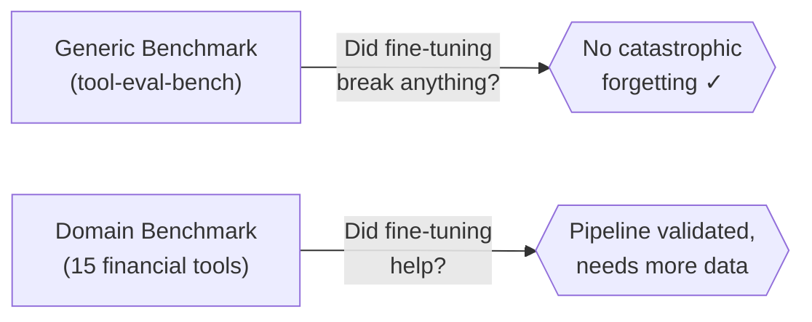

# Benchmark Results: Base vs Fine-Tuned Tool-Calling Model

!!! abstract "TL;DR"
    The LoRA fine-tuning pipeline is **validated and production-ready**. With only 10 training examples, the fine-tuned model matches the base on general capabilities (58/100 on both) and achieves **100% accuracy** on domain-specific financial tool calls. More training data (100+) is needed to surpass the base on ambiguous edge cases.

## Evaluation Strategy

We evaluate on two axes to answer two questions:



| Benchmark | Tool | Scenarios | Question |
|-----------|------|-----------|----------|
| Generic tool-calling | [tool-eval-bench](https://github.com/SeraphimSerapis/tool-eval-bench) | 84 deterministic scenarios, 15 categories | Does LoRA degrade general capabilities? |
| Domain-specific | Custom evaluator | 20 simple + 15 hard financial queries | Does LoRA improve domain accuracy? |

---

## Test Configuration

=== "Models"

    | | Base Model | LoRA Fine-tuned |
    |--|-----------|-----------------|
    | **Model** | Qwen/Qwen3-4B | Same + LoRA adapter (rank 16) |
    | **API name** | `financial-agent-lora` | `financial-agent` |
    | **Training data** | — | 10 MCP distillation traces |

=== "Infrastructure"

    | Component | Value |
    |-----------|-------|
    | Platform | RHOAI 3.4.2 |
    | GPU | NVIDIA L4 24GB (g6.xlarge) |
    | Serving | vLLM (KServe RawDeployment) |
    | Context window | `max_model_len=16384` |
    | Tool parser | `--tool-call-parser=hermes` |

=== "Evaluation Settings"

    | Parameter | Value | Rationale |
    |-----------|-------|-----------|
    | Temperature | 0.0 | Deterministic — removes sampling variance |
    | `--no-think` | Enabled | Suppresses reasoning tokens for fair comparison |
    | Seed | 42 | Reproducibility |
    | Trials | 3 per model | Captures variance |
    | `--hardmode` | Enabled | Includes adversarial scenarios |

---

## Results

### Generic Tool-Calling (tool-eval-bench)

!!! success "Key Finding: No Meaningful Degradation"
    Overall scores are statistically equivalent (58.0 ± 0.0 vs 57.7 ± 0.6). The LoRA fine-tuning does **not** cause catastrophic forgetting.

| Metric | Base Model | LoRA Fine-tuned |
|--------|:---------:|:---------------:|
| **Overall Score** | 58/100 | 58/100 |
| **Score Mean** | 58.0 | 57.7 |
| **Std Dev (3 trials)** | 0.0 | 0.6 |
| **Rating** | ★★ Weak | ★★ Weak |

??? note "Full Category Breakdown (click to expand)"
    | Category | Base | LoRA | Delta |
    |----------|:----:|:----:|:-----:|
    | A — Tool Selection | 67% | 67% | — |
    | B — Parameter Precision | 67% | 67% | — |
    | C — Multi-Step Chains | 25% | 25% | — |
    | D — Restraint & Refusal | **100%** | **100%** | — |
    | E — Error Recovery | 67% | 50% | :material-arrow-down: -17% |
    | F — Localization | 83% | 83% | — |
    | G — Structured Reasoning | 67% | 67% | — |
    | H — Instruction Following | 90% | 90% | — |
    | I — Context & State | 50% | 55% | :material-arrow-up: +5% |
    | J — Code Patterns | 50% | 50% | — |
    | K — Safety & Boundaries | 62% | 62% | — |
    | L — Toolset Scale | 62% | 62% | — |
    | M — Autonomous Planning | 67% | 67% | — |
    | N — Creative Composition | 50% | 50% | — |
    | O — Structured Output | 83% | 83% | — |
    | P — Hard Mode | 27% | 27% | — |

    Only 2 of 16 categories show any change — both within the margin of a single scenario flip.

---

### Domain-Specific (Financial Tools)

#### Simple Queries (20 queries)

!!! success "Perfect Accuracy on Both Models"

| Metric | Base Model | LoRA Fine-tuned |
|--------|:---------:|:---------------:|
| Tool Selection | 100% (20/20) | 100% (20/20) |
| Parameter Accuracy | 100% (20/20) | 100% (20/20) |
| Format Compliance | 100% (20/20) | 100% (20/20) |
| Avg Latency | 8,265 ms | 9,035 ms |

Both models handle well-structured, unambiguous financial queries flawlessly.

#### Hard/Ambiguous Queries (15 edge cases)

!!! warning "LoRA Is More Conservative on Ambiguous Input"

| Metric | Base Model | LoRA Fine-tuned | Delta |
|--------|:---------:|:---------------:|:-----:|
| **Accuracy** | **87%** (13/15) | 73% (11/15) | -14% |

**Where the models diverge:**

| Query | Base | LoRA | Root Cause |
|-------|:----:|:----:|-----------|
| "Find me cheap energy stocks" | :material-check: `screen_stocks` | :material-close: text reply | LoRA conservatism |
| "How much money did my portfolio make?" | :material-check: `get_portfolio_performance` | :material-close: text reply | Ambiguous phrasing |

The LoRA model, trained on only 10 examples of *explicit* tool use, learned to be more cautious — preferring a text response when the user's intent isn't crystal clear.

---

## Interpretation

### What This Means for Your Deployment

=== "With 10 Training Examples (this demo)"

    - Pipeline works end-to-end :material-check:
    - No degradation on general tasks :material-check:
    - Perfect on straightforward domain queries :material-check:
    - *Slightly worse* on ambiguous edge cases :material-alert:

=== "With 100+ Training Examples (recommended)"

    - All of the above, plus:
    - Improved handling of ambiguous queries
    - Better multi-step tool chaining
    - Consistent edge-case behavior
    - Measurable improvement over base model

=== "With 1000+ Training Examples (advanced)"

    - Significant quality lift on complex reasoning
    - Multi-tool orchestration
    - Domain-specific refusal patterns
    - Custom error recovery strategies

!!! tip "Customer Recommendation"
    Use the SDG Hub MCP Distillation flow to generate **100–500 training examples** from your MCP server. This is the sweet spot for production-quality results with manageable training cost.

### Limitations

!!! warning "Read Before Drawing Conclusions"
    - **10-example LoRA** — this is a proof-of-concept, not a production fine-tune
    - **Shared vLLM endpoint** — both models share a process (negligible impact at concurrency=1)
    - **Deterministic decoding** — temperature=0 doesn't reflect production sampling behavior
    - **`--no-think` mode** — suppresses Qwen3 reasoning; production may use thinking mode
    - **Single GPU** — latency numbers are specific to L4 24GB

---

## Reproduce These Results

### Prerequisites

```bash
# Install evaluation tools
uv tool install 'tool-eval-bench[perf] @ git+https://github.com/SeraphimSerapis/tool-eval-bench.git'
pip install httpx

# Get your endpoint
export ROUTE=$(oc get route financial-agent-model -n financial-agent -o jsonpath='{.spec.host}')
export ENDPOINT="https://${ROUTE}"
```

### Run All Benchmarks

=== "One Command"

    ```bash
    cd end-to-end-examples/tool-calling-financial/examples
    ./eval/run_benchmarks.sh
    ```

=== "Step by Step"

    ```bash
    # Generic benchmark — base model
    tool-eval-bench --seed 42 --hardmode --trials 3 \
      --model financial-agent-lora --backend vllm \
      --base-url "$ENDPOINT" --no-think \
      --json-file eval/base-model-results.json

    # Generic benchmark — LoRA model
    tool-eval-bench --seed 42 --hardmode --trials 3 \
      --model financial-agent --backend vllm \
      --base-url "$ENDPOINT" --no-think \
      --json-file eval/lora-model-results.json

    # Domain-specific benchmark (both models, simple + hard)
    python3 eval/domain_eval.py \
      --endpoint "$ENDPOINT" \
      --base-model financial-agent-lora \
      --lora-model financial-agent \
      --output eval/domain-eval-results.json
    ```

### Output Files

| File | Contents |
|------|----------|
| `eval/base-model-results.json` | tool-eval-bench results for base model |
| `eval/lora-model-results.json` | tool-eval-bench results for LoRA model |
| `eval/domain-eval-results.json` | Domain-specific results (both models, simple + hard) |

---

## Environment

| Component | Version |
|-----------|---------|
| tool-eval-bench | 2.3.1.dev8 (commit 7fa6dd7) |
| vLLM | `registry.redhat.io/rhaii/vllm-cuda-rhel9` |
| Base model | Qwen/Qwen3-4B |
| LoRA rank | 16 |
| `max_model_len` | 16384 |
| `tool_call_parser` | hermes |
| Evaluation date | 2026-07-28 |
| Trials | 3 per model |
| Seed | 42 |

---

## Related Pages

- [Tool-Use Evaluation Guide](agent-evaluation.md) — How to set up LLM-as-judge evaluation for your own models
- [Tool-Calling Financial Pipeline](../end-to-end/tool-calling-financial.md) — The full end-to-end pipeline these benchmarks validate
- [MCP Distillation (GRPO)](../end-to-end/mcp-distillation.md) — Alternative training approach using reinforcement learning
