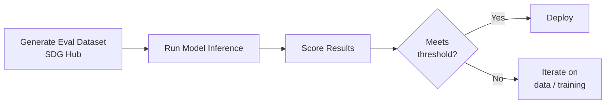

# Evaluation

Evaluation is critical to knowing whether your fine-tuned model actually improved. RHOAI supports three evaluation approaches, each targeting a different model capability.

## Evaluation Approaches

| Approach | What it measures | When to use |
|----------|-----------------|-------------|
| [RAG Evaluation](rag-evaluation.md) | Retrieval-augmented generation quality | Models used in RAG pipelines |
| [Code Evaluation](code-evaluation.md) | Code generation correctness (pass@1) | Models generating code |
| [Tool-Use Evaluation](agent-evaluation.md) | Tool-calling accuracy with LLM-as-judge | Models calling tools / APIs |

## General Evaluation Workflow



1. **Generate** an evaluation dataset using SDG Hub (separate from training data)
2. **Run** your fine-tuned model on the evaluation prompts
3. **Score** using automated metrics or LLM-as-judge
4. **Decide** whether to deploy or iterate

## Quick Loss Check

Before detailed evaluation, verify training converged by plotting the loss curve:

```python
from training_hub import plot_loss

plot_loss("./my-trained-model")
```

A healthy loss curve should:

- Decrease steadily during training
- Not spike or oscillate significantly
- Plateau towards the end of training

See [Plot Loss](../utilities/plot-loss.md) for more details.

## Related

- [RAG Evaluation](rag-evaluation.md) — Generate RAG evaluation datasets
- [Code Evaluation](code-evaluation.md) — Benchmark code generation
- [Tool-Use Evaluation](agent-evaluation.md) — Evaluate tool-calling quality
- [Plot Loss](../utilities/plot-loss.md) — Visualize training progress
