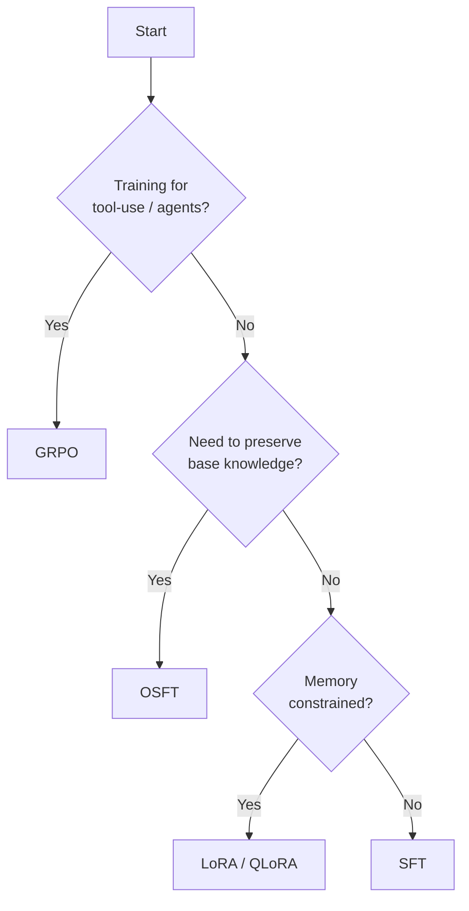

# Choosing a Training Algorithm

Training Hub provides four algorithms, each optimized for different constraints. Use this guide to pick the right one.

## Decision Flowchart



## Side-by-Side Comparison

=== "SFT"

    **Supervised Fine-Tuning** — Maximum learning capacity.

    | Property | Value |
    |----------|-------|
    | Parameters trained | 100% |
    | GPU requirement | 2-8x A100 80GB |
    | Best for | Learning new knowledge or behaviors |
    | Risk | Catastrophic forgetting of base capabilities |

    ```python
    from training_hub import sft

    sft(
        model_path="meta-llama/Llama-3.1-8B-Instruct",
        data_path="training_data.jsonl",
        ckpt_output_dir="./output",
        num_epochs=4,
        effective_batch_size=32,
        max_seq_len=4096,
    )
    ```

    **When to use:** You have abundant training data and want maximum performance on your specific task. You don't need the model to retain strong general capabilities.

=== "OSFT"

    **Orthogonal Subspace Fine-Tuning** — Learn without forgetting.

    | Property | Value |
    |----------|-------|
    | Parameters trained | 100% (constrained) |
    | GPU requirement | 2-8x A100 80GB |
    | Best for | Adding knowledge while preserving base model capabilities |
    | Key parameter | `unfreeze_rank_ratio` controls learning vs preservation |

    ```python
    from training_hub import osft

    osft(
        model_path="meta-llama/Llama-3.1-8B-Instruct",
        data_path="training_data.jsonl",
        ckpt_output_dir="./output",
        unfreeze_rank_ratio=0.01,
        effective_batch_size=32,
        max_tokens_per_gpu=16384,
        max_seq_len=4096,
        learning_rate=2e-5,
        num_epochs=4,
    )
    ```

    **When to use:** You need to add domain knowledge (medical, legal, financial) but the model must still perform well on general tasks.

=== "LoRA"

    **Low-Rank Adaptation** — Memory-efficient fine-tuning.

    | Property | Value |
    |----------|-------|
    | Parameters trained | ~1% (low-rank adapters) |
    | GPU requirement | 1x A100 or L40 |
    | Best for | Limited GPU memory, quick experiments |
    | Key parameters | `lora_r` (rank), `lora_alpha` (scaling) |

    ```python
    from training_hub import lora_sft

    lora_sft(
        model_path="meta-llama/Llama-3.1-8B-Instruct",
        data_path="training_data.jsonl",
        ckpt_output_dir="./output",
        num_epochs=4,
        lora_r=16,
        lora_alpha=32,
    )
    ```

    **When to use:** You have limited GPU resources (single GPU), want fast iteration, or need to maintain multiple task-specific adapters for the same base model.

=== "GRPO"

    **Group Relative Policy Optimization** — RL for tool-use.

    | Property | Value |
    |----------|-------|
    | Parameters trained | ~1% (LoRA) |
    | GPU requirement | 1-4x A100 |
    | Best for | Teaching models to use tools and APIs |
    | Key feature | Learns from verifiable rewards (tool calls succeed/fail) |

    ```python
    from training_hub import lora_grpo

    lora_grpo(
        model_path="meta-llama/Llama-3.1-8B-Instruct",
        data_path="tool_traces.jsonl",
        ckpt_output_dir="./output",
        num_iterations=15,
    )
    ```

    **When to use:** You're building an agent that needs to call tools (MCP servers, APIs) and you want it to learn which tool to call and how to construct arguments.

## Detailed Comparison Table

| Feature | SFT | OSFT | LoRA | GRPO |
|---------|-----|------|------|------|
| Parameters updated | All | All (constrained) | ~1% | ~1% |
| Base knowledge preserved | No | **Yes** | Partially | Partially |
| Min GPU | 2x A100 | 2x A100 | 1x A100 | 1x A100 |
| Training speed | Moderate | Moderate | Fast | Slow |
| Supports QLoRA | — | — | **Yes** | **Yes** |
| Continual learning | Limited | **Yes** | Limited | No |
| Reward-based learning | No | No | No | **Yes** |
| Output | Full model | Full model | Adapter | Adapter |

## Algorithm Guides

- [SFT](../training/sft.md) — Full supervised fine-tuning guide
- [OSFT](../training/osft.md) — Orthogonal subspace fine-tuning guide
- [LoRA](../training/lora.md) — Low-rank adaptation guide
- [GRPO](../training/grpo.md) — Group relative policy optimization guide
