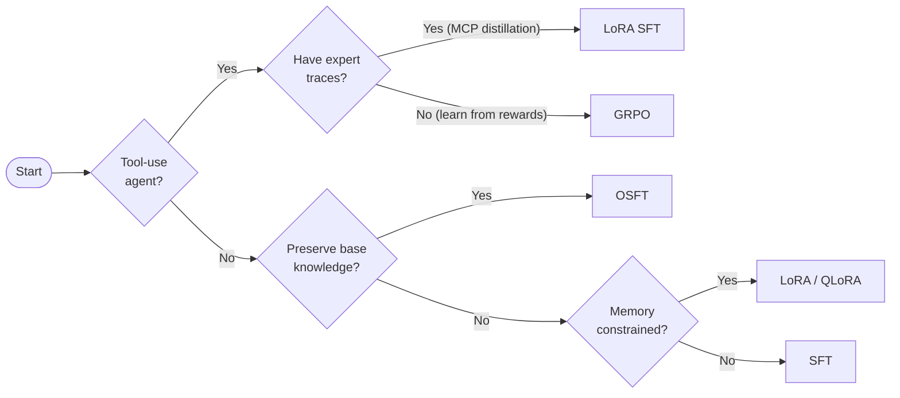

# Choosing a Training Algorithm

Training Hub provides four algorithms, each optimized for different constraints. Use this guide to pick the right one.

## Decision Flowchart



!!! info "LoRA SFT vs GRPO for tool-use"
    Both produce tool-calling models, but from different data. **LoRA SFT** learns from expert demonstrations (MCP distillation traces where a frontier model shows the correct tool calls). **GRPO** learns from rewards (the model explores tool calls and is rewarded when they succeed). LoRA SFT is faster to train and has a validated end-to-end pipeline on RHOAI — see the [Tool-Calling Model Pipeline](../end-to-end/tool-calling-financial.md). GRPO can generalize better to unseen tool combinations but requires more compute.

## Side-by-Side Comparison

=== "SFT"

    **Supervised Fine-Tuning** — Maximum learning capacity.

    | Property | Value |
    |----------|-------|
    | Parameters trained | 100% |
    | GPU requirement | 2-8x A100 80GB |
    | Best for | Learning new knowledge or behaviors |
    | Risk | Catastrophic forgetting of base capabilities |

    ```python
    from training_hub import sft

    sft(
        model_path="meta-llama/Llama-3.1-8B-Instruct",
        data_path="training_data.jsonl",
        ckpt_output_dir="./output",
        num_epochs=4,
        effective_batch_size=32,
        max_seq_len=4096,
    )
    ```

    **When to use:** You have abundant training data and want maximum performance on your specific task. You don't need the model to retain strong general capabilities.

=== "OSFT"

    **Orthogonal Subspace Fine-Tuning** — Learn without forgetting.

    | Property | Value |
    |----------|-------|
    | Parameters trained | 100% (constrained) |
    | GPU requirement | 2-8x A100 80GB |
    | Best for | Adding knowledge while preserving base model capabilities |
    | Key parameter | `unfreeze_rank_ratio` controls learning vs preservation |

    ```python
    from training_hub import osft

    osft(
        model_path="meta-llama/Llama-3.1-8B-Instruct",
        data_path="training_data.jsonl",
        ckpt_output_dir="./output",
        unfreeze_rank_ratio=0.01,
        effective_batch_size=32,
        max_tokens_per_gpu=16384,
        max_seq_len=4096,
        learning_rate=2e-5,
        num_epochs=4,
    )
    ```

    **When to use:** You need to add domain knowledge (medical, legal, financial) but the model must still perform well on general tasks.

=== "LoRA"

    **Low-Rank Adaptation** — Memory-efficient fine-tuning for knowledge and tool-use.

    | Property | Value |
    |----------|-------|
    | Parameters trained | ~1% (low-rank adapters) |
    | GPU requirement | 1x A100 or L40 (L4 with QLoRA) |
    | Best for | Single-GPU training, tool-calling agents, multi-adapter serving |
    | Key parameters | `lora_r` (rank), `lora_alpha` (scaling) |

    ```python
    from training_hub import lora_sft

    lora_sft(
        model_path="meta-llama/Llama-3.1-8B-Instruct",
        data_path="training_data.jsonl",
        ckpt_output_dir="./output",
        num_epochs=4,
        lora_r=16,
        lora_alpha=32,
    )
    ```

    **When to use:** You have limited GPU resources (single GPU), want fast iteration, or need to maintain multiple task-specific adapters for the same base model. Also the recommended algorithm for **tool-calling models** trained on MCP distillation traces — see the [Tool-Calling Model Pipeline](../end-to-end/tool-calling-financial.md).

=== "GRPO"

    **Group Relative Policy Optimization** — Reward-based learning for tool-use.

    | Property | Value |
    |----------|-------|
    | Parameters trained | ~1% (LoRA) |
    | GPU requirement | 1-4x A100 |
    | Best for | Learning tool-use from rewards without expert demonstrations |
    | Key feature | Learns from verifiable rewards (tool calls succeed/fail) |

    ```python
    from training_hub import lora_grpo

    lora_grpo(
        model_path="meta-llama/Llama-3.1-8B-Instruct",
        data_path="tool_traces.jsonl",
        ckpt_output_dir="./output",
        num_iterations=15,
        backend="art",
    )
    ```

    **When to use:** You want the model to learn tool-use through exploration and reward signals rather than expert demonstrations. GRPO can generalize better to unseen tool combinations but is slower to train. If you have expert traces from MCP distillation, use **LoRA SFT** instead — it's faster and has a [validated pipeline on RHOAI](../end-to-end/tool-calling-financial.md).

## Detailed Comparison Table

| Feature | SFT | OSFT | LoRA | GRPO |
|---------|-----|------|------|------|
| Parameters updated | All | All (constrained) | ~1% | ~1% |
| Base knowledge preserved | No | **Yes** | Partially | Partially |
| Min GPU | 2x A100 | 2x A100 | 1x A100 | 1x A100 |
| Training speed | Moderate | Moderate | Fast | Slow |
| Supports QLoRA | — | — | **Yes** | **Yes** |
| Continual learning | Limited | **Yes** | Limited | No |
| Reward-based learning | No | No | No | **Yes** |
| Output | Full model | Full model | Adapter | Adapter |

## Algorithm Guides

- [SFT](../training/sft.md) — Full supervised fine-tuning guide
- [OSFT](../training/osft.md) — Orthogonal subspace fine-tuning guide
- [LoRA](../training/lora.md) — Low-rank adaptation guide
- [GRPO](../training/grpo.md) — Group relative policy optimization guide

## What to Read Next

Now that you've chosen an algorithm, pick a track:

=== "Knowledge Track"

    Teach a model domain knowledge from documents (financial regulations, medical literature, product docs):

    1. [Knowledge Tuning Pipeline](../end-to-end/knowledge-tuning.md) — Full end-to-end walkthrough (data generation → training → evaluation → serving)
    2. [GPU Requirements](../reference/gpu-requirements.md) — VRAM estimates for your chosen algorithm and model

=== "Tool-Calling Track"

    Fine-tune a model to call tools from MCP servers, APIs, or databases:

    1. [Tool-Calling Model Pipeline](../end-to-end/tool-calling-financial.md) — Validated end-to-end on RHOAI 3.4.2 (MCP distillation → LoRA SFT → vLLM serving → guardrails), uses financial services as the example domain
    2. [MCP Distillation](../end-to-end/mcp-distillation.md) — Generic pipeline for any MCP server
