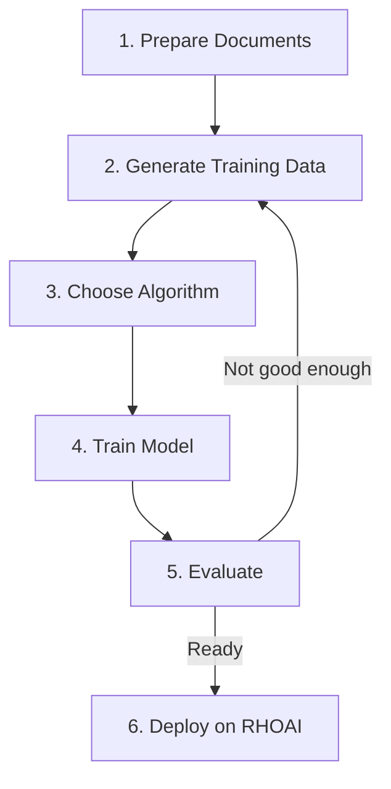

# What is Model Customization?

Model customization is the process of adapting a pre-trained language model to perform well on your specific domain or task. Instead of training from scratch (which requires enormous compute), you take an existing model and teach it new knowledge, skills, or behaviors using your data.

## Why Smaller Models?

Large frontier models (70B+ parameters) are powerful but expensive to serve. A well-customized smaller model (3B–8B parameters) can **match or exceed frontier model performance** on your specific task while being:

- **Cheaper to serve** — 4-10x lower inference cost
- **Faster** — Lower latency for real-time applications
- **Deployable on-premise** — Runs on a single GPU node
- **Private** — Your data never leaves your infrastructure

## The RHOAI Model Customization Stack

RHOAI provides two key libraries that work together:

### SDG Hub — Synthetic Data Generation

[SDG Hub](https://github.com/Red-Hat-AI-Innovation-Team/sdg_hub) generates high-quality training data from your raw documents. A teacher LLM (like GPT-4 or Claude) reads your documents and generates question-answer pairs, summaries, and other training examples in the JSONL messages format.

```python
from sdg_hub import Flow, FlowRegistry

FlowRegistry.discover_flows()
flow = Flow.from_yaml(FlowRegistry.get_flow_path("Knowledge Tuning Flow"))
flow.set_model_config(model="gpt-4o-mini", api_key="...")
result = flow.generate(dataset)
```

### Training Hub — Model Fine-Tuning

[Training Hub](https://github.com/Red-Hat-AI-Innovation-Team/training_hub) provides multiple fine-tuning algorithms optimized for different use cases:

```python
from training_hub import sft, osft, lora_sft

sft(
    model="meta-llama/Llama-3.1-8B-Instruct",
    data="training_data.jsonl",
    output_dir="./output",
)
```

## The Pipeline

Every model customization project follows the same high-level flow:



1. **Prepare** — Gather your domain documents (PDFs, Markdown, web pages)
2. **Generate** — Use SDG Hub to create synthetic training data from your documents
3. **Choose** — Pick the right [training algorithm](choosing-an-algorithm.md) for your use case
4. **Train** — Fine-tune the model with Training Hub
5. **Evaluate** — Measure performance against your benchmarks
6. **Deploy** — Serve the model via KServe / vLLM on RHOAI

## Next Steps

- [Quickstart](quickstart.md) — Get up and running in 5 minutes
- [Choosing an Algorithm](choosing-an-algorithm.md) — Decide between SFT, OSFT, LoRA, and GRPO
- [Knowledge Tuning Pipeline](../end-to-end/knowledge-tuning.md) — Full end-to-end walkthrough
