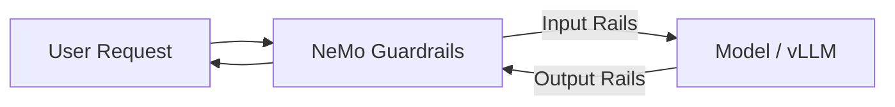
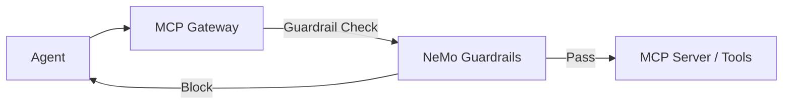

# Guardrails & Safety

Production deployments of fine-tuned models — especially tool-calling agents — require safety rails to prevent misuse, protect sensitive data, and enforce compliance policies. RHOAI provides NeMo Guardrails (GA in 3.4+) with MCP Gateway integration (Technology Preview in 3.5 EA2).

## Why Guardrails Matter for Model Customization

Fine-tuned models inherit the base model's capabilities *and* its risks. A model trained on financial tool-use data can:

- Correctly call `submit_trade_order` — but also execute trades a restricted client shouldn't make
- Answer portfolio questions — but leak account numbers or SSNs in responses
- Follow instructions precisely — including prompt injection attacks

Guardrails sit between the model and the user (or between the agent and its tools) to enforce safety policies.

## NeMo Guardrails on RHOAI (GA)

NeMo Guardrails runs as a sidecar or standalone service that intercepts model inputs and outputs, applying configurable safety rails.

### Architecture



### Core Capabilities

| Capability | Type | Description |
|-----------|------|-------------|
| Jailbreak detection | Input rail | Blocks prompt injection and adversarial inputs |
| PII detection & masking | Input + output | Detects and masks SSNs, account numbers, etc. |
| Content safety | Output rail | Blocks harmful, biased, or off-topic responses |
| Topic control | Input rail | Restricts the model to approved topics |
| Regex-based rails | Input + output | Pattern matching for domain-specific data (account numbers, routing numbers) |
| Custom Colang flows | Both | Programmable compliance logic in Colang 2.0 |

### Configuration

NeMo Guardrails uses a YAML configuration file and optional Colang 2.0 flow definitions:

```yaml
models:
  - type: main
    engine: vllm
    parameters:
      openai_api_base: "${VLLM_ENDPOINT_URL}/v1"
      model_name: "my-finetuned-model"

rails:
  input:
    flows:
      - jailbreak detection
      - pii detection

  output:
    flows:
      - pii masking
      - response safety

  config:
    enable_guardrails_endpoint: true
    otel_enabled: true
```

### Regex Rails for Domain-Specific PII

Define pattern-based rules for data your domain handles:

```yaml
regex_rails:
  input:
    - name: "ssn_input"
      pattern: "[0-9]{3}-[0-9]{2}-[0-9]{4}"
      action: block
      description: "Block Social Security Numbers"

  output:
    - name: "account_number_output"
      pattern: "ACCT-[0-9]{4,12}"
      action: mask
      replacement: "ACCT-****"
      description: "Mask account numbers in responses"
```

### Custom Compliance Flows (Colang 2.0)

Write programmable guardrails for domain-specific rules:

```
define flow financial disclaimer injection
  """Append regulatory disclaimer to investment recommendations."""
  when bot said something like "recommend" or "suggest investing" or "investment advice"
    $disclaimer = "This information is for educational purposes only and does not constitute investment advice."
    bot say "{$last_bot_message}\n\n---\n⚠️ {$disclaimer}"
```

### Deploy as a Kubernetes Custom Resource

```yaml
apiVersion: trustyai.opendatahub.io/v1alpha1
kind: NemoGuardrails
metadata:
  name: my-guardrails
  namespace: rhoai-guardrails
spec:
  replicas: 2
  modelEndpoint:
    url: "https://my-model.apps.cluster.example.com/v1"
  configSecretRef:
    name: my-guardrails-config
  openTelemetry:
    enabled: true
    endpoint: "http://otel-collector.observability.svc:4317"
```

The TrustyAI operator creates the guardrails service and exposes the `/v1/guardrails/checks` endpoint for direct policy evaluation.

### Test the Guardrails

```bash
curl -X POST "$GUARDRAILS_ENDPOINT/v1/guardrails/checks" \
  -H "Content-Type: application/json" \
  -d '{
    "input": "My SSN is 123-45-6789, check my account ACCT-7832",
    "config": {"rails": ["pii_detection"]}
  }'
```

## MCP Gateway Integration (RHOAI 3.5 TP)

!!! warning "Technology Preview"
    MCP Gateway integration is a Technology Preview feature in RHOAI 3.5 EA2. APIs and behavior may change.

For tool-calling agents, NeMo Guardrails can protect not just model inputs/outputs but also **tool calls** routed through the MCP Gateway:



### Enable MCP Gateway

Add the `mcpGateway` field to the NemoGuardrails CR:

```yaml
spec:
  mcpGateway:
    name: my-mcp-gateway
    namespace: rhoai-guardrails
```

And create the MCPGatewayExtension CR:

```yaml
apiVersion: trustyai.opendatahub.io/v1alpha1
kind: MCPGatewayExtension
metadata:
  name: my-mcp-gateway
  namespace: rhoai-guardrails
spec:
  mcpServerUrl: "http://my-mcp-server.svc:8080"
  guardrailsRef:
    name: my-guardrails
    namespace: rhoai-guardrails
```

This ensures every tool call from the agent passes through guardrail checks before reaching the MCP server.

## GA vs Technology Preview Features

| Feature | RHOAI Version | Status |
|---------|--------------|--------|
| NemoGuardrails CR | 3.4+ | GA |
| Input/output rails | 3.4+ | GA |
| Regex rails | 3.4+ | GA |
| Colang 2.0 custom flows | 3.4+ | GA |
| `/v1/guardrails/checks` endpoint | 3.4+ | GA |
| Multiple replicas | 3.4+ | GA |
| OpenTelemetry integration | 3.4+ | GA |
| Zero-downtime config changes | 3.4+ | GA |
| MCP Gateway integration | 3.5 EA2 | **TP** |

## Related

- [Financial Agent Guardrails](../end-to-end/financial-agent.md#step-6-configure-guardrails) — Worked example with financial compliance rails
- [Serving](../serving/index.md) — Deploy models before adding guardrails
- [Agent Evaluation](../evaluation/agent-evaluation.md) — Evaluate tool-use quality before deploying
- [NeMo Guardrails on RHOAI (Official Docs)](https://docs.redhat.com/en/documentation/red_hat_openshift_ai_self-managed/3.4/html/ensuring_ai_safety_with_guardrails)
