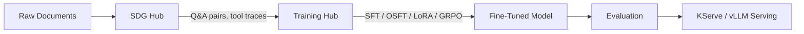

### Data Generation

Generate high-quality synthetic training data from your documents using a teacher LLM and SDG Hub's composable flows.

[Explore SDG Hub →](data-generation/index.md)

### Model Training

Fine-tune smaller models with SFT, OSFT, LoRA, or GRPO. Preserve base knowledge, minimize GPU usage, or train tool-use agents.

[Compare Algorithms →](getting-started/choosing-an-algorithm.md)

### Evaluation

Measure your model's quality with RAG benchmarks, code evaluation, and LLM-as-judge for agent tool-use accuracy.

[Evaluate Models →](evaluation/index.md)

### Knowledge Tuning

End-to-end pipeline: prepare documents, generate Q&A data, train with OSFT or SFT, evaluate, and deploy on RHOAI.

[Full Walkthrough →](end-to-end/knowledge-tuning.md)

### MCP Distillation

Teach a model to use your tools. A frontier model explores MCP servers and generates training data for GRPO.

[Build an Agent →](end-to-end/mcp-distillation.md)

### GPU Planning

Estimate VRAM requirements, compare GPU options, and find tuned hyperparameters for Llama, Qwen, Phi, and Granite.

[Plan Resources →](reference/gpu-requirements.md)

## Training Algorithms

<a href="training/sft/" class="algo-badge">SFT — Full Fine-Tune</a>
<a href="training/osft/" class="algo-badge">OSFT — Knowledge Preserving</a>
<a href="training/lora/" class="algo-badge">LoRA — Memory Efficient</a>
<a href="training/grpo/" class="algo-badge">GRPO — Tool-Use RL</a>

## Supported Models

Fine-tuning examples and tuned hyperparameters are provided for:

| Model | Size | Best For |
|-------|------|----------|
| **Llama 3.1** | 8B | General-purpose, strong baseline |
| **Qwen 2.5** | 7B | Multilingual, reasoning |
| **Phi 4 Mini** | 3.8B | Cost-efficient, constrained deployments |
| **Granite 3.3 / 4.0** | 8B | Enterprise workloads |
| **Ministral** | 3B | Ultra-compact environments |
| **GPT-OSS** | 20B | Maximum capacity |

See [Model-Specific Configs](domains/model-specific.md) for per-model hyperparameters and GPU requirements.

## The Pipeline

**SDG Hub** generates high-quality synthetic training data from your documents using a teacher LLM. **Training Hub** fine-tunes a smaller student model on that data. Both are open-source Python libraries officially referenced in [RHOAI 3.4 documentation](https://docs.redhat.com/en/documentation/red_hat_openshift_ai/3.4) and pre-installed in Red Hat-curated workbench images.
