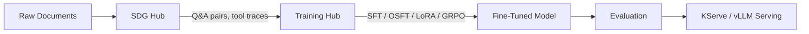

# Customize LLMs on Red Hat OpenShift AI

Build production-ready, domain-specific language models using smaller, efficient architectures. This guide covers the complete lifecycle — from synthetic data generation through model training to evaluation — on RHOAI 3.4.

## The Model Customization Pipeline

**SDG Hub** generates high-quality synthetic training data from your documents using a teacher LLM. **Training Hub** fine-tunes a smaller student model on that data. Both are open-source Python libraries officially referenced in [RHOAI 3.4 documentation](https://docs.redhat.com/en/documentation/red_hat_openshift_ai/3.4) and pre-installed in Red Hat-curated workbench images. The result is a compact, domain-expert model you can deploy on RHOAI via KServe.

## Start Here

| Goal | Guide |
|------|-------|
| **Inject domain knowledge** into a model | [Knowledge Tuning Pipeline](end-to-end/knowledge-tuning.md) |
| **Teach a model to use your tools** (MCP) | [MCP Distillation Pipeline](end-to-end/mcp-distillation.md) |
| **Pick the right training algorithm** | [Choosing an Algorithm](getting-started/choosing-an-algorithm.md) |
| **Estimate GPU requirements** before training | [Memory Estimator](utilities/memory-estimator.md) |

## Training Algorithms at a Glance

| Algorithm | Best for | Key property | GPU needs |
|-----------|----------|-------------|-----------|
| [SFT](training/sft.md) | Maximum learning capacity | Full parameter update | 2-8x A100 |
| [OSFT](training/osft.md) | Adding knowledge without forgetting | Orthogonal subspace constraint | 2-8x A100 |
| [LoRA](training/lora.md) | Memory-constrained environments | Low-rank adapters, ~1% params trained | 1x A100 or L40 |
| [GRPO](training/grpo.md) | Tool-use and agent training | RL from verifiable rewards | 1-4x A100 |

## Supported Models

Fine-tuning examples and tuned hyperparameters are provided for:

- **Llama 3.1 8B** — Meta's flagship open model
- **Qwen 2.5 7B** — Strong multilingual reasoning
- **Phi 4 Mini** (~3.8B) — Dense, efficient architecture
- **Granite 3.3 / 4.0** — Red Hat's enterprise models
- **Ministral 3B** — Compact Mistral model for constrained environments
- **GPT-OSS 20B** — Large-scale open model

See [Model-Specific Configs](domains/model-specific.md) for per-model hyperparameters and GPU requirements.

## What's in This Guide

- **[Getting Started](getting-started/overview.md)** — Overview, quickstart, and algorithm selection
- **[Data Generation](data-generation/index.md)** — Creating training data with SDG Hub
- **[Training](training/sft.md)** — Algorithm guides with parameter references
- **[Domains](domains/medical.md)** — Domain-specific examples (medical, model-specific)
- **[End-to-End](end-to-end/knowledge-tuning.md)** — Complete pipeline walkthroughs
- **[Evaluation](evaluation/index.md)** — RAG, code, and agent evaluation
- **[Utilities](utilities/memory-estimator.md)** — Memory estimation, loss plotting, model blending
- **[Reference](reference/data-formats.md)** — Data formats and GPU requirements
