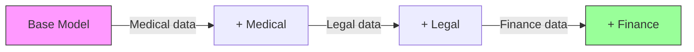

# Continual Learning with OSFT

Continual learning lets you train a model on **new data batches over time** without forgetting what it learned previously. OSFT's orthogonal constraint makes this possible — each training phase updates weights in a subspace orthogonal to previous updates.

## When to Use Continual Learning

- You receive **new domain data periodically** and want to incorporate it
- You need to build a **multi-domain expert** by adding one domain at a time
- You want to **avoid retraining from scratch** every time new data arrives

## How It Works



Each OSFT phase updates weights in an **orthogonal subspace**, meaning Phase 2 updates don't interfere with Phase 1 updates. The model accumulates knowledge across domains.

## Example: Multi-Domain Expert

```python
from training_hub import osft

# Phase 1: Add medical knowledge
osft(
    model="meta-llama/Llama-3.1-8B-Instruct",
    data="medical_data.jsonl",
    output_dir="./phase1-medical",
    num_epochs=4,
    batch_size=32,
    max_seq_len=4096,
    unfreeze_rank_ratio=0.01,
)

# Phase 2: Add legal knowledge (without losing medical)
osft(
    model="./phase1-medical",
    data="legal_data.jsonl",
    output_dir="./phase2-legal",
    num_epochs=4,
    batch_size=32,
    max_seq_len=4096,
    unfreeze_rank_ratio=0.01,
)

# Phase 3: Add financial knowledge (without losing medical or legal)
osft(
    model="./phase2-legal",
    data="finance_data.jsonl",
    output_dir="./phase3-finance",
    num_epochs=4,
    batch_size=32,
    max_seq_len=4096,
    unfreeze_rank_ratio=0.01,
)
```

## Why Not Just Use SFT?

| Approach | Phase 1 knowledge after Phase 2 | Phase 2 knowledge |
|----------|--------------------------------|-------------------|
| SFT + SFT | Degraded (catastrophic forgetting) | Learned |
| OSFT + OSFT | **Preserved** | **Learned** |
| SFT + OSFT | Partially preserved | Learned |

## Best Practices

!!! tip "Keep `unfreeze_rank_ratio` Consistent"
    Use the same `unfreeze_rank_ratio` across phases. Varying it can cause uneven knowledge distribution.

!!! tip "Evaluate Between Phases"
    Test the model on all previous domains after each phase to verify knowledge retention. If a domain degrades, reduce `unfreeze_rank_ratio`.

!!! tip "Order Matters Less with OSFT"
    Unlike SFT, the order of domains matters less with OSFT because of the orthogonal constraint. However, training the most important domain first is still recommended.

## Related

- [OSFT](osft.md) — The algorithm that enables continual learning
- [Medical Domain](../domains/medical.md) — Domain-specific fine-tuning example
- [Knowledge Tuning](../data-generation/knowledge-tuning.md) — Generate training data for each domain
