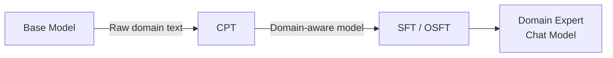

# Continued Pretraining (CPT)

Continued pretraining trains a model on **raw, unstructured text** in your domain — like feeding it domain textbooks. Unlike SFT (which uses Q&A pairs), CPT uses plain text with the model learning to predict the next token, just like the original pretraining process.

## When to Use CPT

- You have large volumes of **domain-specific raw text** (papers, manuals, reports)
- You want the model to deeply **internalize domain language and patterns**
- You plan to follow CPT with **SFT or OSFT** for instruction-following ability

!!! warning "CPT Alone Is Not Enough"
    CPT teaches the model *knowledge* but not *how to use it*. Always follow CPT with SFT or OSFT on instruction-formatted data to produce a useful chat model.

## How It Works



CPT uses the `is_pretraining=True` flag to train on all tokens (not just assistant responses), since the data is plain text rather than conversations.

## Example: Spreadsheet Domain

Train a model to understand spreadsheet formulas and operations:

=== "CPT + SFT"

    ```python
    from training_hub import sft

    sft(
        model_path="ibm-granite/granite-3.3-8b-instruct",
        data_path="spreadsheet_docs.jsonl",
        ckpt_output_dir="./cpt-spreadsheet",
        is_pretraining=True,
        block_size=2048,
        document_column_name="document",
        num_epochs=2,
        effective_batch_size=64,
        max_seq_len=4096,
        learning_rate=2e-6,
    )

    sft(
        model_path="./cpt-spreadsheet/hf_format/samples_0",
        data_path="spreadsheet_qa.jsonl",
        ckpt_output_dir="./sft-spreadsheet",
        num_epochs=4,
        effective_batch_size=32,
        max_seq_len=4096,
    )
    ```

=== "CPT + OSFT"

    ```python
    from training_hub import sft, osft

    sft(
        model_path="ibm-granite/granite-3.3-8b-instruct",
        data_path="spreadsheet_docs.jsonl",
        ckpt_output_dir="./cpt-spreadsheet",
        is_pretraining=True,
        block_size=2048,
        document_column_name="document",
        num_epochs=2,
        effective_batch_size=64,
        max_seq_len=4096,
        learning_rate=2e-6,
    )

    osft(
        model_path="./cpt-spreadsheet/hf_format/samples_0",
        data_path="spreadsheet_qa.jsonl",
        ckpt_output_dir="./osft-spreadsheet",
        unfreeze_rank_ratio=0.25,
        effective_batch_size=32,
        max_tokens_per_gpu=16384,
        max_seq_len=4096,
        learning_rate=2e-5,
        num_epochs=4,
    )
    ```

## CPT Data Format

CPT data uses JSONL with a `document` column containing raw text:

```json
{"document": "The VLOOKUP function searches for a value in the first column of a table range and returns a value in the same row from another column..."}
{"document": "SUMIFS adds cells in a range that meet multiple criteria. Syntax: SUMIFS(sum_range, criteria_range1, criteria1, ...)"}
```

Set `is_pretraining=True` and `document_column_name="document"` to train on these raw text entries. The SFT function handles tokenization and packing internally.

## Key Parameters for CPT

| Parameter | Recommended Value | Why |
|-----------|------------------|-----|
| `learning_rate` | `2e-6` | Lower than SFT to avoid destabilizing pretrained weights |
| `num_epochs` | `1-2` | More epochs risk overfitting on repetitive text |
| `is_pretraining` | `True` | Train on all tokens, not just assistant responses |
| `block_size` | `2048` | Document packing block size |
| `document_column_name` | `"document"` | Column name in JSONL containing raw text |
| `max_seq_len` | `4096-8192` | Longer sequences for document-level context |

## Related

- [SFT](sft.md) — The algorithm used for CPT (with `is_pretraining=True`)
- [OSFT](osft.md) — Recommended follow-up for knowledge preservation
- [Knowledge Tuning](../data-generation/knowledge-tuning.md) — Generate Q&A data for the SFT follow-up phase
