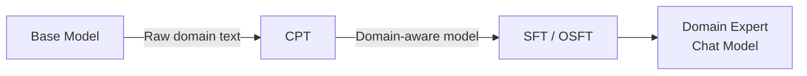

# Continued Pretraining (CPT)

Continued pretraining trains a model on **raw, unstructured text** in your domain — like feeding it domain textbooks. Unlike SFT (which uses Q&A pairs), CPT uses plain text with the model learning to predict the next token, just like the original pretraining process.

## When to Use CPT

- You have large volumes of **domain-specific raw text** (papers, manuals, reports)
- You want the model to deeply **internalize domain language and patterns**
- You plan to follow CPT with **SFT or OSFT** for instruction-following ability

!!! warning "CPT Alone Is Not Enough"
    CPT teaches the model *knowledge* but not *how to use it*. Always follow CPT with SFT or OSFT on instruction-formatted data to produce a useful chat model.

## How It Works



CPT uses the `unmask_input=True` flag to train on all tokens (not just assistant responses), since the data is plain text rather than conversations.

## Example: Spreadsheet Domain

Train a model to understand spreadsheet formulas and operations:

=== "CPT + SFT"

    ```python
    from training_hub import sft

    # Step 1: Continued pretraining on raw spreadsheet documentation
    sft(
        model="ibm-granite/granite-3.3-8b-instruct",
        data="spreadsheet_docs.jsonl",
        output_dir="./cpt-spreadsheet",
        num_epochs=2,
        batch_size=16,
        max_seq_len=8192,
        lr=1e-5,
        unmask_input=True,
    )

    # Step 2: SFT on spreadsheet Q&A pairs
    sft(
        model="./cpt-spreadsheet",
        data="spreadsheet_qa.jsonl",
        output_dir="./sft-spreadsheet",
        num_epochs=4,
        batch_size=32,
        max_seq_len=4096,
    )
    ```

=== "CPT + OSFT"

    ```python
    from training_hub import sft, osft

    # Step 1: Continued pretraining
    sft(
        model="ibm-granite/granite-3.3-8b-instruct",
        data="spreadsheet_docs.jsonl",
        output_dir="./cpt-spreadsheet",
        num_epochs=2,
        batch_size=16,
        max_seq_len=8192,
        lr=1e-5,
        unmask_input=True,
    )

    # Step 2: OSFT to preserve general capabilities
    osft(
        model="./cpt-spreadsheet",
        data="spreadsheet_qa.jsonl",
        output_dir="./osft-spreadsheet",
        num_epochs=4,
        batch_size=32,
        max_seq_len=4096,
        unfreeze_rank_ratio=0.01,
    )
    ```

## CPT Data Format

CPT data uses the same JSONL messages format, but with a single message containing the raw text:

```json
{
  "messages": [
    {
      "role": "user",
      "content": "The VLOOKUP function searches for a value in the first column of a table range and returns a value in the same row from another column..."
    }
  ]
}
```

Set `unmask_input=True` to train on these user-role tokens.

## Key Parameters for CPT

| Parameter | Recommended Value | Why |
|-----------|------------------|-----|
| `lr` | `1e-5` | Lower than SFT to avoid destabilizing pretrained weights |
| `num_epochs` | `1-2` | More epochs risk overfitting on repetitive text |
| `unmask_input` | `True` | Train on all tokens, not just assistant responses |
| `max_seq_len` | `8192` | Longer sequences for document-level context |

## Related

- [SFT](sft.md) — The algorithm used for CPT (with `unmask_input=True`)
- [OSFT](osft.md) — Recommended follow-up for knowledge preservation
- [Knowledge Tuning](../data-generation/knowledge-tuning.md) — Generate Q&A data for the SFT follow-up phase
