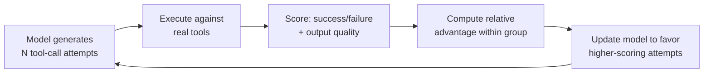

# Group Relative Policy Optimization (GRPO)

GRPO is a reinforcement learning algorithm that trains models to use tools effectively. Instead of learning from labeled examples (like SFT), GRPO learns from **verifiable rewards** — did the tool call succeed? Did the response match the expected output?

## When to Use GRPO

- You're training a model to **call tools** (MCP servers, REST APIs, function calls)
- You have **tool-use traces** with verifiable success/failure signals
- You want the model to learn **which tool to use** and **how to construct arguments**
- You're building an **agent** that interacts with external systems

## Quick Start

```python
from training_hub import lora_grpo

lora_grpo(
    model="meta-llama/Llama-3.1-8B-Instruct",
    data="tool_traces.jsonl",
    output_dir="./grpo-output",
    num_epochs=2,
)
```

## How GRPO Works



1. For each prompt, the model generates **N candidate responses** (tool calls)
2. Each response is **executed** against the actual tool/API
3. Responses are **scored** based on whether they succeeded
4. The model is **updated** to favor responses that scored higher relative to the group

This is more data-efficient than SFT because the model learns *why* certain tool calls work, not just to imitate examples.

## Data Format

GRPO expects tool-use traces in messages format with tool calls and results:

```json
{
  "messages": [
    {"role": "user", "content": "Find products under $20"},
    {
      "role": "assistant",
      "content": null,
      "tool_calls": [{
        "type": "function",
        "function": {
          "name": "search_products",
          "arguments": "{\"max_price\": 20}"
        }
      }]
    },
    {
      "role": "tool",
      "content": "[{\"name\": \"Widget\", \"price\": 15.99}]"
    },
    {"role": "assistant", "content": "I found Widget at $15.99."}
  ]
}
```

## Parameter Reference

| Parameter | Type | Default | Description |
|-----------|------|---------|-------------|
| `model` | str | required | HuggingFace model ID or local path |
| `data` | str | required | Path to JSONL tool traces |
| `output_dir` | str | required | Where to save the trained adapter |
| `num_epochs` | int | `2` | Number of training epochs |
| `lora_r` | int | `16` | LoRA adapter rank |
| `lora_alpha` | int | `32` | LoRA scaling factor |
| `batch_size` | int | `16` | Effective batch size |
| `max_seq_len` | int | `4096` | Maximum sequence length |
| `lr` | float | `5e-6` | Learning rate (lower than SFT) |

## GPU Requirements

| Model Size | Min GPUs |
|-----------|----------|
| 3B | 1x A100 80GB |
| 7-8B | 2x A100 80GB |
| 20B | 4x A100 80GB |

!!! note "Training Time"
    GRPO is slower than SFT because it generates multiple candidate responses per example and needs to execute tool calls for scoring. Plan for 2-4x the wall-clock time of SFT on the same data.

## Related

- [MCP Distillation Pipeline](../end-to-end/mcp-distillation.md) — Generate tool-use training data, then train with GRPO
- [LoRA](lora.md) — GRPO uses LoRA adapters internally
- [Agent Evaluation](../evaluation/agent-evaluation.md) — Evaluate tool-use model quality
