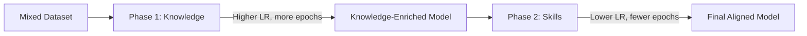

# LAB Multi-Phase Training

LAB (Large-scale Alignment for chatBots) multi-phase training splits the fine-tuning process into two distinct phases, each targeting a different type of data. This approach produces better-aligned models than training on all data at once.

## When to Use Multi-Phase Training

- You have both **knowledge** data and **skills/alignment** data
- You want **better balance** between knowledge retention and instruction following
- You're following the **InstructLab** methodology

## How It Works



**Phase 1 (Knowledge):** Train on knowledge-heavy data with a higher learning rate and more epochs. This injects domain knowledge into the model.

**Phase 2 (Skills):** Starting from the Phase 1 checkpoint, train on skills and alignment data with a lower learning rate and fewer epochs. This teaches the model how to *use* the knowledge effectively.

## Example

```python
from training_hub import sft

# Phase 1: Knowledge training
sft(
    model="meta-llama/Llama-3.1-8B-Instruct",
    data="knowledge_data.jsonl",
    output_dir="./phase1-knowledge",
    num_epochs=7,
    batch_size=32,
    max_seq_len=4096,
    lr=2e-5,
)

# Phase 2: Skills training (starting from Phase 1 output)
sft(
    model="./phase1-knowledge",
    data="skills_data.jsonl",
    output_dir="./phase2-skills",
    num_epochs=3,
    batch_size=32,
    max_seq_len=4096,
    lr=5e-6,
)
```

## Phase Configuration

| Parameter | Phase 1 (Knowledge) | Phase 2 (Skills) |
|-----------|---------------------|-------------------|
| Data | Knowledge QA pairs | Skills/alignment data |
| Epochs | 5-10 | 2-3 |
| Learning rate | `2e-5` | `5e-6` (lower) |
| Base model | Pre-trained model | Phase 1 output |

!!! tip "Data Separation"
    Use SDG Hub's knowledge tuning flows for Phase 1 data and skills tuning flows for Phase 2 data. The [Data Generation](../data-generation/index.md) section covers both.

## With OSFT

You can also run multi-phase training with OSFT for knowledge preservation:

```python
from training_hub import osft

# Phase 1: Knowledge with OSFT
osft(
    model="meta-llama/Llama-3.1-8B-Instruct",
    data="knowledge_data.jsonl",
    output_dir="./phase1-knowledge",
    num_epochs=7,
    unfreeze_rank_ratio=0.01,
)

# Phase 2: Skills with OSFT
osft(
    model="./phase1-knowledge",
    data="skills_data.jsonl",
    output_dir="./phase2-skills",
    num_epochs=3,
    unfreeze_rank_ratio=0.005,  # More conservative for skills
)
```

## Related

- [SFT](sft.md) — The training algorithm used in each phase
- [OSFT](osft.md) — Alternative algorithm for multi-phase with knowledge preservation
- [Knowledge Tuning](../data-generation/knowledge-tuning.md) — Generate Phase 1 data
- [Skills Tuning](../data-generation/skills-tuning.md) — Generate Phase 2 data
