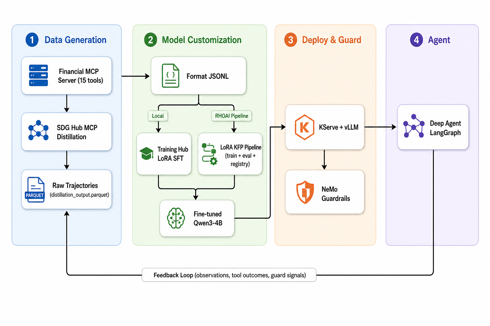

# Financial Agent Model Customization on RHOAI

Fine-tune a small language model (Qwen3-4B) to be an expert tool-calling agent for financial services. Uses SDG Hub to generate domain-specific training data from the financial MCP server, then Training Hub's LoRA SFT to fine-tune the model on tool-calling demonstrations. The fine-tuned model is deployed on RHOAI behind NeMo Guardrails for financial compliance and wrapped in a Deep Agent harness for production use.

## RHOAI Feature Matrix

| Feature | RHOAI Version | Status | Purpose |
|---------|--------------|--------|---------|
| SDG Hub MCP Distillation | 3.4+ | GA | Generate tool-call training data from MCP servers |
| Training Hub LoRA SFT | 3.4+ | GA | Fine-tune model on tool-calling demonstrations |
| LoRA KFP Pipeline | 3.4+ | GA | End-to-end training pipeline (data → train → eval → registry) |
| KServe RawDeployment | 3.4+ | GA | Deploy fine-tuned model with vLLM runtime |
| NeMo Guardrails | 3.4+ | GA | Financial compliance rails, PII detection, disclaimers |
| LM-Eval | 3.4+ | GA | Standard model benchmarks |
| NeMo + MCP Gateway | 3.5 EA2 | **TP** | Auto-enforce guardrails on all agent tool calls |
| Validated Tool-Calling Config | 3.5 EA2 | **TP** | Pre-validated vLLM args for tool-calling models |

**Legend:** GA = Generally Available | TP = Technology Preview

## Architecture



## What You Will Build

A small, efficient language model that acts as an expert financial services agent — capable of calling portfolio management tools, querying market data, performing risk analysis, and executing trades with compliance checks. The base model (Qwen3-4B) starts with general language ability, but after fine-tuning on financial tool-calling demonstrations it learns *which* financial tool to call for a given query, how to format arguments correctly, and how to chain tools together for complex workflows.

Two training paths are provided:
- **03_train_lora_sft.py** — Run training locally via `training_hub.lora_sft()` for development and prototyping
- **03b_train_kfp_pipeline.py** — Run the official LoRA KFP pipeline on RHOAI with automatic dataset download, training, evaluation, and model registry

Both use the same algorithm (LoRA + SFT via Unsloth backend) and produce identical results. The KFP pipeline is the recommended production path because it runs entirely on-cluster and includes evaluation and model registry stages.

## Prerequisites

- RHOAI 3.4+ cluster (3.5 EA2 for MCP Gateway guardrails)
- GPU nodes: 1x NVIDIA L4 24GB (with QLoRA 4-bit) or 1x L40/A100 for full-precision
- Teacher model API key (Gemini 3.6 Flash recommended for cost, or GPT-4o) for data generation
- Langflow instance with a frontier model agent connected to the financial MCP server
- Python 3.11+
- `oc` CLI authenticated to your OpenShift cluster

**For the KFP pipeline (step 03b):**
- Pipeline server running in your Data Science Project
- RWX storage class (default: `nfs-csi`)
- `kubernetes-credentials` secret with cluster API access

## Directory Structure

```
financial-agent/
├── README.md                               This guide
├── demo_server/
│   ├── server.py                           FastMCP financial server (15 tools)
│   ├── data.py                             Deterministic seed data
│   └── README.md                           Server quick-start
├── guardrails/
│   ├── config.yml                          NeMo Guardrails configuration
│   ├── config.co                           Colang 2.0 financial compliance flows
│   ├── nemoguardrails_cr.yaml              NemoGuardrails CR (GA)
│   └── mcpgateway_extension_cr.yaml        MCPGatewayExtension CR (3.5 TP)
└── examples/
    ├── .env.example                        Environment variable template
    ├── requirements.txt                    Python dependencies
    ├── langgraph.json                      LangGraph Dev Server config
    ├── 01_generate_tool_data.py            SDG Hub MCP distillation
    ├── 02_format_training_data.py          Format distillation output to JSONL
    ├── 03_train_lora_sft.py               LoRA SFT training (local, for dev)
    ├── 03b_train_kfp_pipeline.py          LoRA KFP pipeline (RHOAI production)
    ├── 04_deploy_model.py                  KServe RawDeployment + vLLM
    ├── 05_evaluate_agent.py                Agent evaluation + LM-Eval
    ├── 06_configure_guardrails.py          NeMo Guardrails + MCP Gateway
    ├── 07_deep_agent.py                    Deep Agent harness (LangGraph)
    ├── financial_tools.py                  15 @tool wrappers for MCP server
    └── financial_prompts.py                System prompt for Financial Insights Agent
```

## Step-by-Step Guide

### Step 0: Start the Financial MCP Server

```bash
cd demo_server/
pip install fastmcp
python server.py
# Server starts on http://localhost:8009
```

The demo server exposes 15 tools organized into financial domains: portfolio management, market data, risk analysis, and trade execution.

### Step 1: Generate Tool-Call Training Data

**RHOAI Feature:** SDG Hub MCP Distillation (GA)

```bash
cd examples/
cp .env.example .env
# Edit .env with your teacher model API key and Langflow URL

python 01_generate_tool_data.py --num-samples 10
```

This runs the MCP distillation pipeline:
- A frontier model (via Langflow) explores all 15 financial tools
- A teacher LLM synthesizes realistic financial questions
- The frontier model solves each question via actual MCP tool calls (producing expert trajectories)
- Quality filters remove incomplete or low-quality results
- Output: `generated_data/distillation_output.parquet`

### Step 2: Format Training Data

```bash
python 02_format_training_data.py
```

Converts raw tool traces into chat-format JSONL for supervised fine-tuning:

```json
{"messages": [
  {"role": "system", "content": "<tool declarations>"},
  {"role": "user", "content": "What's the risk-adjusted return on my tech portfolio?"},
  {"role": "assistant", "content": "", "function_call": {"name": "get_portfolio_positions", "arguments": "..."}},
  {"role": "function", "content": "{...}", "name": "get_portfolio_positions"},
  {"role": "assistant", "content": "", "function_call": {"name": "calculate_portfolio_risk", "arguments": "..."}},
  {"role": "function", "content": "{...}", "name": "calculate_portfolio_risk"},
  {"role": "assistant", "content": "Your tech portfolio has a Sharpe ratio of..."}
]}
```

Output: `generated_data/training_data.jsonl`

### Step 3: Fine-Tune with LoRA SFT

**RHOAI Feature:** Training Hub LoRA SFT (GA)

Choose one of two paths:

#### Option A: Local Training (for development)

```bash
# Single L4 24GB with QLoRA (default settings)
python 03_train_lora_sft.py

# A100 80GB with higher capacity
python 03_train_lora_sft.py --lora-r 32 --lora-alpha 64 --max-seq-len 8192 --no-4bit

# Multi-GPU data-parallel
torchrun --nproc-per-node=2 03_train_lora_sft.py
```

#### Option B: LoRA KFP Pipeline on RHOAI (recommended for production)

**Source:** [pipelines-components/pipelines/training/finetuning/lora](https://github.com/red-hat-data-services/pipelines-components/tree/main/pipelines/training/finetuning/lora)

```bash
# Step 1: Compile the pipeline YAML
python 03b_train_kfp_pipeline.py --compile-only

# Step 2: Upload pipeline.yaml to RHOAI Dashboard > Pipelines > Import Pipeline
# Step 3: Create a run with these parameters:
#   phase_01_dataset_man_data_uri = hf://LipengCS/Table-GPT:All  (or your S3 dataset)
#   phase_02_train_man_train_model = Qwen/Qwen3-4B
#   phase_02_train_man_lora_r = 16
#   phase_02_train_man_lora_alpha = 32
```

Or automate via the script:

```bash
export KFP_ENDPOINT=https://ds-pipeline-dspa.apps.your-cluster.com
python 03b_train_kfp_pipeline.py \
    --dataset-uri hf://LipengCS/Table-GPT:All \
    --base-model Qwen/Qwen3-4B \
    --namespace financial-agent
```

The KFP pipeline runs four stages automatically:
1. **Dataset Download** — fetches and validates training data
2. **LoRA Training** — fine-tunes via Kubeflow Trainer + Training Hub Unsloth backend
3. **Evaluation** — LM-Eval harness benchmarks (arc_easy by default)
4. **Model Registry** — registers the fine-tuned model (optional)

**KFP Pipeline Prerequisites:**

| Requirement | Details |
|-------------|---------|
| RHOAI components | `dashboard`, `trainer`, `aipipelines` enabled |
| Pipeline server | Running in your Data Science Project |
| Storage class | RWX with `nfs-csi` (or configure `--storage-class`) |
| Secret | `kubernetes-credentials` with `KUBERNETES_SERVER_URL` and `KUBERNETES_AUTH_TOKEN` |
| KFP SDK | `kfp==2.15.2` (for pipeline YAML compilation) |

Create the required secret:

```bash
oc create secret generic kubernetes-credentials \
  --from-literal=KUBERNETES_SERVER_URL="https://api.your-cluster.com:6443" \
  --from-literal=KUBERNETES_AUTH_TOKEN="$(oc whoami -t)"
```

### Step 4: Deploy the Fine-Tuned Model

**RHOAI Feature:** KServe RawDeployment (GA)

```bash
python 04_deploy_model.py
```

Creates a KServe InferenceService with vLLM serving the fine-tuned model. Tool-calling is enabled via `--enable-auto-tool-choice` and `--tool-call-parser hermes` (validated for Qwen3).

Verify with:

```bash
curl -X POST "$MODEL_ENDPOINT/v1/chat/completions" \
  -H "Content-Type: application/json" \
  -d '{
    "model": "financial-agent",
    "messages": [{"role": "user", "content": "Show me my portfolio performance this quarter"}],
    "tools": [{"type": "function", "function": {"name": "get_portfolio_performance", "parameters": {}}}]
  }'
```

### Step 5: Evaluate

**RHOAI Feature:** LM-Eval (GA)

```bash
python 05_evaluate_agent.py
```

Runs:
- **Tool-call accuracy** — correct tool selection for each query
- **Argument correctness** — valid and complete function arguments
- **Multi-step success rate** — tool chaining for complex queries
- **LM-Eval benchmarks** — MMLU, HellaSwag to confirm no capability regression

### Step 6: Configure Guardrails

**RHOAI Feature:** NeMo Guardrails (GA)

```bash
python 06_configure_guardrails.py
```

**Tier 1 — NeMo Guardrails (GA, RHOAI 3.4+):**
- PII detection and masking on inputs/outputs
- Financial disclaimer injection on investment advice
- Jailbreak detection to prevent prompt injection

**Tier 2 — MCP Gateway Integration (TP, RHOAI 3.5):**
- Automatic guardrail enforcement on all tool calls routed through the MCP Gateway
- Policy-based tool access control

### Step 7: Run the Deep Agent Harness

```bash
pip install deepagents langchain-openai langgraph-cli[inmem]

export MODEL_ENDPOINT=https://financial-agent-predictor.apps.your-cluster.com/v1

cd examples/
langgraph dev

# Or run headless:
python 07_deep_agent.py "What is the risk-adjusted performance of portfolio PORT-0001?"
```

The Deep Agent wraps the fine-tuned Qwen3-4B (served via vLLM) with task planning, tool orchestration, and long-term memory. The 15 financial tools are called via the MCP server.

## Resource Estimates

| Phase | Resource | Estimated Time |
|-------|----------|---------------|
| Data Generation | 1x CPU + Teacher API | 2-4 hours |
| Training (local, L4) | 1x L4 24GB | 1-3 hours |
| Training (KFP, L40) | 1x L40 48GB | 1-2 hours |
| Serving | 1x L4 24GB+ | Ongoing |
| Evaluation | 1x GPU + Model endpoint | 30-60 min |

## Validated on RHOAI

This pipeline has been validated end-to-end on the following environment:

| Component | Version / Config |
|-----------|-----------------|
| RHOAI | 3.4.2 |
| OpenShift | 4.18.21 |
| GPU | 1x NVIDIA L4 24GB (`g6.xlarge`) |
| Training Runtime | `training-hub` ClusterTrainingRuntime |
| Training Backend | Unsloth 2026.4.5 + Training Hub |
| Base Model | Qwen/Qwen3-4B (4-bit QLoRA) |
| Teacher Model | Gemini 3.6 Flash (via litellm) |
| SDG Hub | MCP Server Distillation flow (22 blocks) |
| Pipeline Server | DSPA with MinIO + MariaDB |

**Validated steps:**

- MCP server: 15 tools callable via FastMCP
- SDG Hub: Flow loads, teacher model configured, input dataset builds correctly
- Data formatting: Parquet → chat-format JSONL with proper function_call structure
- Training: LoRA SFT via Kubeflow Trainer, loss 1.817→1.511, 38s for 50 examples
- KFP pipeline: Compiles to 2,367-line YAML, uploads to pipeline server
- Model deployment: KServe manifest generates correctly (dry-run validated)
- Guardrails: NemoGuardrails CR generates correctly (dry-run validated)

**Important cluster notes:**

- GPU nodes with taint `nvidia.com/gpu=True:NoSchedule` require a toleration in TrainJob `podTemplateOverrides`
- On `g6.xlarge` (3.5 CPU, 14GB RAM), use `cpu: 2, memory: 10Gi` for training pod requests
- Scale down the model predictor before training if the GPU node is shared (only 1 GPU)
- The KFP pipeline requires RWX storage (`nfs-csi` or EFS). For EBS-only clusters, use the direct TrainJob approach
- Enable `argoWorkflowsControllers` in the DataScienceCluster if the pipeline workflow stays pending

## Troubleshooting

| Symptom | Resolution |
|---------|------------|
| "MCP Server Distillation flow not found" | Ensure `sdg_hub` is installed: `pip install sdg_hub[dev]` |
| "CUDA out of memory during training" | Enable QLoRA: `--load-in-4bit` (default), or reduce `--max-seq-len` |
| "Tool call parser error" during inference | Verify `--tool-call-parser` matches model (use `hermes` for Qwen3) |
| "Guardrails CR not ready" | Check TrustyAI operator is installed |
| KFP pipeline: "storageclass not found" | Set `--storage-class` to your cluster's RWX class |
| KFP pipeline: "kubernetes-credentials not found" | Create the secret (see Step 3 Option B prerequisites) |
| Langflow agent times out | Increase `LANGFLOW_TIMEOUT` or check MCP server reachability |
| TrainJob pod stays Pending (GPU taint) | Add `tolerations` for `nvidia.com/gpu` in `podTemplateOverrides` |
| TrainJob pod stays Pending (memory) | Reduce `memory` request; `g6.xlarge` has ~14GB allocatable |
| KFP workflow stays pending (no status) | Enable `argoWorkflowsControllers` in DSC: `oc patch dsc default-dsc --type=merge -p '{"spec":{"components":{"aipipelines":{"argoWorkflowsControllers":{"managementState":"Managed"}}}}}'` |
| KFP pod evicted (ephemeral storage) | Training images are 7-15GB; use nodes with >100GB ephemeral storage or use direct TrainJob |

## RHOAI 3.4 vs 3.5

**Works fully on RHOAI 3.4 (GA features only):**
- Steps 0-3: MCP server, data generation, formatting, LoRA SFT training
- Step 4: Model deployment with KServe RawDeployment + vLLM
- Step 5: Evaluation with LM-Eval benchmarks
- Step 6 Tier 1: NeMo Guardrails for financial compliance

**RHOAI 3.5 EA2 adds (Technology Preview):**
- Step 4: Validated tool-calling config (pre-validated vLLM args per model)
- Step 6 Tier 2: MCP Gateway integration for automatic guardrail enforcement

## References

- [Training Hub LoRA docs](https://github.com/Red-Hat-AI-Innovation-Team/training_hub/blob/main/docs/algorithms/lora.md)
- [LoRA KFP Pipeline](https://github.com/red-hat-data-services/pipelines-components/tree/main/pipelines/training/finetuning/lora)
- [KFP Pipeline Guide](https://github.com/red-hat-data-services/red-hat-ai-examples/tree/main/examples/fine-tuning/pipelines/training-hub)
- [SDG Hub MCP Distillation](https://github.com/red-hat-data-services/sdg_hub/tree/main/examples/agentic/mcp_distillation_training)
- [NeMo Guardrails on RHOAI](https://docs.redhat.com/en/documentation/red_hat_openshift_ai_self-managed/3.4/html/ensuring_ai_safety_with_guardrails)
- [KServe RawDeployment](https://docs.redhat.com/en/documentation/red_hat_openshift_ai_self-managed/3.4/html/serving_models)
