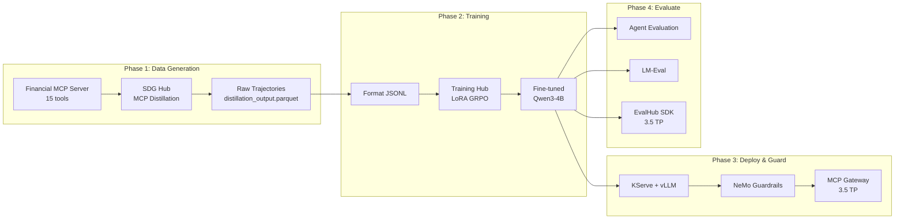

# Financial Agent Model Customization on RHOAI

**Status:** GA (core pipeline) | TP (MCP Gateway guardrails, EvalHub SDK)

Fine-tune a small language model (Qwen3-4B) to be an expert tool-calling agent for financial services. Combines SDG Hub's MCP Distillation flow for generating tool-use training data with Training Hub's LoRA GRPO for reinforcement-learning-based fine-tuning, then deploys behind NeMo Guardrails for financial compliance.

## RHOAI Feature Matrix

| Feature | RHOAI Version | Status | Purpose |
|---------|--------------|--------|---------|
| SDG Hub MCP Distillation | 3.4+ | GA | Generate tool-call training data from MCP servers |
| Training Hub LoRA GRPO | 3.4+ | GA | Train model to select correct tools via reinforcement learning |
| KServe RawDeployment | 3.4+ | GA | Deploy fine-tuned model with vLLM runtime |
| NeMo Guardrails | 3.4+ | GA | Financial compliance rails, PII detection, disclaimers |
| LM-Eval | 3.4+ | GA | Standard model benchmarks |
| KFP Pipelines | 3.4+ | GA | Pipeline automation (optional) |
| NeMo + MCP Gateway | 3.5 EA2 | **TP** | Auto-enforce guardrails on all agent tool calls |
| Validated Tool-Calling Config | 3.5 EA2 | **TP** | Pre-validated vLLM args for tool-calling models |
| EvalHub SDK | 3.5 EA2 | **TP** | Programmatic evaluation job submission |

**Legend:** GA = Generally Available | TP = Technology Preview

## Architecture



## What You Will Build

You will build a small, efficient language model that acts as an expert financial services agent — capable of calling portfolio management tools, querying market data, performing risk analysis, and executing trades with compliance checks. The base model (Qwen3-4B) starts with general tool-calling ability, but after fine-tuning it learns *which* financial tool to call for a given query, how to chain tools together for complex workflows, and when to refuse actions that violate compliance rules.

This example uses GRPO (Group Relative Policy Optimization) instead of standard SFT. Where SFT teaches a model to imitate expert trajectories, GRPO goes further: it generates multiple candidate tool-call sequences, scores them against a reward function that checks tool-call correctness, and optimizes the model to prefer sequences that actually produce correct results. This makes the model robust to ambiguous tool choices (e.g., `get_account_summary` vs `get_portfolio_performance` vs `get_portfolio_positions`) rather than blindly memorizing one path.

The full pipeline takes you from a running MCP server with financial tools through data generation, training, deployment with guardrails, and rigorous evaluation — all on RHOAI infrastructure.

## Prerequisites

- RHOAI 3.4+ cluster (3.5 EA2 for MCP Gateway guardrails and EvalHub SDK)
- GPU nodes: minimum 1x A100/H100 80GB for single-GPU training (`art` backend), 4-8x for multi-GPU (`verl` backend)
- Teacher model API key (GPT-5.2 or compatible)
- Langflow instance with a frontier model agent connected to the financial MCP server
- Python 3.10+
- `oc` CLI authenticated to your OpenShift cluster

## Directory Structure

```
financial-agent/
├── README.md                               This guide
├── demo_server/
│   ├── server.py                           FastMCP financial server (15 tools)
│   ├── data.py                             Deterministic seed data
│   └── README.md                           Server quick-start
├── guardrails/
│   ├── config.yml                          NeMo Guardrails configuration
│   ├── config.co                           Colang 2.0 financial compliance flows
│   ├── nemoguardrails_cr.yaml              NemoGuardrails CR (GA + 3.5 TP)
│   └── mcpgateway_extension_cr.yaml        MCPGatewayExtension CR (3.5 TP)
└── examples/
    ├── .env.example                        Environment variable template
    ├── requirements.txt                    Python dependencies
    ├── 01_generate_tool_data.py            SDG Hub MCP distillation (GA)
    ├── 02_format_training_data.py          Reuse from mcp-distillation/
    ├── 03_train_grpo.py                    Reuse from mcp-distillation/
    ├── 04_deploy_model.py                  KServe RawDeployment + vLLM (GA)
    ├── 05_evaluate_agent.py                Agent evaluation + LM-Eval (GA)
    └── 06_configure_guardrails.py          NeMo Guardrails + MCP Gateway (GA + TP)
```

## Step-by-Step Guide

### Step 0: Start the Financial MCP Server

```bash
cd demo_server/
pip install fastmcp
python server.py
# Server starts on http://localhost:8009
```

The demo server exposes 15 tools organized into financial domains: portfolio management, market data, risk analysis, and trade execution. Tools are deliberately designed with overlapping functionality to test tool-selection accuracy.

### Step 1: Generate Tool-Call Training Data

**RHOAI Feature:** SDG Hub MCP Distillation (GA)

```bash
cd examples/
cp .env.example .env
# Edit .env with your API keys and Langflow URL

python 01_generate_tool_data.py --num-samples 10
```

This runs the full MCP distillation pipeline:
- A frontier model (via Langflow) explores all 15 financial tools, calling each one to understand schemas, outputs, and edge cases
- A teacher LLM synthesizes realistic financial questions grounded in exploration findings
- The frontier model solves each question via actual MCP tool calls (producing expert trajectories)
- Quality filters remove incomplete trajectories and low-quality questions
- Output: `generated_data/distillation_output.parquet`

### Step 2: Format Training Data

```bash
python 02_format_training_data.py
```

Converts raw tool traces into structured function-calling conversations:

```json
{"messages": [
  {"role": "system", "content": "<tool declarations>"},
  {"role": "user", "content": "What's the risk-adjusted return on my tech portfolio?"},
  {"role": "assistant", "content": "", "function_call": {"name": "get_portfolio_positions", "arguments": "..."}},
  {"role": "function", "content": "{...}", "name": "get_portfolio_positions"},
  {"role": "assistant", "content": "", "function_call": {"name": "calculate_portfolio_risk", "arguments": "..."}},
  {"role": "function", "content": "{...}", "name": "calculate_portfolio_risk"},
  {"role": "assistant", "content": "Your tech portfolio has a Sharpe ratio of..."}
]}
```

Output: `generated_data/training_data.jsonl`

### Step 3: Train with GRPO

**RHOAI Feature:** Training Hub LoRA GRPO (GA)

```bash
# Single-GPU (A100 80GB)
python 03_train_grpo.py --backend art --num-iterations 15

# Multi-GPU (4x A100 80GB, faster)
python 03_train_grpo.py --backend verl --n-gpus 4
```

Training uses LoRA GRPO with a `tool_call_reward` function that scores candidate completions based on:
- Whether the correct tool was selected (name match)
- Whether arguments are valid JSON and match the tool schema
- Whether multi-step chains call tools in a logical order

The model learns to prefer tool-call sequences that produce correct results rather than merely imitating the teacher's choices.

### Step 4: Deploy the Fine-Tuned Model

**RHOAI Feature:** KServe RawDeployment (GA) + Validated Tool-Calling Config (3.5 TP)

```bash
python 04_deploy_model.py
```

This creates a KServe InferenceService with vLLM serving the fine-tuned LoRA adapter. The deployment includes tool-calling arguments (`--tool-call-parser`, `--enable-auto-tool-choice`) configured for the Qwen3 architecture.

Verify with a test query:

```bash
curl -X POST "$MODEL_ENDPOINT/v1/chat/completions" \
  -H "Content-Type: application/json" \
  -d '{
    "model": "financial-agent",
    "messages": [{"role": "user", "content": "Show me my portfolio performance this quarter"}],
    "tools": [{"type": "function", "function": {"name": "get_portfolio_performance", "parameters": {}}}]
  }'
```

### Step 5: Evaluate

**RHOAI Feature:** LM-Eval (GA) + Agent Evaluation

```bash
python 05_evaluate_agent.py
```

Runs a multi-faceted evaluation:
- **Tool-call accuracy** — does the model pick the right tool for each query?
- **Argument correctness** — are function arguments valid and complete?
- **Multi-step success rate** — can the model chain tools for complex queries?
- **LM-Eval benchmarks** — standard metrics (MMLU, HellaSwag) to confirm no capability regression
- **EvalHub SDK** (3.5 TP) — submits evaluation jobs programmatically if available

### Step 6: Configure Guardrails

**RHOAI Feature:** NeMo Guardrails (GA) + MCP Gateway (3.5 TP)

```bash
python 06_configure_guardrails.py
```

Configures two tiers of safety enforcement:

**Tier 1 — NeMo Guardrails (GA, RHOAI 3.4+):**
- PII detection and masking on inputs/outputs
- Financial disclaimer injection on investment advice
- Jailbreak detection to prevent prompt injection
- Response safety rails for regulatory compliance

**Tier 2 — MCP Gateway Integration (TP, RHOAI 3.5):**
- Automatic guardrail enforcement on all tool calls routed through the MCP Gateway
- Policy-based tool access control (e.g., `execute_trade` requires compliance pre-check)
- Audit logging of all tool invocations for regulatory traceability

## Resource Estimates

| Phase | Resource | Estimated Time | Estimated Cost |
|-------|----------|---------------|----------------|
| Data Generation | 1x CPU + Teacher API | 2-4 hours | $10-30 API costs |
| Training (art) | 1x A100 80GB | 4-8 hours | — |
| Training (verl) | 4x A100 80GB | 1-2 hours | — |
| Serving | 1x A100 40GB+ | Ongoing | — |
| Evaluation | 1x CPU + Model endpoint | 30-60 min | — |

## Troubleshooting

| Symptom | Resolution |
|---------|------------|
| "MCP Server Distillation flow not found" | Ensure `sdg_hub` is installed: `pip install sdg_hub[dev]` |
| "CUDA out of memory during GRPO" | Reduce `--group-size` (default 8 → 4) or switch to `verl` backend with more GPUs |
| "Tool call parser error" during inference | Verify `--tool-call-parser` matches model architecture (use `hermes` for Qwen3) |
| "Guardrails CR not ready" | Check TrustyAI operator is installed and the NeMo Guardrails CRD is available |
| "MCPGatewayExtension not found" | Requires RHOAI 3.5 EA2+ — this is a Technology Preview feature |
| Langflow agent times out | Increase `LANGFLOW_TIMEOUT` or check that the MCP server is reachable from Langflow |

## 3.4-Only vs 3.5 Upgrade Path

**Works fully on RHOAI 3.4 (GA features only):**
- Steps 0-3: MCP server, data generation, formatting, GRPO training
- Step 4: Model deployment with KServe RawDeployment + vLLM (manual tool-calling args)
- Step 5: Agent evaluation and LM-Eval benchmarks
- Step 6 Tier 1: Standalone NeMo Guardrails with financial compliance rails

**RHOAI 3.5 EA2 adds (Technology Preview):**
- Step 4 enhancement: Validated tool-calling config (pre-validated vLLM args per model architecture)
- Step 5 enhancement: EvalHub SDK for programmatic evaluation job submission
- Step 6 Tier 2: MCP Gateway integration for automatic guardrail enforcement on all tool calls

All 3.5 TP features are additive — the core pipeline runs end-to-end on 3.4 without them.

## Official Documentation

- [SDG Hub MCP Distillation Examples](https://github.com/red-hat-data-services/sdg_hub/tree/main/examples/agentic/mcp_distillation_training)
- [NeMo Guardrails on RHOAI](https://docs.redhat.com/en/documentation/red_hat_openshift_ai_self-managed/3.4/html/ensuring_ai_safety_with_guardrails)
- [KServe RawDeployment](https://docs.redhat.com/en/documentation/red_hat_openshift_ai_self-managed/3.4/html/serving_models)
- [LM-Eval on RHOAI](https://docs.redhat.com/en/documentation/red_hat_openshift_ai_self-managed/3.4/html/evaluating_models)
